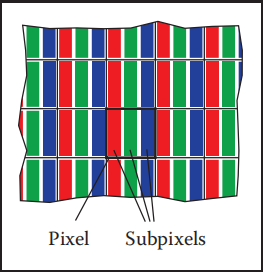
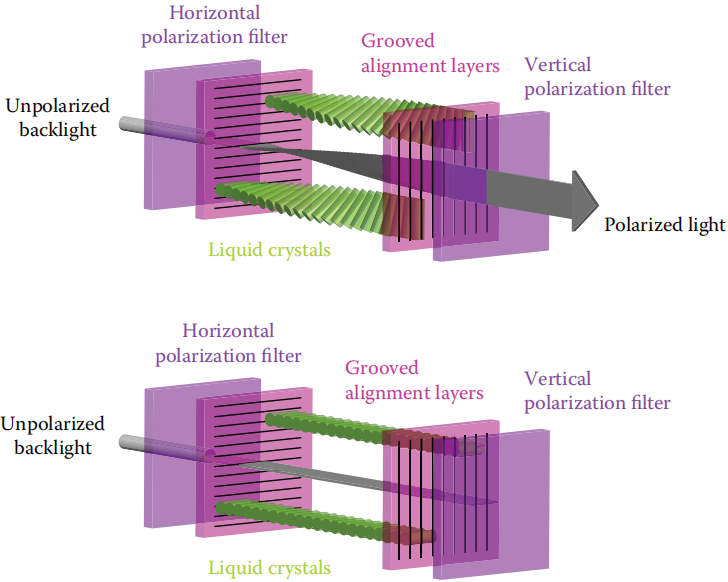
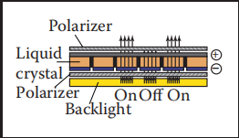
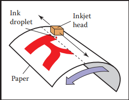
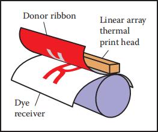
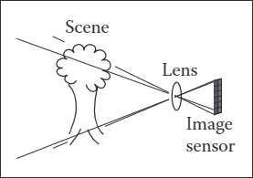
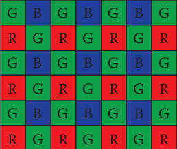
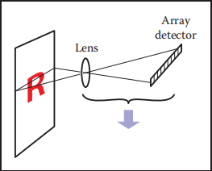
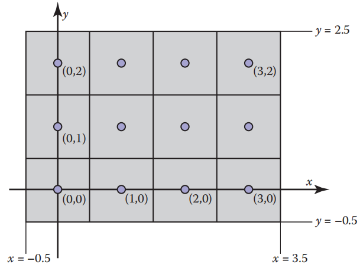
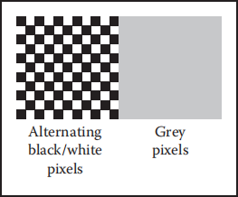

# 3 Raster Images

大多数计算机图形图像在某种光栅显示器上呈现给用户。 光栅显示将图像显示为像素的矩形数组。 一个常见的例子是平板电脑显示器或电视，它有一个由小的发光像素组成的矩形数组，这些像素可以单独设置为不同的颜色，以创建任何所需的图像。 通过混合不同强度的红光、绿光和蓝光来获得不同的颜色。 大多数打印机，如激光打印机和喷墨打印机，也是光栅设备。 它们基于扫描：没有像素的物理网格，而是通过在网格上的选定点沉积墨水来顺序放置图像。

&emsp;&emsp;光栅在图像输入设备中也很普遍。 数码相机包含一个图像传感器，该传感器包含一个光敏像素网格，每个像素都记录落在其上的光的颜色和强度。 桌面扫描仪包含一个线性像素阵列，这些像素在页面上扫过，每秒进行多次测量以生成像素网格。

&emsp;&emsp;由于光栅在设备中非常普遍，因此光栅图像是存储和处理图像的最常用方式（或者，也许是因为光栅图像非常方便以至于光栅设备很流行）。 光栅图像只是一个二维数组，用于存储每个像素的像素值——通常将颜色存储为三个数字，分别为红色、绿色和蓝色。 可以通过使用存储图像中的每个像素来控制显示器的像素的颜色，从而在显示器上显示存储在存储器中的光栅图像。

&emsp;&emsp;但我们并不总是想以这种方式显示图像。 我们可能想要更改图像的大小或方向、校正颜色，甚至显示粘贴在移动的 3 维表面上的图像。 即使在电视中，显示器的像素数也很少与所显示的图像相同。 像这种打破了图像像素和显示像素之间的直接联系的情况， 最好将光栅图像视为对要显示的图像的独立于设备的描述，而将显示设备视为近似理想图像的一种方式。

&emsp;&emsp;除了使用像素数组之外，还有其他描述图像的方法。矢量图像是通过存储形状的描述（由线条或曲线界定的颜色区域）来描述的，而不参考任何特定的像素网格。 从本质上讲，这相当于存储显示图像的指令，而不是显示它所需的像素。 矢量图像的主要优点是它们与分辨率无关，并且可以在非常高分辨率的设备上很好地显示。 相应的缺点是它们必须经过光栅化才能显示。 矢量图像通常用于文本、图表、机械绘图和其他应用，在这些应用中，清晰度和精度很重要，不需要摄影图像和复杂的着色。

&emsp;&emsp;在本章中，我们讨论光栅图像和显示的基础知识，特别注意标准显示器的非线性。 当我们在后面的章节中讨论计算图像时，必须牢记像素值与光照强度相关的细节（或者：您必须知道图像中的这些数字实际上意味着什么）。

## 3.1 光栅设备Raster Devices

&emsp;&emsp;在抽象地讨论光栅图像之前，先了解一些使用这些图像的特定设备的基本操作是有益的。 一些熟悉的光栅设备可以归类为一个简单的层次结构：

- 输出 Output
    - 显示 Display
        - 透射式 Transmissive：液晶显示（LCD）
        - 发射型 Emissive：发光二极管（LED）显示
    - 屏幕拷贝 Hardcopy
        - 二进制 Binary：喷墨打印机
        - 连续色调 Continuous tone：热升华打印机
- 输入 Input
    - 二维阵列传感器：数码相机
    - 一维阵列传感器：平板扫描仪

### 3.1.1 显示器 Displays

目前的显示器，包括电视和数字电影放映机以及用于计算机的显示器和投影仪，几乎普遍基于固定的像素阵列。 它们可以分为使用直接发射可控光量的像素的发射型显示器和像素本身不发光而是改变它们允许通过它们的光量的透射显示器。 透射式显示器需要光源来照亮它们：在直视式显示器中，这是阵列背后的背光； 在投影仪中，它是一种发出光线的灯，通过阵列后投射到屏幕上。 发射型显示器是它自己的光源。

&emsp;&emsp;发光二极管 (LED) 显示器是发射型的一个例子。每个像素由一个或多个 LED 组成，这些 LED 是半导体器件（基于无机或有机半导体），其发光强度取决于穿过它们电流（见图 3.1）。

图 3.1。 发光二极管的工作原理（LED显示屏）。

&emsp;&emsp;彩色显示器中的像素分为三个独立控制的子像素——一个红色、一个绿色和一个蓝色——每个子像素都有自己的 LED，使用不同的材料制成，因此它们发出不同颜色的光（图 3.2）。 从远处观看显示器时，人眼无法区分各个子像素，感知的颜色是红色、绿色和蓝色的混合色。

图 3.2 平板显示器像素内的红色、绿色和蓝色子像素

&emsp;&emsp;液晶显示器 (LCD) 是透射型的一个例子。 液晶是一种材料，其分子结构使其能够旋转通过它的光的偏振，并且可以通过施加的电压来调节旋转的程度。 LCD 像素（图 3.3）后面有一层偏振膜，因此它被偏振光照亮——假设它是水平偏振的。

图 3.3  LCD 显示器的一个像素处于关闭状态（底部），其中前偏光片阻挡所有通过后偏光片的光线，以及开启状态（顶部），其中液晶单元旋转光的偏振，因此 它可以通过前偏光片。 图片由 Erik Reinhard 提供（Reinhard、Khan、Aky ¨uz 和 Johnson，2008 年）。

&emsp;&emsp;像素前面的第二层偏振膜被定向为仅透射垂直偏振光。 如果施加的电压设置为使得中间的液晶层不改变偏振，则所有光都被阻挡并且像素处于“关闭”（最小强度）状态。 如果电压设置为使液晶将偏振旋转 90 度，那么所有从像素背面进入的光都会从正面逸出，像素完全“开启”——它具有最大 强度。 中间电压会部分地旋转偏振，因此前偏振器会部分阻挡光线，导致强度介于最小值和最大值之间（图 3.4）。 与彩色 LED 显示器一样，彩色 LCD 的每个像素内都有红色、绿色和蓝色子像素，它们是三个独立的像素，上面有红色、绿色和蓝色滤色器。

图 3.4  液晶显示器的操作（LCD）。

&emsp;&emsp;具有固定像素网格的任何类型的显示器，包括这些和其他技术，都具有由网格大小决定的基本固定分辨率（显示器的分辨率有时称为“本机分辨率”，因为大多数显示器可以通过内置转换处理其他分辨率的图像）。对于显示器和图像，分辨率仅意味着像素网格的尺寸：如果台式显示器具有分辨率为 1920 × 1200 像素，这意味着它有 2,304,000 个像素排列在 1920 列和 1200 行中。

&emsp;&emsp;不同分辨率的图像要填满屏幕，必须使用第 9 章的方法转换为 1920 × 1200 的图像。

### 3.1.2 硬拷贝设备 Hardcopy Devices

&emsp;&emsp;在纸上永久记录图像的过程与在显示器上瞬时显示图像的限制非常不同。 在印刷中，颜料分布在纸或其他介质上，以便当光线从纸反射时形成所需的图像。 打印机是像显示器一样的光栅设备，但许多打印机只能打印二进制图像——颜料要么沉积要么不沉积在每个网格位置，不可能有中间数量。

&emsp;&emsp;喷墨打印机（图 3.5）是通过扫描形成光栅图像的设备示例。 喷墨打印头包含带有颜料的液体墨水，可以在电子控制下以非常小的液滴喷射。 打印头在纸上移动，当它通过应该接收墨水的网格位置时会发射出墨滴； 在打算保持空白的区域不会喷出墨水。 每次扫描后，纸张会稍微前移，然后放置下一行网格。 彩色打印是通过使用多个打印头进行的，每个打印头喷洒不同颜料的墨水，因此每个网格位置都可以接收不同颜色墨滴的任意组合。 因为所有的墨滴都是一样的，所以喷墨打印机打印的是二值图像：在每个网格点上有一个墨滴或没有墨滴； 没有中间色调。（也有连续喷墨打印机在缠绕在旋转鼓上的纸上以连续的螺旋路径打印，而不是来回移动打印头）

图 3.5  喷墨打印机的操作。

&emsp;&emsp;喷墨打印机没有像素的物理阵列； 分辨率取决于液滴的大小以及每次扫描后纸张前进的距离。 许多喷墨打印机在打印头中有多个喷嘴，可以一次完成多次扫描，但最终决定行间距的是纸张前进的距离，而不是喷嘴间距。

&emsp;&emsp;热染料转移过程是连续色调打印过程的一个例子，这意味着可以在每个像素上沉积不同数量的染料——它不像喷墨打印机那样全有或全无（图 3.6）。包含有色染料的供体色带被压在纸或染料接收器与包含线性阵列加热元件的打印头之间，每个加热元件用于图像中的每一列像素。当纸和色带经过打印头时，加热元件会打开和关闭以在需要染色的区域加热色带，导致染料从色带扩散到纸张上。对几种染料颜色中的每一种都重复此过程。由于较高的温度会导致更多的染料转移，因此可以控制沉积在每个网格位置的每种染料的量，从而可以产生连续范围的颜色。打印头中加热元件的数量在整个页面的方向上建立了固定的分辨率，但沿页面的分辨率由加热和冷却速率与纸张速度之比决定。

图 3.6  热转印打印机的操作。

&emsp;&emsp;与显示器不同，打印机的分辨率是根据像素密度而不是像素总数来描述的。 因此，打印头上的元素间隔为每英寸 300 个的热染料转移打印机在页面上的分辨率为每英寸 300 个像素 (ppi)。 如果选择沿页面的分辨率相同，我们可以简单地说打印机的分辨率为 300 ppi。 将点放置在每英寸 1200 个网格点的网格上的喷墨打印机被描述为具有每英寸 1200 个点 (dpi) 的分辨率。 由于喷墨打印机是二进制设备，因此至少出于两个原因需要更精细的网格。 由于边缘是突然的黑/白边界，因此需要非常高的分辨率以避免出现阶梯或锯齿（参见第 8.3 节）。 打印连续色调图像时，需要通过打印称为半色调的不同密度点图案来模拟中间色的高分辨率。（术语“dpi”经常用于表示“每英寸像素数”，但 dpi 应用于指代二进制设备，而 ppi 应用于指代连续色调设备。）

### 3.1.3 输入设备 Input Devices

光栅图像必须来自某个地方，任何不是由某种算法计算的图像都必须由某种光栅输入设备测量，最常见的是相机或扫描仪。 即使在渲染 3D 场景图像时，照片也经常用作纹理贴图（参见第 11 章）。 光栅输入设备必须对每个像素进行光测量，并且（与输出设备一样）它们通常基于传感器阵列。

图 3.7  数码相机的操作。

&emsp;&emsp;数码相机是二维阵列输入设备的一个例子。 相机中的图像传感器是具有光敏像素网格的半导体器件。 两种常见类型的阵列称为 CCD（电荷耦合器件）和 CMOS（互补金属氧化物半导体）图像传感器。 相机的镜头将要拍摄的场景图像投射到传感器上，然后每个像素测量落在其上的光能，最终产生一个数字，并进入输出图像（图 3.7）。 与彩色显示器使用红色、绿色和蓝色子像素的方式大致相同，大多数彩色相机通过使用滤色器阵列或马赛克来工作，让每个像素只能看到红色、绿色或蓝色光，而让图像处理软件在称为去马赛克的过程中填充缺失值（图 3.8）。

图 3.8  大多数彩色数码相机使用类似于此处显示的**Bayer**马赛克的滤色器阵列。 每个像素测量红光、绿光或蓝光。

&emsp;&emsp;其他相机使用三个独立的阵列或阵列中的三个独立层来测量每个像素的独立红色、绿色和蓝色值，无需进一步处理即可生成可用的彩色图像。 相机的分辨率由阵列中的固定像素数决定，通常使用像素总数来引用：具有 3000 列和 2000 行的阵列的相机产生分辨率为 3000 × 2000 的图像，其中有 6 百万像素，称为 6 兆像素 (MP) 相机。 重要的是要记住，马赛克传感器不能测量完整的彩色图像，因此，与使用马赛克传感器的相机相比，测量相同像素数但具有独立的红色、绿色和蓝色测量值的相机记录的图像信息更多(销售相机的人使用$10^6$来表示“兆”，而不是像兆字节那样的$2^{20}$。)。

&emsp;&emsp;平板扫描仪还测量每个像素网格的红色、绿色和蓝色值，但与热染料转移打印机一样，它使用一维阵列扫过正在扫描的页面，每秒进行多次测量。 页面上的分辨率由阵列的大小固定，页面上的分辨率由测量频率与扫描头移动速度的比较决定。 彩色扫描仪有一个$3 ×n_x$阵列，其中$n_x$是整个页面的像素数，其中三行由红色、绿色和蓝色过滤器覆盖。 通过测量三种颜色的时间之间的适当延迟，这允许在每个网格点进行三个独立的颜色测量。 与连续色调打印机一样，扫描仪的分辨率以每英寸像素 (ppi) 为单位报告(扫描仪的分辨率有时称为“光学分辨率”，因为大多数扫描仪可以通过内置转换生成其他分辨率的图像)。

&emsp;&emsp;有了这些关于我们的图像来自哪里以及它们将去哪里的具体信息，我们现在将更抽象地讨论图像，就像我们在图形算法中使用它们的方式。

图 3.9  平板扫描仪的操作。

## 3.2 图像、像素和几何 Images, Pixels, and Geometry

&emsp;&emsp;我们知道，光栅图像是一个大的像素阵列，每个像素都存储有关其网格点处图像颜色的信息。 我们已经看到了各种输出设备如何处理我们发送给它们的图像，以及输入设备如何从物理世界中光形成的图像中获取它们。 但是对于计算机中的计算，我们需要一个方便的抽象，它独立于任何设备的细节，我们可以用它来推理如何产生或解释存储在图像中的值。

&emsp;&emsp;当我们测量或再现图像时，它们采用光能的二维分布形式：显示器发出的光是显示器表面上位置的函数； 落在相机图像传感器上的光线是传感器平面上位置的函数； 作为一张纸上位置的函数的反射率或反射光的分数（与吸收相反）。 因此，在物理世界中，图像是在二维区域（几乎总是矩形）上定义的函数。 所以我们可以将图像抽象为一个函数

$$*I(x, y) : R → V,*$$

其中$R ⊂ R2$ 是一个矩形区域，V 是可能的像素值的集合。 最简单的情况是理想化的灰度图像，其中矩形中的每个点只有一个亮度（无颜色），我们可以说$V = R^+$（非负实数）。 理想化的彩色图像，每个像素都有红色、绿色和蓝色值，$V = (R^+)^3$。 我们将在下一节讨论 V 的其他可能性。

&emsp;&emsp;光栅图像与连续图像的这种抽象概念有什么关系？看具体的例子，来自相机或扫描仪的像素是对图像在像素周围一些小区域上的平均颜色的度量。 显示像素及其红色、绿色和蓝色子像素的设计使得像素表面上图像的平均颜色由光栅图像中的相应像素值控制。 在这两种情况下，像素值都是图像颜色的局部平均值，称为图像的一个点样本。 换句话说，当我们在一个像素中找到x的值时，就意味着“这个网格点附近的图像的值为x”。 第 9 章进一步探讨了图像作为函数采样表示的想法。

图 3.10。 4像素×3像素屏幕的坐标。 请注意，在某些 API 中，y 轴将指向下方。

&emsp;&emsp;一个平凡但重要的问题是像素在 2D 空间中的位置。这只是一个约定问题，但建立一致的约定很重要！ 在本书中，光栅图像由表示像素的列 (i) 和行 (j) 的 (i, j) 对索引，从左下角开始计数。 如果图像有$n_x$列和$n_y$行像素，则左下角的像素为 (0, 0)，右上角的像素为($n_x$ − 1, $n_y$ − 1)。 我们需要 2D 真实屏幕坐标来指定像素位置。 我们将像素的样本点放置在整数坐标处，如图 3.10 中的 4 × 3 屏幕所示(在某些 API 和许多文件格式中，图像的行是从上到下组织的，因此 (0, 0) 位于左上角。 这是由于历史原因：模拟电视传输中的行从顶部开始)。

&emsp;&emsp;图像的矩形域的宽度为$n_x$和高度为$n_y$，并以该网格为中心，这意味着它在每侧的最后一个采样点之外延伸了半个像素。 所以$n_x × n_y$图像的矩形域是

$$*R = [−0.5, n_x − 0.5] × [−0.5, n_y − 0.5] .*$$

&emsp;&emsp;同样，这些坐标只是约定，但稍后在实现相机和视图转换时记住它们很重要（一些系统将坐标移动半个像素以将采样点放置在整数之间的中间，但将图像的边缘放置在整数处。）。

### 3.2.1 像素值 Pixel Values

&emsp;&emsp;到目前为止，我们已经用实数描述了像素的值，表示图像中某个点的强度（可能分别代表红色、绿色和蓝色）。这表明图像应该是浮点数数组，其中任意一个（用于灰度或黑白图像）或三个（用于 RGB 彩色图像）每个像素存储的 32 位浮点数。 当需要其精度和值范围时，有时会使用这种格式，但图像有很多像素和内存，用于存储和传输图像的带宽总是稀缺的。 在这种格式下，仅一张 10 兆像素的照片就会消耗大约 115 MB 的 RAM（为什么是115MB而不是120MB）。

&emsp;&emsp;直接显示的图像所需的范围更小。虽然原则上可能的光强度范围是无界的，但任何给定的设备都有一个明确的有限的最大强度，所以在许多情况下，像素有一个有界的范围是完全足够的，为了简单起见，通常将其设为[0,1]。例如，8位图像中可能的值为0,1/255,2/255，…, 254/255, 1。用浮点数存储的图像允许大范围的值，通常称为高动态范围(HDR)图像，以区别于用整数存储的固定范围或低动态范围(LDR)图像。关于高动态范围图像的技术和应用的深入讨论见第21章。

&emsp;&emsp;以下是一些典型应用的像素格式：

- 1 位灰度—不需要中间灰度的文本和其他图像（需要高分辨率）；
- 8 位 RGB 固定范围颜色（每像素总共 24 位）——网络和电子邮件应用程序、客户照片；
- 8 位或 10 位固定范围 RGB（24–30 位/像素）——计算机显示器的数字接口；
- 12 到 14 位固定范围 RGB（36–42 位/像素）——专业摄影的原始相机图像；
- 16 位固定范围 RGB（48 位/像素）——专业摄影和打印； 固定距离图像图像处理的中间格式；
- 16 位固定范围灰度（16 位/像素）——放射学和医学成像；
- 16 位“半精度”浮点 RGB——HDR 图像； 用于实时渲染的中间格式；
- 32 位浮点 RGB — 用于软件渲染和处理 HDR 图像的通用中间格式。

减少用于存储每个像素的位数会导致图像中出现两种不同类型的失真或人为引入的缺陷。 首先，当像素被设置或裁剪为最大可表示值时，使用固定范围值编码图像会产生裁剪。 例如，一张晴朗场景的照片可能包含比白色表面亮得多的反射； 当图像转换到要显示的固定范围时，这些将被剪裁（即使它们是由相机测量的）。 其次，当需要将像素值四舍五入到最接近的可表示值会引入强度或颜色的可见跳跃时，以有限精度编码图像会导致量化失真或条纹。 条纹在动画和视频中可能特别隐蔽，条纹在静止图像中可能不会令人反感，但当它们来回移动时会变得非常明显。

### 3.2.2 监测强度和伽玛 Monitor Intensities and Gamma

&emsp;&emsp;所有现代显示器都对像素的“值”进行数字输入，并将其转换为强度级别。 真正的显示器在关闭时具有一些非零强度，因为屏幕会反射一些光。 出于我们的目的，我们可以将这种“黑色”和完全开启的显示器视为“白色”。 我们假设像素颜色的数字描述范围从 0 到 1。 黑色为零，白色为一，介于黑白之间的灰色为 0.5。 请注意，这里的“中途”指的是来自像素的物理光量，而不是外观。 人类对强度的感知是非线性的，不属于本讨论的一部分； 更多信息请参见第 20 章。

&emsp;&emsp;要在显示器上生成正确的图像，必须了解两个关键问题。 首先是显示器相对于输入是非线性的。 例如，如果您将显示器 0、0.5 和 1.0 作为三个像素的输入，则显示的强度可能是 0、0.25 和 1.0（关闭、四分之一完全打开和完全打开）。 作为这种非线性的近似表征，监视器通常以 $γ$（“伽马”）值来表征。 这个值就是公式中的自由度。

$$displayed intensity = (maximum intensity)a^γ,\tag{3.1}$$ 

&emsp;&emsp;其中 a 是介于 0 和 1 之间的输入像素值。 例如，如果监视器的伽玛值为 2.0，而我们输入的值 $a$ = 0.5，则显示的强度将是最大可能强度的四分之一，因为$0.5^2 = 0.25$。 请注意，无论$γ$ 的值如何，$a$ = 0 映射到零强度，$a$ = 1 映射到最大强度。 使用$γ$ 描述显示器的非线性只是一个近似值； 我们在估计设备$γ$ 时不需要很高的准确度。衡量非线性度的一个很好的直观方法是找到给出介于黑白之间的强度的$a$ 值。 

$$0.5 = a^γ.$$

如果我们能找到$a$，我们可以通过两边取对数来推导出$γ$：

$$*γ = \frac{ln0.5}{lna}*$$

图 3.11  从远处看，交替的黑白像素介于黑白之间。 显示器的伽玛值可以通过找到与黑白图案具有相同强度的灰度值来推断。

&emsp;&emsp;我们可以通过标准技术找到这个 $a$，我们在输入 $a$ 的灰色像素方块旁边显示一个黑白像素的棋盘图案（图 3.11），然后要求用户调整 a（例如，使用滑块） 直到两侧的平均亮度匹配。 当您从远处观看此图像时（如果您是近视者，则不戴眼镜），当 a 产生介于黑白之间的强度时，图像的两侧看起来大致相同。 这是因为模糊的棋盘格混合了偶数个白色和黑色像素，因此整体效果是介于白色和黑色之间的均匀颜色（对于模拟接口的显示器，难以沿水平方向快速改变强度，水平黑白条纹比棋盘格效果更好）。

&emsp;&emsp;一旦我们知道了 γ，我们就可以对我们的输入进行伽马校正，以便 a = 0.5 的值以介于黑白之间的强度显示。 这是通过转换完成的

$$*a = a ^ {\frac{1}{γ}} .*$$

当这个公式代入方程（3.1）时，我们得到

$$displayed intensity = (a')^γ =  (a^{\frac{1}{γ}})^γ (maximum\ intensity)$$

$$= a(maximum\ intensity).$$

真实显示器的另一个重要特征是它们采用量化的输入值。 因此，虽然我们可以在浮点范围 [0, 1] 内操纵强度，但监视器的详细输入是固定大小的整数。 这个整数最常见的范围是 0-255，它可以保存在 8 位存储中。 这意味着 $a$ 的可能值不是 [0, 1] 中的任何数字，而是

$$a可能的值为：\{\frac{0}{255},\frac{1}{255},\frac{2}{255},...,\frac{254}{255},\frac{255}{255}\}$$

这意味着可能显示的强度值是近似的，其中M是最大强度。在需要控制确切强度的应用中，我们必须实际测量256种可能的强度，这些强度在屏幕上的不同点可能是不同的，特别是对于crt。它们也可能随着观看角度的不同而变化。幸运的是，很少有应用需要如此精确的校准。

$$\{M{(\frac{0}{255})}^γ,M{(\frac{1}{255})}^γ,M{(\frac{2}{255})}^γ,...,M{(\frac{254}{255})}^γ,M{(\frac{255}{255})}^γ\}$$

## 3.3 RGB颜色 RGB Color

大多数计算机图形图像是根据红绿蓝 (RGB) 颜色定义的。 RGB 颜色是一个简单的空间，可以直接转换为大多数计算机屏幕的控件。 本节从用户的角度讨论RGB颜色，以操作便利为目标。 第 19 章对颜色进行了更深入的讨论，但 RGB 颜色空间的机制将使我们能够编写大多数图形程序。 RGB色彩空间的基本思想是通过混合三种原色光来显示颜色：一红一绿一蓝。 灯光以加法方式混合（在小学时，您可能了解到原色是红色、黄色和蓝色，例如，黄色 + 蓝色 = 绿色。 这是减法混合，它与更常见的显示器中发生的加色混合有根本的不同）。

图 3.12  红/绿/蓝颜色的加法混合规则。

&emsp;&emsp;在 RGB 加法混合中，我们有（图 3.12）

红色 + 绿色 = 黄色，

绿色 + 蓝色 = 青色，

蓝色 + 红色 = 洋红色，

红色 + 绿色 + 蓝色 = 白色。

&emsp;&emsp;如果允许我们将主灯从完全关闭（由像素值 0 表示）调暗到完全打开（由 1 表示），我们就可以创建可以在 RGB 显示器上显示的所有颜色。 红色、绿色和蓝色像素值创建一个具有红色、绿色和蓝色轴的三维 RGB 颜色立方体。 轴的允许坐标范围从零到一。 颜色立方体如图 3.13 所示。

&emsp;&emsp;立方体临界颜色是：

黑色 = (0, 0, 0),

红色 = (1, 0, 0),

绿色 = (0, 1, 0),

蓝色 = (0, 0, 1),

黄色 = (1, 1, 0),

洋红色 = (1, 0, 1),

青色 = (0, 1, 1),

白色 = (1, 1, 1)

                                                     

图 3.13  3D 中的 RGB 颜色立方体及其面展开。 任何 RGB 颜色都是立方体中的一个点。

&emsp;&emsp;实际的 RGB 级别通常以量化形式给出，就像第 3.2.2 节中讨论的灰度一样。 每个组件都用一个整数指定。 这些整数最常见的大小是每个字节一个字节，因此三个 RGB 分量中的每一个都是 0 到 255 之间的整数。三个整数一起占用三个字节，即 24 位。 因此，具有“24 位颜色”的系统对于三种原色中的每一种都有 256 种可能的级别。 第 3.2.2 节中讨论的伽马校正问题也分别适用于每个 RGB 分量。

## 3.4 Alpha 混合 Alpha Compositing

通常我们只想部分覆盖像素的内容。 一个常见的例子发生在混合中，我们有一个背景，并想在它上面插入一个前景图像。 对于前景中的不透明像素，我们只需替换背景像素。 对于完全透明的前景像素，我们不会更改背景像素。 对于部分透明的像素，必须小心。 当前景对象具有部分透明区域（例如玻璃）时，可能会出现部分透明像素。 但是，必须混合前景和背景的最常见情况是当前景对象仅部分覆盖像素时，要么位于前景对象的边缘，要么存在子像素孔，例如远处树的叶子间隙 。

&emsp;&emsp;将前景对象与背景对象混合所需的最重要的信息是像素覆盖率，它告诉前景层覆盖的像素的比例。 我们可以称这个分数为α。 如果我们想在背景色$c_b$上合成一个前景色$c_f$，并且前景覆盖的像素的分数是α，那么我们可以使用公式

$$c = αc_f + (1 − α)c_b.\tag{3.2}$$                                                         

对于不透明的前景层，解释为前景对象覆盖像素矩形内的区域 α，背景对象覆盖剩余区域，即 (1 − α)。 对于透明层（想想在玻璃或描图纸上绘制的图像，使用半透明涂料），解释是前景层阻挡了来自背景的光的分数 (1 − α) 并贡献了分数 α 用它自己的颜色来代替被移除的东西。 图 3.14 显示了使用公式 (3.2) 的示例（由于前景层和背景层的权重加起来为1，如果前景层和背景层的颜色相同，颜色不会改变）。

&emsp;&emsp;图像中所有像素的 α 值可能存储在单独的灰度图像中，然后称为 alpha 蒙版或透明度蒙版。或者信息可以存储为 RGB 图像中的第四个通道，在这种情况下 称为 alpha 通道，图像可以称为 RGBA 图像。对于 8 位图像，每个像素占用 32 位，这在许多计算机体系结构中是一个方便大小的块。

&emsp;&emsp;尽管通常使用方程 (3.2)，但在各种情况下，α 的使用方式不同（Porter & Duff，1984）。

图 3.14  使用等式 (3.2) 进行合成的示例。 前景图像在放置在背景图像之上之前实际上被 α 通道裁剪。 生成的复合材料显示在底部。

### 3.4.1 图像存储 Image Storage

大多数 RGB 图像格式为每个红色、绿色和蓝色通道使用八位。 这导致单个百万像素图像的原始信息大约为三兆字节。 为了减少存储需求，大多数图像格式都允许进行某种压缩。 在较高级别上，这种压缩要么是无损的，要么是有损的。 在无损压缩中没有信息被丢弃，而在有损系统中一些信息会不可恢复地丢失。 流行的图像存储格式包括：

- jpeg。这种有损格式根据人类视觉系统中的阈值压缩图像块。 这种格式适用于自然图像。
- tiff。尽管存在许多其他选项，但这种格式最常用于保存二进制图像或无损压缩的 8 位或 16 位 RGB。
- ppm。尽管存在许多选项，但这种非常简单的无损、未压缩格式最常用于 8 位 RGB 图像。
- png。这是一组具有良好开源管理工具的无损格式。

由于压缩和变化，需要编写图像的输入/输出例程。幸运的是，通常可以依靠库例程来读写标准文件格式。对于快速而简陋的应用程序(简单性高于效率)，一个简单的选择是使用原始ppm文件，通常只需将存储在内存中的图像的数组转储到一个文件中，并在适当的头文件前添加相应的头文件即可编写这些文件。

**Frequently Asked Questions**

- 他们为什么不让显示器线性化并避免所有这些伽马业务？

&emsp;&emsp;理想情况下，监视器的 256 种可能强度看起来应该是均匀分布的，而不是在能量上呈线性分布。 由于人类对强度的感知本身是非线性的，因此 1.5 到 3 之间的伽玛值（取决于观看条件）将使主观意义上的强度大致均匀。 这样，伽马就是一个特征。 否则制造商会使显示器线性化。

**Exercise**

&emsp;&emsp;通过拍摄自然图像（最好是扫描照片，而不是可能已经应用拜耳马赛克的数码照片）并创建由交错的红/绿/蓝通道组成的灰度图像，模拟从Bayer马赛克获取的图像。 这模拟了数码相机的原始输出。 现在从该输出创建一个真正的 RGB 图像并与原始图像进行比较。