# 9 Signal Processing

在图形学中，我们经常处理具有连续变量的函数：图像是您看到的第一个示例，但是随着您继续对图形的探索，您会遇到更多示例。 就其性质而言，连续函数不能直接在计算机中表示； 我们必须以某种方式使用有限数量的位来表示它们。 表示连续函数的最有用的方法之一是使用函数的样本：只需将函数的值存储在许多不同的点，并在需要时和需要时重建它们之间的值。

&emsp;&emsp;您现在已经熟悉使用二维像素网格来表示图像的想法——所以您已经看到了采样表示！ 想象一下由数码相机拍摄的图像：由相机镜头形成的场景的实际图像是图像平面上位置的连续函数，相机将该函数转换为二维样本网格。 在数学上，相机将 $R ^ 2 → C$类型的函数（其中 C 是颜色集）转换为颜色样本的二维数组，或 $Z ^ 2 → C$ 类型的函数。

&emsp;&emsp;采样表示的另一个示例是 2D 数字化平板电脑，例如平板电脑的屏幕或艺术家使用的单独的数位板。 在这种情况下，原始函数是触控笔的运动，它是一个时变 2D 位置，或类型为 $R → R ^ 2$ 的函数。 数字化仪在许多时间点测量触控笔的位置，从而产生一系列 2D 坐标或 $Z → R ^ 2$ 类型的函数。 动作捕捉系统对附着在演员身体上的特殊标记做同样的事情：它随着时间的推移获取标记的 3D 位置 ($R → R ^ 3$ ) 并将其转化为一系列瞬时位置测量 ($Z → R ^ 3$ ）。

&emsp;&emsp;在维度上，医用 CT 扫描仪用于无创检查人体内部，测量密度作为体内位置的函数。 扫描仪的输出是密度值的 3D 网格：它将身体的密度 ($R ^ 3 → R$) 转换为 3D 实数数组 ($Z ^ 3 → R$)。

&emsp;&emsp;这些例子看起来不同，但实际上它们都可以使用完全相同的数学来处理。 在所有情况下，函数都在一维或多维的点阵上被采样，并且在所有情况下，我们都需要能够从样本数组中重建原始连续函数。

&emsp;&emsp;从2D图像的例子来看，似乎像素已经足够了，一旦相机对图像进行了离散化，我们就再也不需要考虑连续函数了。 但是如果我们想让屏幕上的图像更大或更小，特别是通过非整数比例因子呢？ 事实证明，执行此操作的最简单算法表现不佳，会引入明显的视觉失真，称为走样。 解释走样发生的原因和理解如何防止走样需要采样理论的数学知识。 由此产生的算法相当简单，但它们背后的推理以及使它们表现良好的细节可能很有趣。

&emsp;&emsp;在计算机中表示连续函数当然不是图形独有的。 采样和重建的想法也不是。 采样表示用于从数字音频到计算物理的应用程序，图形只是相关算法和数学的一个（绝不是第一个）用户。 自 1920 年代以来，关于如何进行采样和重建的基本事实在通信领域就已为人所知，并且完全按照我们在 1940 年代使用它们的形式进行了陈述（Shannon & Weaver，1964）。

&emsp;&emsp;本章首先使用数字音频的具体一维示例来总结采样和重构。 然后，我们继续介绍作为一维和二维采样和重建基础的基本数学和算法。 最后，我们进入频域观点的细节，它提供了对这些算法行为的许多见解。

## 9.1 数字音频：一维采样 Digital Audio: Sampling in 1D

尽管采样表示已经在电信中使用了多年，但在过去十年中越来越多地使用数字记录音频之后，1982 年推出的光盘是采样的第一个高度可见的消费者应用。

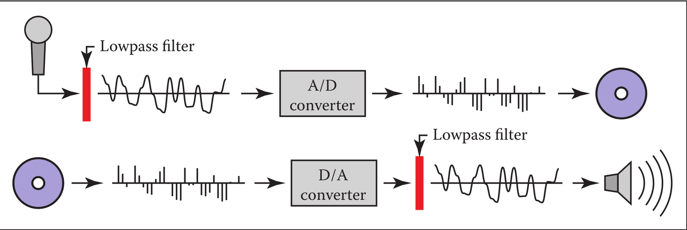

<center>图 9.1 数字音频中的采样和重建。</center>

&emsp;&emsp;在录音中，麦克风将声音（以压力波形式存在于空气中）转换为随时间变化的电压，相当于测量麦克风所在位置的气压变化。 这种电信号需要以某种方式存储，以便在以后播放并发送到扬声器，扬声器通过与电压同步移动隔膜将电压转换回压力波。

&emsp;&emsp;记录音频信号的数字方法（图 9.1）使用采样：模数转换器（A/D 转换器，或 ADC）每秒测量电压数千次，生成可轻松存储的整数流 在任意数量的媒体上，例如录音室计算机上的磁盘，或传输到另一个位置，例如便携式音频播放器中的内存。 在播放时，数据以适当的速率读出并发送到数模转换器（D/A 转换器或 DAC）。 DAC 根据它接收到的数字产生电压，并且，如果我们采取足够的样本来公平地表示电压的变化，那么最终的电信号就所有实际目的而言都与输入相同。

&emsp;&emsp;事实证明，获得良好再现效果所需的每秒采样数取决于我们尝试录制的声音的高音。 如果我们尝试录制短笛或钹，那么适合再现弦乐贝司或底鼓的采样率会产生奇怪的结果； 但是这些声音以更高的采样率再现得很好。 为避免这些低采样失真，数字录音机对 ADC 的输入进行过滤，以去除可能导致问题的高频。

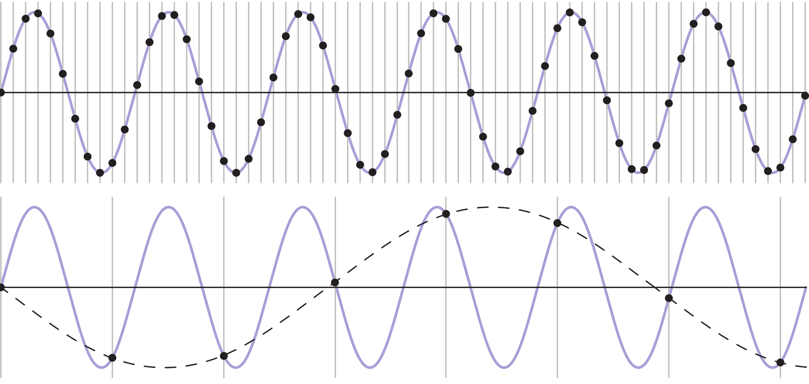

<center>图 9.2  以两种不同速率采样的正弦波（蓝色曲线）。顶部：在高采样率下，生成的样本（黑点）很好地代表了信号。 底部：较低的采样率会产生模棱两可的结果：样本与采样频率低得多的波（虚线）所产生的结果完全相同。</center>

### 9.1.1 采样失真和走样 Sampling Artifacts and Aliasing

数字音频记录链可以作为图形中发生的采样和重建过程的具体模型。 同样的低采样和重建失真也发生在图像或图形中的其他采样信号中，解决方案是相同的：在采样之前过滤，在重建期间再次过滤。

&emsp;&emsp;图 9.2 显示了可能因采样频率过低而产生的失真类型的具体示例。 在这里，我们使用两种不同的采样频率对简单的正弦波进行采样：顶部每个周期 10.8 个采样，底部每个周期采样 1.2 个。 较高的速率产生一组明显能很好地捕获信号的样本，但由较低采样率产生的样本与低频正弦波的样本无法区分——事实上，面对这组样本，低频正弦波似乎更有可能被解释。

&emsp;&emsp;采样完成后，就不可能知道两个信号中的哪一个（快正弦波或慢速正弦波）是原始信号，因此没有一种方法可以在这两种情况下正确地重建信号。 由于高频信号“假装”为低频信号，因此这种现象称为走样。

&emsp;&emsp;每当采样和重建中的缺陷导致出现频率惊人的失真时，就会出现走样。 在音频中，走样采用听起来奇怪的额外音调的形式——10KHz 的铃声，在以 8KHz 采样后变成 6KHz 的音调。 在图像中，混叠通常采用莫尔图案的形式，这是由样本网格与图像中的规则特征相互作用产生的，例如图 9.34 中的百叶窗。

&emsp;&emsp;合成图像中的另一个走样示例是熟悉的仅用黑白像素渲染的直线上的阶梯（图 9.34）。 这是小尺度特征（线条的锐利边缘）在不同尺度上产生走样 的示例（对于浅坡线条，楼梯台阶很长）。

采样和重构的基本问题可以简单地根据特征过小或过大来理解，但一些更定量的问题更难回答：

- 采样率需要达到多高才能确保获得良好的结果？
- 什么样的滤波器适合采样和重构？
- 需要多大程度的平滑才能避免走样？

对这些问题的可靠回答将不得不等到我们在第9.5节中充分理解了理论之后才能得到。

## 9.2 卷积 Convolution

在我们讨论采样和重建算法之前，我们将首先检查它们所基于的数学概念——卷积。 卷积是一个简单的数学概念，它是用于采样、过滤和重建的算法的基础。 这也是我们将在本章后面分析这些算法的基础。

&emsp;&emsp;卷积是对函数的一种操作：它取两个函数并将它们结合起来，产生一个新的函数。在本书中，卷积运算符用星号表示：对函数f和g进行卷积的结果是$f \star g$。我们说f与g卷积，$f \star g$是f和g的卷积。

&emsp;&emsp;卷积可以应用于连续函数（为任何实参数 x 定义的函数 f (x)）或离散序列（仅为整数参数 i 定义的函数 a[i]）。 它还可以应用于在一维、二维或更高维域上定义的函数（即具有一个、两个或多个参数的函数）。 我们将首先从离散的一维情况开始，然后继续讨论连续函数和二维和三维函数。

&emsp;&emsp;为方便定义，我们通常假设函数的域永远存在，当然在实践中它们必须停在某个地方，我们必须以特殊的方式处理端点。

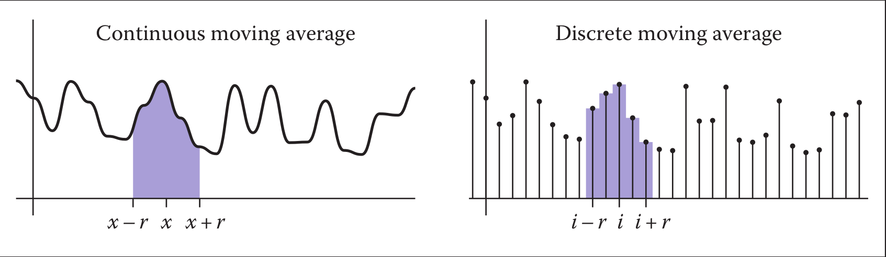

<center>图 9.3  使用移动平均线平滑。</center>

### 9.2.1 移动平均线 Moving Averages

&emsp;&emsp;要了解卷积的基本情况，请考虑使用移动平均值平滑一维函数的示例（图 9.3）。 为了在任何点获得平滑的值，我们计算函数在每个方向上延伸距离 r 的范围内的平均值。 距离 r，称为平滑操作的半径，是控制发生多少平滑的参数。

&emsp;&emsp;对于离散或连续函数，我们可以用数学方法说明这个想法。 如果我们平滑一个连续函数 g(x)，平均意味着在一个区间上对 g 进行积分，然后除以该区间的长度：

$$ h(x) = \frac{1}{2r} \int_{x-r} ^ {x+r} g(t) dt $$

&emsp;&emsp;另一方面，如果我们要平滑离散函数 a[i]，平均意味着将一系列索引的 a 相加并除以值的数量：

$$c[i] = \frac{1}{2r+1}\displaystyle\sum_{j=i-r}^{i+r}a[j]$$

&emsp;&emsp;在每种情况下，都选择了归一化常数，以便如果我们平滑一个常数函数，结果将是相同的函数。

&emsp;&emsp;这种移动平均线的思想是卷积的本质； 唯一的区别是在卷积中移动平均是加权平均。

### 9.2.2 离散卷积 Discrete Convolution

我们将从卷积的最具体情况开始：将离散序列 a[i] 与另一个离散序列 b[i] 进行卷积。 结果是离散序列 $(a \star b)[i]$。 这个过程就像用移动平均值平滑 a 一样，但这次不是对距离 r 内的所有样本均等加权，而是使用第二个序列 b 为每个样本赋予权重（图 9.4）。 值 b[i − j] 给出了位置 j 处样本的权重，该位置距离我们正在评估卷积的索引 i 的距离为 i − j。 这里是（a * b）的定义，用公式表示：

$$(a \star b)[i] = \displaystyle\sum_{i} a[j]b[i-j] \tag{9.2}$$  

通过省略 j 的界限，我们表明这个和在所有整数上运行（即，从 -∞ 到 +∞）。 图 9.4 说明了如何计算一个输出样本，使用$b = \frac{1}{16}[...,0,1,4,6,4,1,0]$的示例，即 $b[0] = \frac{6}{16}，a[\pm1]=\frac{4}{16}$等等。

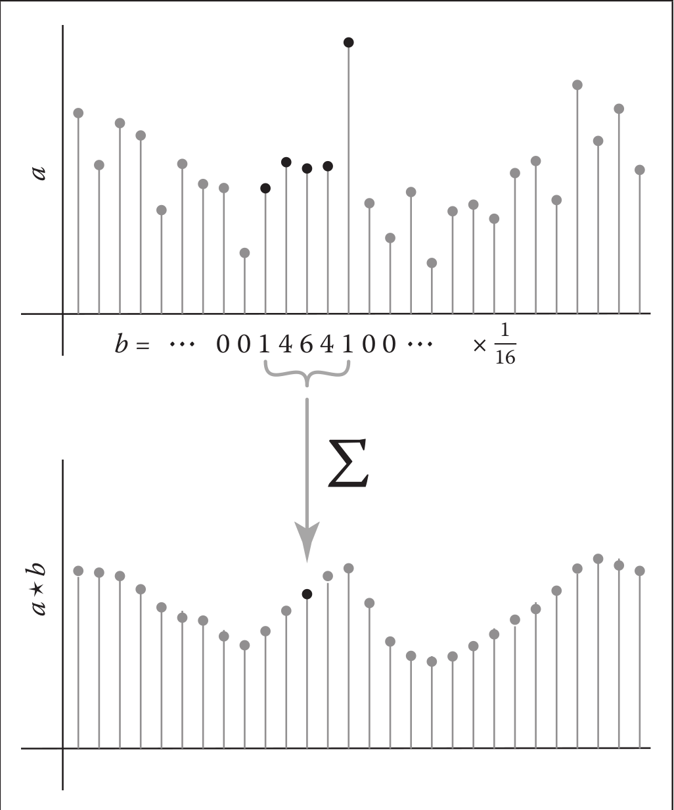

<center>图 9.4  计算序列 a 与支持五个样本宽度的滤波器 b 的离散卷积中的一个值。 $a \star b$ 中的每个样本都是 a 中附近样本的平均值，加权为b 的值。</center>
&emsp;&emsp;在图形中，两个函数之一通常具有有限支持（如图 9.4 中的示例），这意味着它仅在参数值的有限区间内为非零。 如果我们假设 b 有有限的支持，那么有一些半径 r 使得当 |k| 时 b[k]=0 > 河。 在这种情况下，我们可以将上面的总和写为

$$(a \star b[i] = \sum_{j=i-r}^{i+r} a[j]b[i-j]),$$

我们可以将代码中的定义表示为
```lua
function convolve(sequence a, filter b, int i)
       s = 0
       r = b.radius
       for j = i − r to i + r do
       s = s + a[j]b[i − j]
return s
```
<b><font color=#334ea4>卷积滤波器Convolution Filters</font></b>
卷积很重要，因为我们可以使用它来执行过滤。 回顾我们的第一个过滤示例，移动平均线，我们现在可以将平滑操作重新解释为与特定序列的卷积。 当我们计算某个有限范围内的指数的平均值时，这与对范围内的所有点进行相同的加权并用零对其余点进行加权是相同的。 这种滤波器在非零区间内具有恒定值，称为箱形滤波器（box filter因为如果您绘制它的图形，它看起来像一个矩形 - 参见图 9.5）。 对于半径为 r 的盒式滤波器，权重为$1/(2r + 1)$ ：

$$b[k]=\Bigm\lbrace_{0 \quad otherwise.}^{\frac{1}{2r+1}\quad -r\leq k \leq r,}$$

如果将此滤波器代入方程（9.2），您会发现它简化为方程（9.1）中的移动平均线。

<div align=center>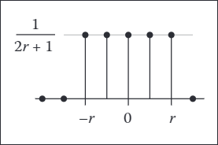</div>
<center>图 9.5 离散盒式滤波器</center>

&emsp;&emsp;如本例所示，卷积滤波器通常设计为总和为 1。这样，它们不会影响信号的整体电平。
示例（盒式和步骤的卷积）。 对于一个简单的滤波示例，让信号为阶跃函数
$$a[i]=\Bigm\lbrace_{0 \quad i \, < \, 0 ,}^{1 \quad i \, \geq \, 0,}$$

滤波器是以零为中心的五点盒式滤波器，
$$b[k]=\frac{1}{5}\Bigm\lbrace_{0 \quad otherwise.}^{1 \quad -2 \, \leq \, k \, \leq \, 2,}$$
<div align=center>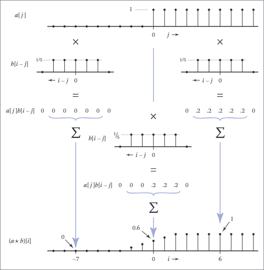</div>
<center>图9.6 盒函数与阶跃函数的离散卷积。</center>

卷积a和b的结果是什么？ 如图 9.6 所示，在特定索引i处，结果是从 i - 2 到 i + 2 范围内的阶跃函数的平均值。 如果 i < -2，我们对所有零进行平均，结果为零。 如果 i ≥ 2，我们对所有的取平均值，结果为 1。 中间有 i + 3 个，产生值$\frac{i+3}{5}$输出是一个线性斜坡，在五个样本中从 0 变为 1：$\frac{1}{5}$ [. . . , 0, 0, 1, 2, 3, 4, 5, 5, . . . ]。

<b><font color=#334ea4>卷积的性质Properties of Convolution</font></b>

到目前为止，我们编写它的方式，卷积看起来像是一个不对称操作：a 是我们要平滑的序列，b 提供权重。 但是卷积的一个很好的特性是它实际上并没有任何区别：滤波器和信号是可以互换的。 要看到这一点，只需重新考虑等式 (9.2) 中的总和，其中索引从滤波器 b 的原点计数，而不是从 a 的原点计数。 也就是说，我们将 j 替换为 i - k。 这种变量变化的结果是
$$
\begin{aligned}
(a \star b)[i] &=\sum_{k} a[i-k] b[i-(i-k)] \\
&=\sum_{k} b[k] a[i-k] .
\end{aligned}
$$


&emsp;&emsp;这与等式 (9.2) 完全相同，但 a 充当滤波器，b 充当信号。所以对于任何序列a和b，$(a\star b)=(b\star a)$，我们说卷积是一个交换运算。

&emsp;&emsp;更一般地说，卷积是一种“类似乘法”的操作。就像数字或函数的乘法或加法一样，参数的顺序和括号的位置都不会影响结果。此外，卷积以与乘法相同的方式与加法相关。准确地说，卷积是可交换的和可结合的，并且是可分配的。
<center>

可交换的: $(a \star b)[i]=(b \star a)[i]$

可结合的: $(a \star(b \star c))[i]=((a \star b) \star c)[i]$

可分配的: $(a \star(b+c))[i]=(a \star b+a \star c)[i]$

</center>

如果我们将卷积视为乘法，这些属性是非常自然的，并且它们很容易了解，因为它们可以通过在我们实际计算卷积之前简化卷积来帮助我们节省工作量。例如，假设我们想取一个序列 a 并用三个滤波器 b1、b2 和 b3 对它进行卷积——也就是说，我们想要 $\left(\left(a \star b_{1}\right) \star b_{2}\right) \star b_{3}$。如果序列很长并且滤波器很短（即它们具有小半径），首先将三个滤波器卷积在一起（计算 $b_{1} \star b_{2} \star b_{3}$）然后将结果与信号进行卷积，计算 $a \star\left(b_{1} \star b_{2} \star b_{3}\right)$，我们从关联性中知道给出了相同的结果。

&emsp;&emsp;一个非常简单的滤波器用作离散卷积的标识：它是半径为零的离散滤波器，或序列 d[i] = . . . , 0, 0, 1, 0, 0, . . . （图 9.7）。如果我们将 d 与信号 a 进行卷积，则和中将只有一个非零项：

<div align=center>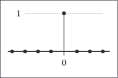</div>
<center>图9.7 离散身份滤波器。</center>

&emsp;&emsp;一个非常简单的滤波器用作离散卷积的标识：它是半径为零的离散滤波器，或序列 d[i] = 。 . . , 0, 0, 1, 0, 0, . . . （图 9.7）。如果我们将 d 与信号 a 进行卷积，则和中将只有一个非零项：

$$\begin{aligned}(a \star d)[i] &=\sum_{j=i}^{j=i} a[j] d[i-j] \\ &=a[i] \end{aligned}$$

很明显，将 a 与 d 卷积只会再次返回 a。序列 d 称为离散内冲。它有时在表示滤波器时很有用：例如，用滤波器 b 对信号 a 进行平滑然后从原始信号中减去该信号的过程可以表示为使用滤波器 d -b 的单个卷积：

$$c=a-a \star b=a \star d-a \star b=a \star(d-b)$$

### 9.2.3 卷积作为移位滤波器的和 Convolution as a Sum of Shifted Filters
还有另一种完全等效的解释方程（9.2）的方法。一次查看 $a \star b$ 的样本会导致我们已经看到的加权平均解释。但是如果我们省略 [i]，我们可以将总和视为将整个序列加在一起。完成这项工作需要一个符号：如果 b 是一个序列，那么向右移动 j 个位置的相同序列称为 $b_{\rightarrow j}$（图 9.8）：

$$b_{\rightarrow j}[i]=b[i-j]$$

<div align=center>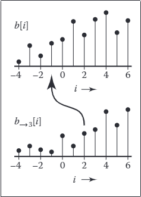</div>

<center>

图9.8 移动一个序列b得到$b_{\rightarrow j}$。

</center>

这样看，卷积是 b 的移位副本的总和，由 a 的条目加权（图 9.9）。由于可交换性，我们可以选择 a 或 b 作为滤波器；如果我们选择 b，那么我们将为输入中的每个样本添加一个滤波器副本。

<div align=center>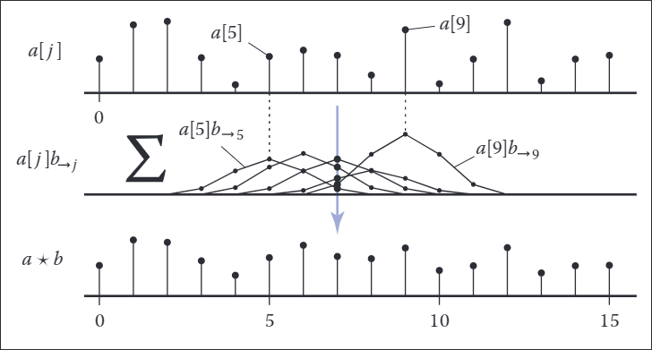</div>

<center>

图9.9 离散卷积作为滤波器移位副本的总和。

</center>

### 9.2.4 连续函数卷积 Convolution with Continuous Functions

虽然离散序列确实是我们在计算机程序中实际使用的，但这些采样序列应该代表连续函数，而且我们通常需要对连续函数进行数学推理，以便弄清楚要做什么。因此，定义连续函数之间以及连续函数和离散函数之间的卷积很有用。

&emsp;&emsp;两个连续函数的卷积是等式 (9.2) 的明显推广，用积分代替总和：

$$(f \star g)(x)=\int_{-\infty}^{+\infty} f(t) g(x-t) d t \tag{9.3}$$

解释这个定义的一种方法是，在参数 x 处计算的 f 和 g 的卷积是在我们移动 g 以使 g(0) 与 f(t ）。就像在离散情况下一样，卷积是一个移动平均值，滤波器为平均值提供权重（见图 9.10）。

<div align=center>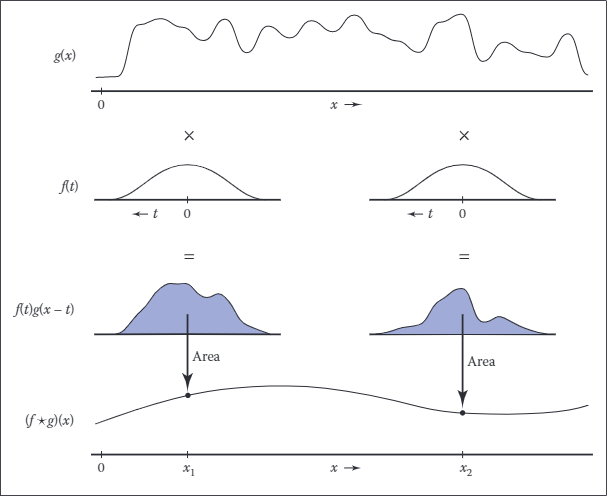</div>

<center>

图9.10 连续卷积。

</center>

&emsp;&emsp;像离散卷积一样，连续函数的卷积是可交换的和关联的，并且是可分配的。同样与离散情况一样，连续卷积可以看作是滤波器副本的总和，而不是加权平均值的计算。除了，在这种情况下，滤波器 g 有无限多个副本

$$(f \star g)=\int_{-\infty}^{+\infty} f(t) g_{\rightarrow t} d t$$

示例（两个框函数的卷积）。设 f 为盒函数：

$$f(x)= \begin{cases}1 & -\frac{1}{2} \leq x<\frac{1}{2} \\ 0 & \text { otherwise }\end{cases}$$

那么$f \star f$是什么？定义（公式 9.3）给出

$$(f \star f)(x)=\int_{-\infty}^{\infty} f(t) f(x-t) d t$$

图 9.11 显示了这个积分的两种情况。当 x ≤ − 1 或 x ≥ 1 时，这两个框可能有零重叠；在这种情况下，结果为零。当−1 < x < 1时，重叠取决于两个框之间的距离，即|x|；结果是 1 -| x|。所以

$(f \star f)(x)= \begin{cases}1-|x| & -1<x<1 \\ 0 & \text { otherwise }\end{cases}$

这个函数，称为tent function，是另一个常见的滤波器（参见第 9.3.1 节）。

<div align=center>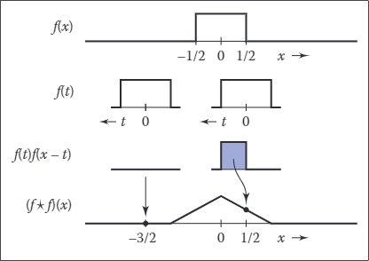</div>

<center>

图9.11 卷积两个盒子产生一个三角波形（tent function）。

</center>

<b><font color=#334ea4>

狄拉克$\delta$函数The Dirac Delta Function

</font></b>

在离散卷积中，我们看到离散脉冲 d 充当恒等式：$d \star a=a$。在连续情况下，还有一个恒等函数，称为狄拉克脉冲或狄拉克$\delta$函数，记为$\delta(x)$。

<div align=center>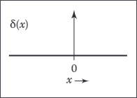</div>

<center>

图 9.12。狄拉克$\delta$函数 δ(x)

</center>


&emsp;&emsp;直观地说，delta 函数是一个非常窄、非常高的尖峰，其宽度非常小，但面积仍然等于 1（图 9.12）。 delta 函数的关键定义属性是，将它乘以一个函数会选择恰好为零的值：

$$\int_{-\infty}^{\infty} \delta(x) f(x) d x=f(0)$$

delta 函数在 0 处没有明确定义的值（您可以将其值大致视为 +∞），但对于所有 x •= 0，它确实具有值 δ(x) = 0

<div align=center>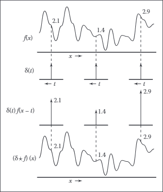</div>
<center>

图 9.13。将函数与 δ(x) 进行卷积会返回相同函数的副本。

</center>

&emsp;&emsp;从这个选择单个值的性质，可以得出 delta 函数是连续卷积的恒等式（图 9.13），因为将 δ 与任何函数 f 卷积都会产生

$$(\delta \star f)(x)=\int_{-\infty}^{\infty} \delta(t) f(x-t) d t=f(x)$$

所以$\delta \star f=f$（并且由于交换性 $f \star \delta=f$ 也是）。

### 9.2.5 离散-连续卷积

有两种方法可以连接离散世界和连续世界。一种是采样：我们通过在所有整数参数处写下函数的值并忘记其余的来将连续函数转换为离散函数。给定一个连续函数 $f(x)$，我们可以对其进行采样以转换为离散序列 a[i]

$$a[i]=f(i)$$

反过来，从离散函数或序列到连续函数，称为重构。这是使用另一种形式的卷积来完成的，即离散连续形式。在这种情况下，我们使用连续滤波器 f(x) 对离散序列 a[i] 进行滤波：

$(a \star f)(x)=\sum_{i} a[i] f(x-i)$

x 处的重构函数 $a \star f$ 的值是 x 附近 i 值的样本 a[i] 的加权和（图 9.14）。权重来自滤波器 f，它在一组相隔一个单位的点上进行评估。例如，如果 x = 5 .3 且 f 的半径为 2，则 f 的计算值为 1.3、0.3、-0.7 和 -1.7。请注意，对于离散连续卷积，我们通常首先编写序列，然后编写滤波器，以便总和超过整数。

<div align=center>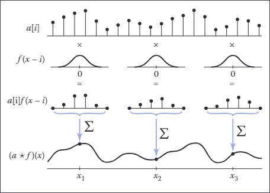</div>
<center>

图 9.14 离散连续卷积。

</center>

&emsp;&emsp;与离散卷积一样，如果我们知道滤波器的半径 r，我们可以对总和设置界限，消除 x 和 i 之间的差异至少为 r 的所有点

$(a \star f)(x)=\sum_{i=\lceil x-r\rceil}^{\lfloor x+r\rfloor} a[i] f(x-i)$

请注意，如果一个点正好落在与 x 的距离 r 处（即，如果 x -r 结果是一个整数），它将被排除在总和之外。这与离散情况相反，我们在 i -r 处包括点。
&emsp;&emsp;用代码表示为：
```lua
function reconstruct(sequence a, filter f, real x)
       s = 0 
       r = f.radius
       for i = [x − r] to ]x + r] do
              s = s + a[i]f(x − i)
       return s
```

&emsp;&emsp;与其他形式的卷积一样，离散连续卷积可以看作是对滤波器的移位副本求和（图 9.15）：

$(a \star f)=\sum_{i} a[i] f_{\rightarrow i}$

<div align=center>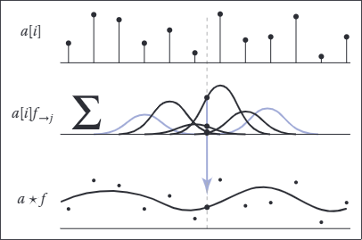</div>
<center>

图 9.15。重构（离散-连续卷积）作为滤波器移位副本的总和。

</center>

离散连续卷积与样条曲线密切相关。对于均匀样条（例如均匀 B 样条），样条的参数化曲线正是样条的基函数与控制点序列的卷积（参见第 15.6.2 节）。

### 9.2.6 多维卷积 Convolution in More Than One Dimension

到目前为止，我们所说的关于采样和重建的一切都是一维的：存在单个变量 x 或单个序列索引 i。然而，图形中采样和重建的许多重要应用都应用于二维函数——尤其是二维图像。幸运的是，采样算法和理论从 1D 到 2D、3D 等的推广在概念上非常简单。

&emsp;&emsp;从离散卷积的定义开始，我们可以通过将和变为双和来将其推广到二维：

$$(a \star b)[i, j]=\sum_{i^{\prime}} \sum_{j^{\prime}} a\left[i^{\prime}, j^{\prime}\right] b\left[i-i^{\prime}, j-j^{\prime}\right]$$

<div align=center>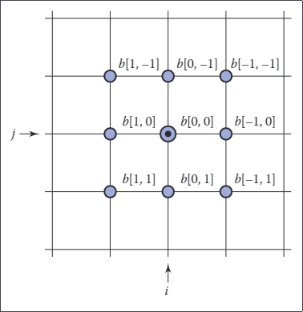</div>
<center>

图 9.16。九个输入样本的权重，这些样本有助于点 (i, j) 的离散卷积，滤波器 b 的半径为 1。


</center>

如果 b 是一个半径为 r 的有限支持滤波器（即，它有 (2r + 1) 2 个值），那么我们可以写出这个有界的和（图 9.16）：

$$(a \star b)[i, j]=\sum_{i^{\prime}=i-r}^{i+r} \sum_{j^{\prime}=j-r}^{j+r} a\left[i^{\prime}, j^{\prime}\right] b\left[i-i^{\prime}, j-j^{\prime}\right]$$

并用代码表示：
```lua
function convolve2d(sequence2d a, filter2d b, int i, int j)
       s = 0 
       r = b.radius
       for i′ = i − r to i + r do
              for j′ = j − r to j + r do
                     s = s + a[i′][j′]b[i − i′][j − j′]
       return s
```

&emsp;&emsp;这个定义可以用与 1D 情况相同的方式来解释：每个输出样本是输入中某个区域的加权平均值，使用 2D 滤波器作为“掩码”来确定平均值中每个样本的权重。
&emsp;&emsp;继续概括，我们也可以在 2D 中编写连续-连续（图 9.17）和离散-连续（图 9.18）卷积：

$$(f \star g)(x, y)=\iint f\left(x^{\prime}, y^{\prime}\right) g\left(x-x^{\prime}, y-y^{\prime}\right) d x^{\prime} d y^{\prime} ;$$
$$(a \star f)(x, y)=\sum_{i} \sum_{j} a[i, j] f(x-i, y-j) .$$

<div align=center>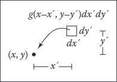</div>
<center>

图 9.17 输入信号中由 (x, y) 处的连续卷积产生的无穷小区域的权重。

</center>

在每种情况下，特定点的结果是该点附近输入的加权平均值。对于连续-连续情况，它是以该点为中心的区域上的加权积分，而在离散-连续情况下，它是落在该点附近的所有样本的加权平均值。

<div align=center>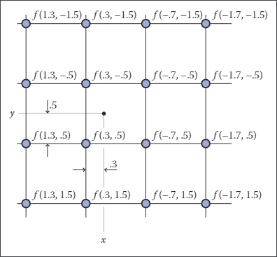</div>
<center>

图 9.18 对于半径为 2 的重建滤波器，16 个输入样本的权重有助于在点 (x, y) 处进行离散连续卷积。

</center>

一旦我们从 1D 到 2D，应该相当清楚如何进一步推广到 3D 甚至更高维度。

## 9.3 卷积滤波器 Convolution Filters
现在我们有了卷积机制，让我们来看看图形中常用的一些特殊滤波器。
&emsp;&emsp;以下每个滤波器都有一个自然半径，这是当样本间隔一个单位时用于采样或重建的默认大小。在本节中，滤波器被定义为这个自然大小：例如，盒子滤波器的自然半径为$\frac{1}{2}$ ，立方滤波器的自然半径为2。我们还安排每个滤波器积分为 1：$\int_{x=0}^{\infty} f(x) d x=1$ ，在不改变信号平均值的情况下进行采样和重构。
&emsp;&emsp;正如我们将在第 9.4.3 节中看到的，一些应用程序需要不同大小的滤波器，这可以通过缩放基本滤波器来获得。对于滤波器$f(x)$，我们可以定义一个版本的 scale s：

$$f_{s}(x)=\frac{f(x / s)}{s}$$

滤波器水平拉伸 s 倍，然后垂直挤压 $\frac{1}{s}$倍，使其面积不变。一个自然半径为 r 并在尺度 s 上使用的滤波器的支撑半径为 sr（参见下面的图 9.20）。

### 9.3.1 卷积滤波器建筑 A Gallery of Convolution Filters

<b><font color=#334ea4>盒子滤波器The Box Filter</font></b>

盒子滤波器（图 9.19）是一个分段常数函数，其积分等于 1。作为离散滤波器，它可以写成

$$a_{\mathrm{box}, r}[i]= \begin{cases}1 /(2 r+1) & |i| \leq r \\ 0 & \text { otherwise }\end{cases}$$

请注意，为了对称，我们包括两个端点。

&emsp;&emsp;作为一个连续滤波器，我们写

$$f_{\text {box }, r}(x)= \begin{cases}1 /(2 r) & -r \leq x<r \\ 0 & \text { otherwise }\end{cases}$$

<div align=center>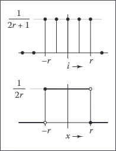</div>
<center>

图 9.19 输入信号中由 (x, y) 处的连续卷积产生的无穷小区域的权重。

</center>

在这种情况下，我们排除了一个端点，这使得半径为 0.5 的框可用作重建滤波器。正是因为盒子滤波器是不连续的，所以这些边界情况很重要，因此对于这个特定的滤波器，我们需要注意它们。对于$r=\frac{1}{2}$的自然半径，我们只写$f_{\text {box }}$。


<b><font color=#334ea4>帐篷滤波器The Tent Filter</font></b>

tent 或线性滤波器（图 9.20）是一个连续的分段线性函数：

$$f_{\text {tent }}(x)= \begin{cases}1-|x| & |x|<1 \\ 0 & \text { otherwise }\end{cases}$$

<div align=center>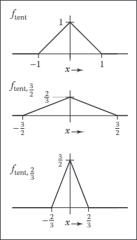</div>
<center>

图 9.20 帐篷过滤器和两个缩放版本。

</center>

它的自然半径是 1。对于像这个这样的过滤器，它至少是$C^{0}$（也就是说，值没有突然的跳跃，就像盒子一样），我们不再需要分开定义离散和连续滤波器：离散滤波器只是以整数采样的连续滤波器。

<b><font color=#334ea4>高斯滤波器The Gaussian Filter</font></b>
高斯函数（图 9.21）也称为正态分布，在理论上和实践上都是一个重要的滤波器。随着本章的进行，我们将看到更多它的特殊属性：

$$f_{g}, \sigma(x)=\frac{1}{\sigma \sqrt{2 \pi}} e^{-x^{2} / 2 \sigma^{2}}$$

<div align=center>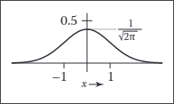</div>
<center>

图 9.21 高斯滤波器

</center>

参数 σ 称为标准差。 Gaussian 是一个很好的采样滤波器，因为它非常平滑；我们将在本章后面更准确地说明这一说法。


&emsp;&emsp;高斯滤波器没有任何特定的自然半径；它是 σ 范围内有用的采样滤波器。高斯也没有有限的支持半径，尽管由于指数衰减，它的值迅速变得小到可以忽略。然后，在必要时，我们可以通过在某个半径 r 之外将其设置为零来修剪函数的尾部，从而得到修剪后的高斯函数。这意味着滤波器的宽度和自然半径可以根据应用而有所不同，并且按 s 缩放的修剪高斯与具有标准偏差 sσ 和半径 sr 的未缩放修剪高斯相同。在实践中处理此问题的最佳方法是将 σ 和 r 设置为过滤器的属性，在指定过滤器时固定，然后在应用时像其他任何过滤器一样缩放过滤器。

<b><font color=#334ea4>B样条三次滤波器The B-Spline Cubic Filter</font></b>

许多滤波器被定义为分段多项式，四片（自然半径为 2）的三次滤波器通常用作重建滤波器。一种这样的滤波器被称为 B 样条滤波器（图 9.22），因为它起源于样条曲线的混合函数（参见第 15 章）：

$$f_{B}(x)=\frac{1}{6}\left\{\begin{array}{ll}
-3(1-|x|)^{3}+3(1-|x|)^{2}+3(1-|x|)+1 & -1 \leq x \leq 1, \\
(2-|x|)^{3} & 1 \leq|x| \leq 2, \\
0 & \text { otherwise }
\end{array}\right.$$

在分段三次中，B 样条是特殊的，因为它具有连续的一阶和二阶导数——即$C^2$。定义这个滤波器的更简洁的方法是$f_{B}=f_{\mathrm{bOx}} \star f_{\mathrm{bOx}} \star f_{\mathrm{bOx}} \star f_{\mathrm{bOx}}$；证明上面的较长形式是等价的是卷积的一个很好的练习（参见练习 3）。

<div align=center>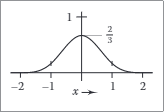</div>
<center>

图 9.22 B样条三次滤波器

</center>

<b><font color=#334ea4>Catmull-Rom三次过滤器The Catmull-Rom Cubic Filter</font></b>

另一个以样条线命名的分段三次滤波器，Catmull-Rom 滤波器（图 9.23），在 x = -2、-1、1 和 2 处的值为零，这意味着当用作重建滤波器时，它将对样本进行插值（第 9.3.2 节）：

$$f_{C}(x)=\frac{1}{2}\left\{\begin{array}{ll}
-3(1-|x|)^{3}+4(1-|x|)^{2}+(1-|x|) & -1 \leq x \leq 1 \\
(2-|x|)^{3}-(2-|x|)^{2} & 1 \leq|x| \leq 2 \\
0 & \text { otherwise }
\end{array}\right.$$

<div align=center>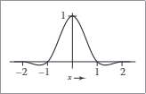</div>
<center>

图 9.23 Catmull-Rom 过滤器。

</center>

<b><font color=#334ea4>Mitchell-Netravali 三次滤波器The Mitchell-Netravali Cubic Filter</font></b>

对于重采样图像的最重要应用，Mitchell 和 Netravali (Mitchell & Netravali, 1988) 对三次过滤器进行了研究，并推荐前两种过滤器之间的中间过滤器作为最佳综合选择（图 9.24）。它只是前两个过滤器的加权组合：

$$\begin{aligned}
f_{M}(x) &=\frac{1}{3} f_{B}(x)+\frac{2}{3} f_{C}(x) \\
&=\frac{1}{18}\left\{\begin{array}{ll}
-21(1-|x|)^{3}+27(1-|x|)^{2}+9(1-|x|)+1 & -1 \leq x \leq 1, \\
7(2-|x|)^{3}-6(2-|x|)^{2} & 1 \leq|x| \leq 2, \\
0 & \text { otherwise } .
\end{array}\right.
\end{aligned}$$

<div align=center></div>
<center>

图 9.24 Mitchell-Netravali 过滤器。

</center>


### 9.3.2 过滤器的属性Properties of Filters
过滤器有一些与之配套的传统术语，我们用它来描述过滤器并将它们相互比较。
&emsp;&emsp;滤波器的脉冲响应只是该函数的另一个名称：它是滤波器对只包含一个脉冲的信号的响应（回想一下，与脉冲卷积只会返回滤波器）。
&emsp;&emsp;如果连续滤波器用于从离散序列重构连续函数时，如果得到的函数准确地采用样本点处的样本值，那么它就是插值——也就是说，它“连接点”而不是产生一个只在点附近的函数。插值滤波器正是那些 f(0) = 1 和 f(i) = 0 对于所有非零整数 i 的滤波器 f（图 9.25）。

<div align=center>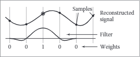</div>
<center>

图 9.25。插值滤波器准确地重构样本点，因为它在距中心的所有非零整数偏移处都具有零值。

</center>

&emsp;&emsp;采用负值的过滤器具有振铃或过冲：它会在被过滤函数值的急剧变化周围产生额外的值振荡。
&emsp;&emsp;例如，Catmull-Rom 滤波器在两侧都有负波瓣，如果用它过滤阶跃函数，它会稍微夸大阶跃，导致函数值低于 0 和高于 1（图 9.26）。

<div align=center>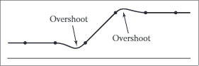</div>
<center>

图 9.26。在过滤或重建尖锐的不连续性时，具有负瓣的滤波器总是会产生一些过冲。

</center>

&emsp;&emsp;一个连续滤波器是无波纹的，如果在用作重构滤波器时，它将一个常数序列重构为一个常数函数（图 9.27）。这等效于在任何整数间隔网格上过滤器总和为 1 的要求：

$$\sum_{i} f(x+i)=1 \quad \text { for all } x$$

<div align=center>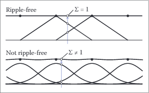</div>
<center>

图 9.27。半径为 1 的 tent 滤波器是一个无波纹重构滤波器；标准差为 1/2 的高斯滤波器不是。

</center>

第 9.3.1 节中的所有滤波器在其自然半径处都是无波纹的，除了高斯，但当它们以非整数尺度使用时，它们都不一定是无波纹的。如果需要消除离散连续卷积中的波纹，这样做很容易：将每个计算的样本除以用于计算它的权重之和：

$$(\overline{a \star f})(x)=\frac{\sum_{i} a[i] f(x-i)}{\sum_{i} a[i]} \tag{9.4}$$

这个表达式仍然可以解释为 a 和滤波器 f 之间的卷积（参见练习 6）。


&emsp;&emsp;连续滤波器具有一定程度的连续性，它是随处定义的最高阶导数。一个过滤器，比如盒子过滤器，它的值有突然的跳跃，它根本不是连续的。一个连续但有尖角（一阶导数不连续）的滤波器，例如帐篷滤波器，其连续性阶数为零，我们说它是 C0。一个具有连续导数（没有尖角）的滤波器，例如上一节中的分段三次滤波器，是 C1；如果它的二阶导数也是连续的，就像 B 样条滤波器一样，它是 C2。滤波器的连续性顺序对于重构滤波器尤为重要，因为重构函数继承了滤波器的连续性。

<b><font color=#334ea4>可分离过滤器Separable Filters</font></b>

到目前为止，我们只讨论了一维卷积的滤波器，但对于图像和其他多维信号，我们也需要滤波器。通常，任何 2D 函数都可以是 2D 过滤器，有时以这种方式定义它们很有用。但是，在大多数情况下，我们可以从我们已经看到的 1D 过滤器构建合适的 2D（或更高维）过滤器。

最有用的方法是使用可分离过滤器。在特定 x 和 y 处的可分离滤波器$f_{2}(x, y)$的值只是在 x 和 y 处评估的$f_1$（一维滤波器）的乘积

$$f_{2}(x, y)=f_{1}(x) f_{1}(y) .$$

同样，对于离散滤波器，

$$b_{2}[i, j]=b_{1}[i] b_{1}[j]$$

通过$f_2$的任何水平或垂直切片都是$f_1$的缩放副本。 $f_2$的积分是$f_1$的积分的平方，因此特别是如果$f_1$被归一化，那么$f_2$也是如此。

<div align=center></div>
<center>

图 9.28 可分离的 2D 帐篷过滤器。

</center>

示例（可分离的帐篷过滤器）。如果我们为 f1 选择 tent 函数，得到的分段双线性函数（图 9.28）为

$$f_{2, \text { tent }}(x, y)=\left\{\begin{array}{ll}
(1-|x|)(1-|y|) & |x|<1 \quad \text { and } \quad|y|<1 \\
0 & \text { otherwise }
\end{array}\right.$$

沿坐标轴的轮廓是帐篷函数，但沿对角线的轮廓是二次函数（例如，沿着正象限中的线 x = y，我们看到二次函数$(1 -x)^2）$。

示例（二维高斯滤波器）。如果我们为 f1 选择高斯函数，得到的二维函数（图 9.29）是

$$\begin{aligned}
f_{2, g}(x, y) &=\frac{1}{2 \pi}\left(e^{-x^{2} / 2} e^{-y^{2} / 2}\right), \\
&=\frac{1}{2 \pi}\left(e^{-\left(x^{2}+y^{2}\right) / 2}\right), \\
&=\frac{1}{2 \pi} e^{-r^{2} / 2} .
\end{aligned}$$

请注意，如果我们围绕原点旋转 1D 高斯以产生圆对称函数，这与我们将获得的函数相同（直到比例因子）。同时圆对称和可分的特性是高斯函数所独有的。沿坐标轴的轮廓是高斯的，但沿任何方向的轮廓在距中心的任何偏移处也是如此。

<div align=center>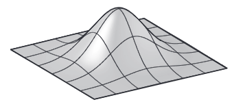</div>
<center>

图 9.29 可分离的 2D 帐篷过滤器。

</center>

&emsp;&emsp;与其他 2D 过滤器相比，可分离过滤器的主要优势在于实施效率。让我们将 a2 的定义代入离散卷积的定义：

$$\left(a \star b_{2}\right)[i, j]=\sum_{i^{\prime}} \sum_{j^{\prime}} a\left[i^{\prime}, j^{\prime}\right] b_{1}\left[i-i^{\prime}\right] b_{1}\left[j-j^{\prime}\right] .$$

注意$b_{1}\left[i-i^{\prime}\right]$不依赖于$j^{\prime}$并且可以从内部和中分解出来：

$$=\sum_{i^{\prime}} b_{1}\left[i-i^{\prime}\right] \sum_{j^{\prime}} a\left[i^{\prime}, j^{\prime}\right] b_{1}\left[j-j^{\prime}\right] .$$

让我们将内部和缩写为$S\left[i^{\prime}\right]$

$$\begin{array}{c}
S\left[i^{\prime}\right]=\sum_{j^{\prime}} a\left[i^{\prime}, j^{\prime}\right] b_{1}\left[j-j^{\prime}\right] \\
\left(a \star b_{2}\right)[i, j]=\sum_{i^{\prime}} b_{1}\left[i-i^{\prime}\right] S\left[i^{\prime}\right]
\end{array}\tag{9.5}$$

使用这种形式的方程，我们可以首先计算并存储$i^\prime$的每个值的$S[i^\prime]$，然后使用这些存储的值计算外和。乍一看，这似乎并不显着，因为我们仍然必须做与$(2r + 1)^2$成比例的工作来计算所有内部和。但是，如果我们想计算多个点 [i, j] 的值，情况就完全不同了。

&emsp;&emsp;假设我们需要计算 [2, 2] 和 [3, 2] 处的$a \star b_{2}$，并且 b1 的半径为 2。检查公式 9.5，我们可以看到我们需要 S[0], 。 . . , S [4] 来计算 [2, 2] 处的结果，我们需要 S[1], . . . , S [5] 计算 [3, 2] 处的结果。因此，在可分离公式中，我们可以只计算 S 的所有六个值并共享 S[1], 。 . . , S [4]（图 9.30）。

<div align=center>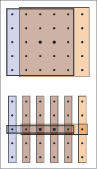</div>
<center>

图 9.30 使用包含 25 个样本的单独二维数组（上图）计算两个输出点，而不是沿着列过滤一次，然后使用包含五个样本的单独一维数组（下图）。

</center>

这种节省对于大型过滤器具有重要意义。在一般情况下，使用半径为 r 的滤波器对图像进行滤波需要每个像素计算$(2 r+1)^{2}$个乘积，而使用相同大小的可分离滤波器对图像进行滤波需要$2(2r + 1)$个乘积（费用为一些中间存储）。渐近复杂度从$O\left(r^{2}\right)$到$O\left(r\right)$的这种变化使得可以使用更大的滤波器。

算法是：

$$\begin{array}{l}
\text { function filterImage(image } I \text {, filter } b \text { ) } \\
r=b \text {.radius } \\
n_{x}=I \text {.width } \\
n_{y}=I \text {.height } \\
\text { allocate storage array } S\left[0 \ldots n_{x}-1\right] \\
\text { allocate image } I_{\text {out }}\left[r \ldots n_{x}-r-1, r \ldots n_{y}-r-1\right] \\
\text { initialize } S \text { and } I_{\text {out }} \text { to all zero } \\
\text { for } j=r \text { to } n_{y}-r-1 \text { do } \\
\text { for } i^{\prime}=0 \text { to } n_{x}-1 \text { do } \\
S\left[i^{\prime}\right]=0 \\
\text { for } j^{\prime}=j-r \text { to } j+r \text { do } \\
S\left[i^{\prime}\right]=S\left[i^{\prime}\right]+I\left[i^{\prime}, j^{\prime}\right] b\left[j-j^{\prime}\right] \\
\text { for } i=r \text { to } n_{x}-r-1 \text { do } \\
\text { for } i^{\prime}=i-r \text { to } i+r \text { do } \\
I_{\text {out }}[i, j]=I_{\text {out }}[i, j]+S\left[i^{\prime}\right] b\left[i-i^{\prime}\right] \\
\text { return } I_{\text {out }}
\end{array}$$

为简单起见，此函数通过从输出图像的所有四个侧面修剪 r 个像素来避免所有边界问题。在实践中，有多种方法可以处理边界；见第 9.4.3 节。

## 9.4 图像信号处理 Signal Processing for Images

到目前为止，我们已经抽象地讨论了采样、滤波和重建，主要使用 1D 信号作为示例。但正如我们在本章开头所观察到的，信号处理在图形中最重要和最常见的应用是采样图像。让我们仔细看看这一切是如何应用于图像的。

### 9.4.1 使用离散过滤器进行图像过滤 Image Filtering Using Discrete Filters

也许卷积最简单的应用是使用离散卷积处理图像。图像处理程序的一些最广泛使用的特性是简单的卷积滤波器。图像模糊可以通过与许多常见的低通滤波器进行卷积来实现，范围从框到高斯（图 9.31）。高斯过滤器会产生非常平滑的模糊效果，通常用于此目的。

&emsp;&emsp;与模糊相反的是锐化，一种方法是使用“反锐化蒙版”程序：从原始图像中减去一部分 α。通过重新调整以避免改变整体亮度，我们有

$$\begin{aligned}
I_{\text {sharp }} &=(1+\alpha) I-\alpha\left(I \star f_{g, \sigma}\right) \\
&=I \star\left((1+\alpha) d-\alpha f_{g, \sigma}\right) \\
&=I \star f_{\text {sharp }}(\sigma, \alpha),
\end{aligned}$$

其中$f_{g, \sigma}$是宽度为$\sigma$的高斯滤波器。利用离散脉冲 d 和卷积的分布特性，我们能够将整个过程写成一个依赖于模糊宽度和锐化程度的单个滤波器（图 9.32）。

<div align=center></div>
<center>

图 9.32。使用卷积滤波器锐化图像。

</center>

组合两个离散过滤器的另一个示例是投影。通常采用模糊的、移动的对象轮廓副本来创建柔和的阴影（图 9.33）。我们可以将移位操作表示为带有偏离中心脉冲的卷积：

$$d_{m, n}(i, j)=\left\{\begin{array}{ll}
1 & i=m \text { and } j=n \\
0 & \text { otherwise. }
\end{array}\right.$$

<div align=center></div>
<center>

图 9.33。使用卷积滤波器锐化图像。

</center>

通过与两个过滤器进行卷积来实现移位，然后是模糊：

$$\begin{aligned}
I_{\text {shadow }} &=\left(I \star d_{m, n}\right) \star f_{g, \sigma} \\
&=I \star\left(d_{m, n} \star f_{g, \sigma}\right) \\
&=I \star f_{\text {shadow }}(m, n, \sigma) .
\end{aligned}$$

在这里，我们使用关联性将两个操作分组为具有三个参数的单个过滤器。

### 9.4.2 图像采样中的抗锯齿 Antialiasing in Image Sampling

在图像合成中，我们经常需要生成图像的采样表示，我们有一个连续的数学公式（或者至少一个我们可以用来计算任何点的颜色的过程，而不仅仅是整数像素位置）。光线追踪是一个常见的例子；更多关于光线追踪和抗锯齿的具体方法在第 4 章。在信号处理的语言中，我们有一个连续的 2D 信号（图像），我们需要在规则的 2D 点阵上对其进行采样。如果我们在没有任何特殊措施的情况下继续对图像进行采样，结果将显示出各种混叠伪影（图 9.34）。在图像的锐利边缘，我们会看到被称为“锯齿”的阶梯状伪影。在有重复图案的区域，我们会看到被称为莫尔 ́e 图案的宽带。
<div align=center>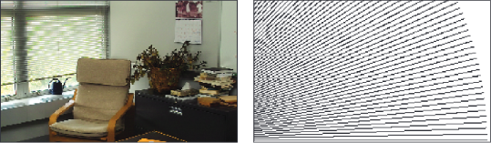</div>
<center>

图 9.34。图像中的两种混叠伪影：周期性纹理中的莫尔图案（左）和直线上的“锯齿”（右）。

</center>

<div align=center>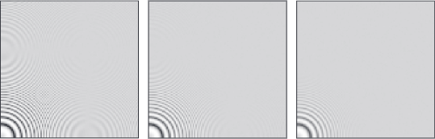</div>
<center>

图 9.35 用于抗锯齿的三个不同采样过滤器的比较一个困难的测试图像，其中包含随着变大而间隔越来越近的圆圈。

</center>


&emsp;&emsp;这里的问题是图像包含太多小尺度特征；我们需要在采样前通过过滤来平滑它。回顾方程（9.3）中连续卷积的定义，我们需要在像素位置周围的区域上对图像进行平均，而不是仅仅取单个点的值。具体方法在第 4 章中讨论。像盒子这样的简单过滤器可以改善锐利边缘的外观，但仍会产生一些莫尔条纹（图 9.35）。非常平滑的高斯滤波器对莫尔条纹图案更有效，但代价是整体更加模糊。这两个示例说明了锐度和混叠之间的权衡，这是选择抗混叠滤波器的基础。

### 9.4.3 重构和重采样 Reconstruction and Resampling

仔细过滤至关重要的最常见的图像操作之一是重采样——改变采样率，或改变图像大小。

&emsp;&emsp;假设我们使用 3000 x 2000 像素大小的数码相机拍摄了一张图像，并且我们希望将其显示在只有 1280 x 1024 像素的监视器上。为了使它适合，在保持 3:2 纵横比的同时，我们需要将其重新采样为 1278 x 852 像素。我们应该怎么做呢？

&emsp;&emsp;解决这个问题的一种方法是将这个过程视为丢弃像素：大小比率在 2 到 3 之间，因此我们必须在保留的像素之间丢弃一两个像素。用这种方法可以缩小图像，但结果质量很低——图 9.34 中的图像是使用像素删除制作的。然而，像素下降非常快，在交互式操作期间预览调整大小的图像是一个合理的选择。

&emsp;&emsp;考虑调整图像大小的方法是重新采样操作：我们想要一组图像在由新图像尺寸定义的特定网格上的样本，我们通过对从输入重建的连续函数进行采样来获得它们样本（图 9.36）。这样看，它只是一系列标准图像处理操作：首先，我们从输入样本中重建一个连续函数，然后我们对该函数进行采样，就像我们对任何其他连续图像进行采样一样。为了避免混叠伪影，需要在每个阶段使用适当的过滤器。

</center>

<div align=center>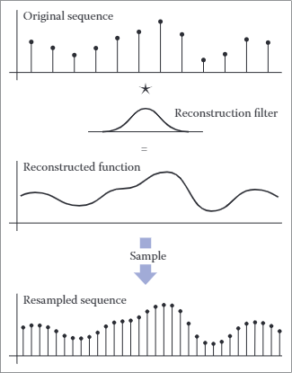</div>
<center>

图 9.36 重新采样图像由两个逻辑步骤组成，这些步骤在代码中组合成一个操作。首先，我们使用重建滤波器从输入样本中定义一个平滑、连续的函数。然后，我们在新网格上对该函数进行采样以获得输出样本。

</center>

&emsp;&emsp;一个小例子如图 9.37 所示：如果原始图像是 12 × 9 像素，而新图像是 8 × 6 像素，则每个维度的输出像素是输入像素的 2/3，因此它们在图像上的间距是原始样本间距的 3/2。

&emsp;&emsp;为了得出每个输出样本的值，我们需要以某种方式计算样本之间图像的值。像素删除算法为我们提供了一种方法：只需获取输入图像中最接近样本的值并将其作为输出值。这完全等同于使用 1 像素宽（半径为二分之一）的框滤波器重建图像，然后进行点采样。

&emsp;&emsp;当然，如果选择像素丢弃或其他非常简单的过滤的主要原因是性能，那么人们永远不会将该方法作为一般重建和重采样过程的特例来实现。事实上，由于不连续性，盒式过滤器很难在通用框架中工作。但是，对于高质量的重采样，重建/采样框架提供了宝贵的灵活性。

</center>

<div align=center>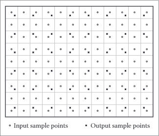</div>
<center>

图 9.36 重新采样 12 x 9 图像以制作 8 x 6 图像时输入和输出网格的采样位置。

</center>

要计算出算法细节，最简单的方法是下拉到 1D 并讨论对序列重新采样。编写实现的最简单方法是根据我们在第 9.2.5 节中定义的重构函数。

$$function resample(sequence  a , float  x_{0} , float  \Delta x , int  n , filter  f  )
create sequence  b  of length  n 
for  i=0  to  n-1  do
 b[i]=\operatorname{reconstruct}\left(a, f, x_{0}+i \Delta x\right) 
return  b$$

参数$x_0$给出了新序列的第一个样本相对于旧序列的样本的位置。也就是说，如果第一个输出样本落在输入序列中样本 3 和 4 的中间，则$x_0$为 3.5。

此过程通过将输入序列与连续滤波器进行卷积来重建连续图像，然后对其进行点采样。这并不是说这两个操作是顺序发生的——连续函数仅在原则上存在，其值仅在样本点处计算。但在数学上，该函数计算函数$a\starf$的一组点样本。

但是，这种点采样似乎是错误的，因为我们刚刚说完应该使用适当的平滑滤波器对信号进行采样以避免混叠。我们应该将重构函数与采样滤波器 g 和点采样 g \star(f \star a)进行卷积。但由于这与 (g \star f) \star a 相同，我们可以将采样滤波器与重构滤波器一起滚动；我们只需要一个卷积操作（图 9.38）。这种组合的重建和采样滤波器称为重采样滤波器。

</center>

<div align=center>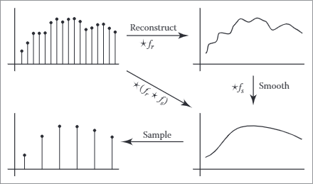</div>
<center>

图 9.38 重新采样 12 x 9 图像以制作 8 x 6 图像时输入和输出网格的采样位置。

</center>


重新采样图像时，我们通常以旧图像为单位指定一个源矩形，该矩形指定我们要保留在新图像中的部分。例如，使用第 3 章中的像素样本定位约定，我们用来重新采样整个图像的矩形是 $(\left(-0.5, n_{x}^{\text {old }}-0.5\right) \times\left(-0.5, n_{y}^{\text {old }}-0.5\right)$。给定一个源矩形$\left(x_{l}, x_{h}\right) \times\left(y_{l}, y_{h}\right)$，新图像的样本间距为$\Delta x=\left(x_{h}-x_{l}\right) / n_{x}^{\text {new }}$ in x 和 $\Delta y=\left(y_{h}-y_{l}\right) / n_{y}^{\text {new }}$ in y 。左下角的样本位于$\left(x_{l}+\Delta x / 2, y_{l}+\Delta y / 2\right)$

修改一维伪代码以使用此约定，并将对重构函数的调用扩展为隐含的双循环，我们得出：

$$\begin{array}{l}
\text { function resample(sequence } a \text {, float } x_{l} \text {, float } x_{h} \text {, int } n \text {, filter } f \text { ) } \\
\text { create sequence } b \text { of length } n \\
r=f \text {.radius } \\
x_{0}=x_{l}+\Delta x / 2 \\
\text { for } i=0 \text { to } n-1 \text { do } \\
\quad s=0 \\
\quad x=x_{0}+i \Delta x \\
\quad \text { for } j=\lceil x-r\rceil \text { to }\lfloor x+r\rfloor \text { do } \\
\quad s=s+a[j] f(x-j) \\
\quad b[i]=s \\
\text { return } b
\end{array}$$

&emsp;&emsp;此例程包含重新采样图像的所有基础知识。最后一个有待解决的问题是在图像边缘做什么，这里的简单版本将超出输入序列的范围。我们可能会做几件事：

- 只需在序列末尾停止循环即可。这相当于用零填充图像。
- 将所有数组访问剪辑到序列的末尾——也就是说，当我们想要访问 a[-1] 时返回 a[0]。这相当于通过扩展最后一行或最后一列来填充图像的边缘。
- 当我们接近边缘时修改过滤器，使其不会超出序列的边界。

当我们重新采样整个图像时，第一个选项会导致边缘暗淡，这并不令人满意。第二种选择很容易实现；第三个可能是表现最好的。修改图像边缘附近的过滤器的最简单方法是对其进行重新归一化：将过滤器除以落在图像内的过滤器部分的总和。这样，过滤器总是在实际图像样本上加 1，因此它保留了图像强度。出于性能考虑，最好将边缘过滤器半径内的像素带（需要重新归一化）与中心（包含更多像素并且不需要重新归一化）分开处理。

&emsp;&emsp;重采样滤波器的选择很重要。有两个独立的问题：过滤器的形状和大小（半径）。由于滤波器既作为重构滤波器又作为采样滤波器，这两种角色的要求都会影响滤波器的选择。对于重建，我们需要一个足够平滑的滤波器，以避免在放大图像时出现混叠伪影，并且滤波器应该是无波纹的。对于采样，滤波器应该足够大以避免欠采样，并且应该足够平滑以避免摩尔纹伪影。图 9.39 说明了这两种不同的需求。


&emsp;&emsp;通常，我们会选择一种滤波器形状并根据输入和输出的相对分辨率对其进行缩放。两种分辨率中较低的一个决定了滤波器的大小：当输出比输入更粗采样（下采样，或缩小图像）时，正确采样所需的平滑大于重建所需的平滑，因此我们调整大小根据输出样本间距（图 9.39 中的半径 3）进行过滤。另一方面，当输出被更精细地采样（上采样或放大图像）时，重建所需的平滑占主导地位（重建的函数已经足够平滑，可以以比开始时更高的速率进行采样），所以滤波器的大小由输入样本间距决定（图 9.39 中的半径 1）。

</center>

<div align=center>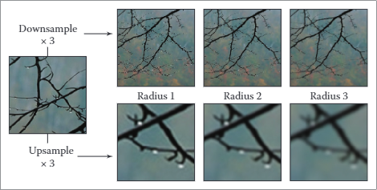</div>
<center>

图 9.39 使用不同大小的滤镜对图像进行上采样（放大）或下采样（缩小）的效果。

</center>

&emsp;&emsp;选择过滤器本身就是速度和质量之间的权衡。常见的选择是箱式过滤器（当速度至关重要时）、帐篷式过滤器（中等质量）或分段立方（优质）。在分段三次的情况下，可以通过在 fB 和 fC 之间进行插值来调整平滑程度； Mitchell-Netravali 过滤器是一个不错的选择。

&emsp;&emsp;就像图像过滤一样，可分离过滤器可以提供显着的加速。基本思想是首先对所有行重新采样，生成一个宽度改变但高度不变的图像，然后重新采样该图像的列以产生最终结果（图 9.40）。修改前面给出的伪代码以利用这种优化是相当简单的。图 9.40。使用可分离的方法重新采样图像。

</center>

<div align=center>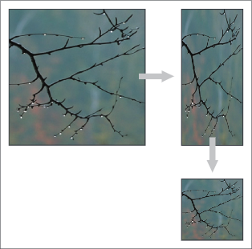</div>
<center>

图 9.40 使用可分离的方法重新采样图像。

</center>

## 9.5 采样理论 Sampling Theory


如果你只对实现感兴趣，可以在这里停止阅读；前几节中的算法和建议将让您实现执行采样和重建的程序并获得出色的结果。然而，有一个更深层次的采样数学理论，其历史可以追溯到电信中采样表示的首次使用。抽样理论回答了许多难以通过严格基于尺度论证的推理来回答的问题。

&emsp;&emsp;但最重要的是，抽样理论为抽样和重建的工作提供了宝贵的见解。它为学习它的学生提供了一套额外的智力工具，用于推理如何使用最有效的代码获得最佳结果。

### 9.5.1 傅里叶变换 The Fourier Transform

傅里叶变换与卷积一起，是构成采样理论的主要数学概念。您可以在许多有关分析的数学书籍以及有关信号处理的书籍中阅读有关傅立叶变换的信息。

&emsp;&emsp;傅里叶变换背后的基本思想是通过将所有频率的正弦波（正弦波）相加来表达任何函数。通过为不同的频率使用适当的权重，我们可以安排正弦曲线叠加到我们想要的任何（合理的）函数。

&emsp;&emsp;例如，图 9.41 中的方波可以用一系列正弦波表示：

$$\sum_{n=1,3,5, \ldots}^{\infty} \frac{4}{\pi n} \sin 2 \pi n x$$

这个傅立叶级数从频率为 1.0 的正弦波 (sin 2πx) 开始——与方波相同——其余项添加越来越小的校正以减少波纹，并在极限情况下精确地再现方波。请注意，总和中的所有项的频率都是方波频率的整数倍。这是因为其他频率会产生与方波不同周期的结果。

&emsp;&emsp;一个令人惊讶的事实是，信号不必是周期性的，以便以这种方式表示为正弦曲线的总和：非周期性信号只需要更多的正弦曲线。我们将在一个连续的正弦曲线族上积分，而不是对离散的正弦曲线序列求和。例如，盒函数可以写成余弦波族的积分：

$$\int_{-\infty}^{\infty} \frac{\sin \pi u}{\pi u} \cos 2 \pi u x d u \tag{9.6}$$

</center>

<div align=center>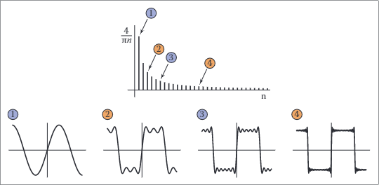</div>
<center>

图 9.41 逼近具有有限正弦和的方波。

</center>

等式 (9.6) 中的积分将无限多个余弦相加，通过权重 (sin πu)/πu 对频率 u 的余弦进行加权。结果，当我们包含越来越高的频率时，会收敛到盒函数（见图 9.42）。当函数 f 以这种方式表示时，这个权重是频率 u 的函数，称为 f 的傅里叶变换，记为 ^f。函数 ^f 告诉我们如何通过对一系列正弦曲线进行积分来构建 f：

$$f(x)= \int _ {\frac {1}{1}}^ {\infty } \widehat {f} (u)e^ {2\pi iux}du \tag{9.7}$$

方程 (9.7) 被称为傅里叶逆变换 (IFT)，因为它以 f 的傅里叶变换开始并以$f$结束。


请注意，在方程 (9.7) 中，复指数$e^{2πiux}$已被替换为前面方程中的余弦。此外，$\widehat {f}$是一个复值函数。需要复数机制来控制正弦曲线的相位和频率；这对于表示任何在零上不对称的函数是必要的。$\widehat {f}$的大小被称为傅里叶谱，对于我们的目的，这已经足够了——我们不需要担心相位或直接使用任何复数。

</center>

<div align=center>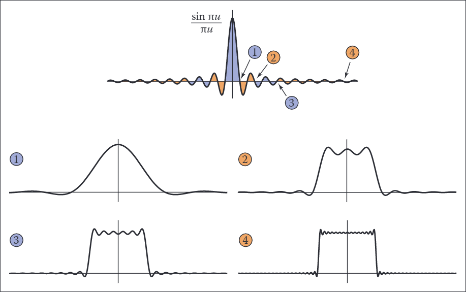</div>
<center>

图 9.42 用最多四个截止频率中的每一个的余弦积分来逼近一个盒子函数。

</center>

事实证明，从 f 计算 $\widehat {f}$ 看起来非常像从 $\widehat {f}$ 计算 f

$$\widehat {f}(u)=\int_{-\infty}^{\infty}\widehat{f}(u)e^{2πiux}du.\tag{9.8}$$

方程（9.8）被称为（前向）傅里叶变换（FT）。指数中的符号是正向和反向傅里叶变换之间的唯一区别，它实际上只是一个技术细节。出于我们的目的，我们可以将 FT 和 IFT 视为相同的操作。

有时$f–\widehat{f}$表示法不方便，然后我们将 f 的傅里叶变换表示为 F{f}，将 ^f 的傅里叶逆变换表示为 F−1{ ^f}