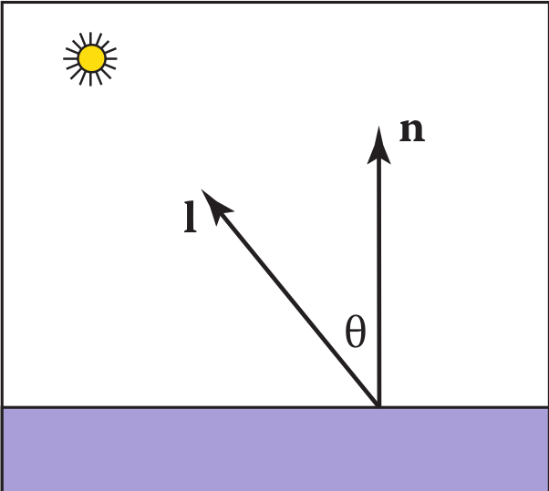
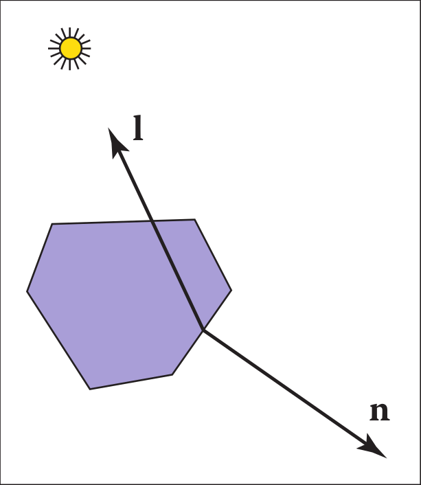
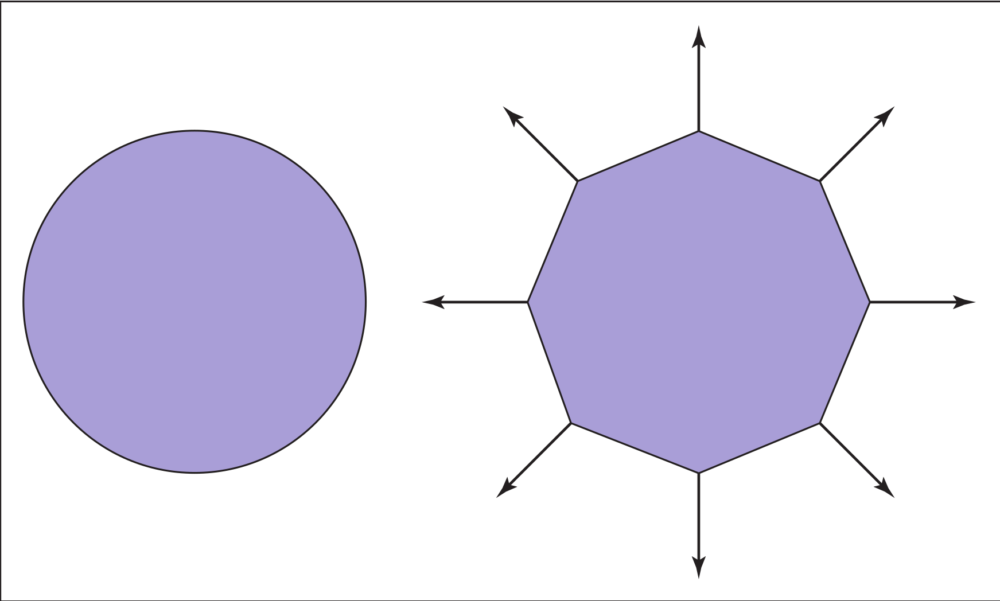
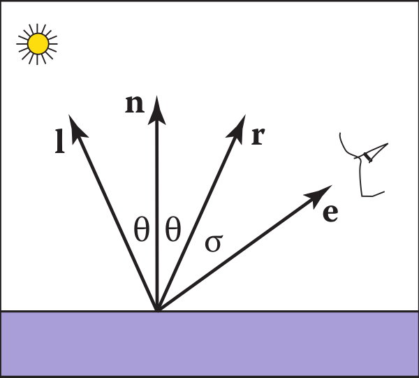
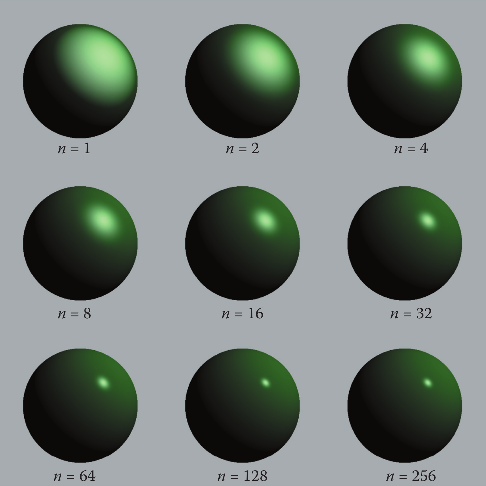
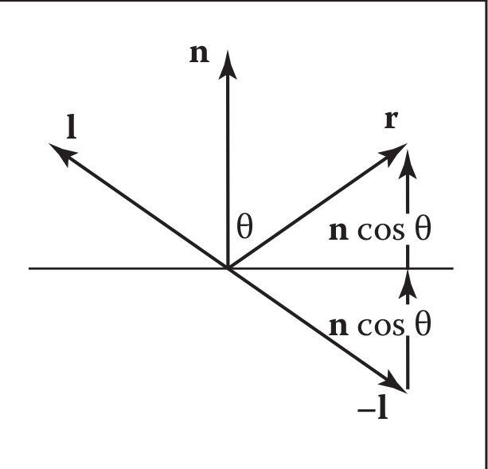
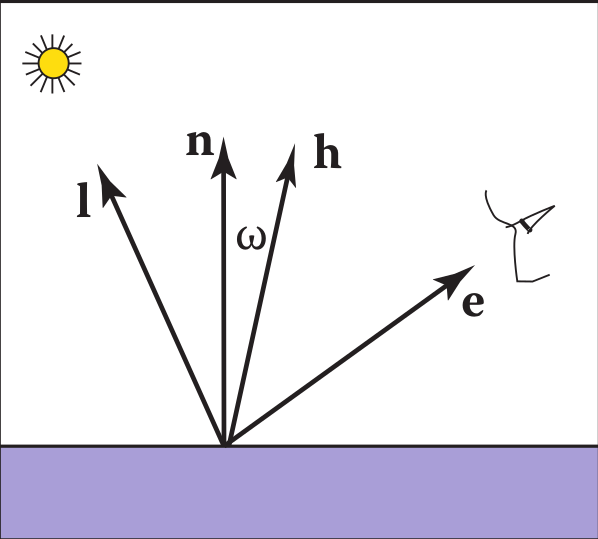
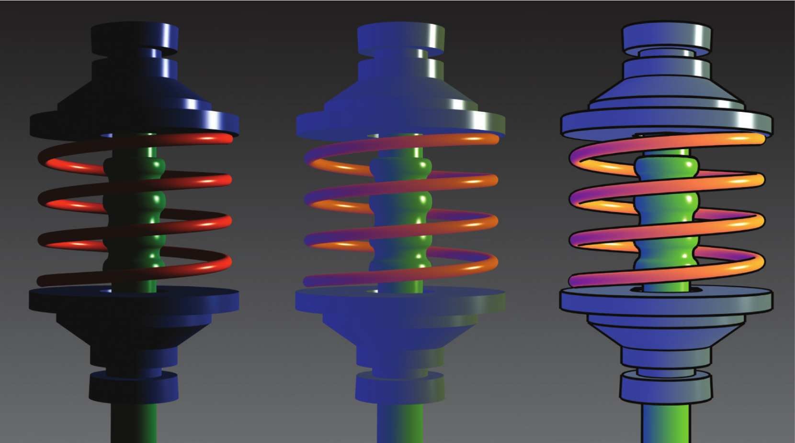

# 10 Surface Shading

为了使物体看起来有更大的体积，它可以帮助使用着色，即用光“绘制”表面。 本章介绍最常见的启发式着色方法。 前两个，diffuse 和 Phong shading，是在 1970 年代开发的，在大多数图形库中都可用。 最后一种是艺术着色，它使用艺术惯例为对象分配颜色。 这会创建让人联想到技术图纸的图像，这在许多应用中都是可取的。

## 10.1 漫反射 Diffuse Shading

&emsp;&emsp;世界上许多物体的表面外观被粗略地描述为“无光泽”，表明该物体根本没有光泽。 例如纸、未加工的木材和干燥的、未抛光的石头。 在很大程度上，这样的物体不会随着视点的变化而发生颜色变化。 例如，如果您注视一张纸上的某一点并在注视该点的同时移动，该点的颜色将保持相对恒定。 此类无光泽对象可被视为具有朗伯对象的行为。 本节讨论如何实现此类对象的着色。 一个关键点是本章中的所有公式都应在世界坐标系中计算，而不是在应用透视变换后的坐标系中计算。 否则，法线之间的角度会发生变化，并且着色会不准确。

### 10.1.1 兰伯特着色模型 Lambertian Shading Model

&emsp;&emsp;兰伯特对象遵循朗伯余弦定律，该定律指出，表面的颜色 c 与表面法线和光源方向之间的夹角的余弦成正比（Gouraud，1971）：

$$c \propto \cos \theta,$$

或以矢量形式：

$$c \propto \mathbf{n} \cdot \mathbf{l},$$

&emsp;&emsp;其中 n 和 l 如图 10.1 所示。 因此，表面上的颜色将根据表面法线和光方向之间的角度的余弦而变化。 请注意，通常假设向量 l 不依赖于对象的位置。 该假设等效于假设光相对于物体大小“遥远”。 这种“远距离”光通常称为定向光，因为它的位置仅由方向指定。

图 10.1  符合兰伯特定律的几何体。 n 和 l 都是单位向量。

&emsp;&emsp;通过改变光源的强度或表面的反射率，可以使表面变亮或变暗。 漫反射率 $c_r$ 是被表面反射的光的比例。 对于不同的颜色分量，该比例会有所不同。 例如，如果一个表面反射的红色入射光的比例高于蓝色入射光，那么它就是红色的。 如果我们假设表面颜色与从表面反射的光成正比，则还必须包括漫反射 反射率 $c_r$ （一种 RGB 颜色）

$$c \propto c_{r} \mathbf{n} \cdot \mathbf{1}.\tag{10.1}$$

&emsp;&emsp;等式 (10.1) 的右侧是 RGB 颜色，所有 RGB 分量都在 [0, 1] 范围内。 我们想添加光强度的影响，同时将 RGB 分量保持在 [0, 1] 范围内。 这建议添加一个 RGB 强度项 $c_l$，它本身具有 [0, 1] 范围内的分量：

$$c=c_{r} c_{l} \mathbf{n} \cdot \mathbf{l}.\tag{10.2}$$

&emsp;&emsp;这是一种非常方便的形式，但它可以为 c 生成超出范围 [0, 1] 的 RGB 分量，因为点积可能为负。 当表面背离光线时，点积为负，如图 10.2 所示

图 10.2  当一个表面背离光时，它应该不会接收到光。 这种情况可以通过检查 l 和 n 的点积是否为负来验证。

&emsp;&emsp;可以将“max”函数添加到等式（10.2）中以测试这种情况：

$$c=c_{r} c_{l} \max (0, \mathbf{n} \cdot \mathbf{l}).\tag{10.3}$$

&emsp;&emsp;处理“负”光的另一种方法是使用绝对值：

$$c=c_{r} c_{l}|\mathbf{n} \cdot \mathbf{l}|.\tag{10.4}$$

&emsp;&emsp;虽然方程 (10.4) 在物理上似乎不可信，但它实际上对应于方程 (10.3)，其中有两个方向相反的光。 出于这个原因，它通常被称为双面照明（图 10.3）。

图 10.3 使用方程（10.4），双边照明公式，相当于假设两个相同颜色的相对光源。

### 10.1.2 环境着色 Ambient Shading

&emsp;&emsp;方程（10.3）的漫反射着色的一个问题是，任何法线背离光的点都是黑色的。 在现实生活中，光线会反射到各个地方，有些光线会从各个方向入射。 此外，通常还有天窗提供“环境”照明。 处理此问题的一种方法是使用多个光源。 一个常见的技巧是始终在眼睛上放置一个暗淡的光源，以便所有可见点都能接收到一些光。 另一种方法是使用等式 (10.4) 所述的两侧照明。 更常见的方法是添加环境项（Gouraud，1971）。 这只是添加到公式 (10.3) 中的常量颜色项：

$$c=c_{r}\left(c_{a}+c_{l} \max (0, \mathbf{n} \cdot \mathbf{l})\right).$$

&emsp;&emsp;直观地，您可以将环境颜色 $c_a$ 视为场景中所有表面的平均颜色。 如果要确保计算出的 RGB 颜色保持在 [0, 1] 3 范围内，则 $c_a + c_l$  ≤ (1, 1, 1)。 否则，您的代码应该将 RGB 大于 1 的值“裁剪” 为 1。

### 10.1.3 基于顶点的漫反射着色 Vertex-Based Diffuse Shading

&emsp;&emsp;如果我们将等式 (10.1) 应用于由三角形组成的对象，它通常具有多面外观。 通常，三角形是平滑表面的近似。 为避免出现多面现象，我们可以在三角形的顶点处放置表面法向量 (Phong, 1975)，并使用顶点处的法向量在每个顶点处应用方程 (10.3)（见图 10.4）。 这将在每个三角形顶点给出一种颜色，并且可以使用第 8.1.2 节中描述的重心插值来插值该颜色。 

&emsp;&emsp;三角形顶点着色的一个问题是我们需要从某处获取法线。 许多模型将提供法线。 如果您细分自己的平滑模型，则可以在创建三角形时创建法线。 如果您看到的多边形模型在顶点处没有法线，并且您想要平滑地对其进行着色，则可以通过各种启发式方法计算法线。 最简单的方法是对共享每个顶点的三角形的法线求平均值，并在顶点处使用该平均法线。 此平均法线不会自动具有单位长度，因此您应该在将其用于着色之前将其转换为单位向量。

图 10.4  圆（左）由八边形（右）近似。 顶点法线记录原始曲线的表面法线。

## 10.2  Phong Shading

&emsp;&emsp;有些表面本质上类似于磨砂表面，但它们具有高光。 此类表面的示例包括抛光瓷砖地板、光泽涂料和白板。随着视点移动，高光会在表面上移动。 这意味着我们必须在我们的方程中添加一个朝向眼睛的单位向量 e。 如果你仔细观察高光，你会发现它们实际上是光的反射； 有时这些反射是模糊的。 这些高光的颜色就是光的颜色——表面颜色似乎没什么影响。 这是因为反射发生在物体的表面，穿透表面并拾取物体颜色的光被漫散射。

### 10.2.1 Phong光照模型 Phong Lighting Model

&emsp;&emsp;我们想在正确的位置添加一个与光源颜色相同的模糊“点”。 点的中心应该画在眼睛的方向 e 与自然反射方向 r “对齐”的地方，如图 10.5 所示。 这里的“排队”在数学上等同于“$\sigma$为零”。 我们希望高光有一些非零区域，这样眼睛就能在$\sigma$小的地方看到一些高光。

图 10.5  Phong 光照模型的几何图形。 如果$\sigma$很小，眼睛应该看到高光。

&emsp;&emsp;给定 r，我们想要一个启发式函数，它在 e = r 时明亮，当 e 远离 r 时逐渐衰减。 一个明显的候选者是它们之间夹角的余弦：

$$c=c_{l}(\mathbf{e} \cdot \mathbf{r}).$$

&emsp;&emsp;使用这个方程有两个问题。 首先是点积可能为负。 这可以通过“if”语句在计算上解决，当点积为负时，该语句将颜色设置为零。 更严重的问题是，这个方程产生的亮点比现实生活中看到的要宽得多。 最大值在正确的位置，它是正确的颜色，但它太大了。 我们可以通过提高到一个幂来缩小它而不减少它的最大颜色：

$$c=c_{l} \max (0, \mathbf{e} \cdot \mathbf{r})^{p}\tag{10.5}.$$

&emsp;&emsp;这里 p 称为 Phong 指数； 它是一个正实数 (Phong, 1975)。改变 Phong 指数对高光的影响可以在图 10.6 中看到。

图 10.6 Phong 指数对高光特性的影响。 这使用等式 (10.5) 形成高光。 还有一个漫反射组件，使对象具有闪亮但非金属的外观。 图片由内特罗宾斯提供。

&emsp;&emsp;为了实现方程（10.5），我们首先需要计算单位向量 r。 给定单位向量 l 和 n，r 是在 n 周围反射的向量 l。 图 10.7 显示这个向量可以计算为

$$r = −l + 2(l · n)n,\tag{10.6}$$

其中点积用于计算 cos θ。

图 10.7  用于计算向量 r 的几何图形。

&emsp;&emsp;基于等式 (10.5) 的替代启发式模型无需检查用作求幂基础的数字的负值 (Warn, 1983)。 我们不计算 r，而是计算 h，即 l 和 e 中间的单位向量（图 10.8）：

$$h = \frac{e+l}{||e+l||}$$

图 10.8  单位向量 h 介于 l 和 e 之间。

&emsp;&emsp;当 h 接近 n 时，即当$\cos\omega=h\cdot n$接近 1 时，会出现高光。这表明了以下规则：

$$c = c _ l (h · n) ^ p.\tag{10.7}$$ 

&emsp;&emsp;这里的指数 p 将与方程（10.5）中的指数具有类似的控制行为，但 h 和 n 之间的夹角是 e 和 r 之间夹角的一半大小，因此细节会略有不同。 在 n 和 h 之间使用余弦的优点是它对于平面上方的眼睛和光始终为正。 缺点是需要平方根和除法来计算 h。

&emsp;&emsp;在实践中，我们希望大多数材质除了高光外还具有漫反射外观。 我们可以结合方程（10.3）和（10.7）得到:

$$c = c _r (c _ a + c _ l  max (0, n · l)) + c _ l (h · n) ^ p .\tag{10.8}$$          

如果我们想让用户调暗高光，我们可以添加一个控制项$c _ p$ ：

$$c = c _r (c _ a + c _ l  max (0, n · l)) + c _ l c _ p (h · n) ^ p .\tag{10.9}$$

&emsp;&emsp;术语$c_p$ 是一种 RGB 颜色，它允许我们更改高亮颜色。 这对于$c _ p = c _ r$ 的金属很有用，因为金属上的高光呈现金属色。 此外，使$c _ p$ 成为小于 1 的中性值通常很有用，以便颜色保持在 1 以下。 例如，设置$c _ p$ = 1 - M，其中 M 是$c _ r$ 的最大分量，将一个没有环境项的光源，将保持颜色低于 1。

### 10.2.2 表面法向量插值 Surface Normal Vector Interpolation

&emsp;&emsp;与具有相同几何形状的朗伯表面相比，具有高光的光滑表面往往会快速改变颜色。 因此，法向量处的阴影会产生令人不安的失真。

&emsp;&emsp;通过在多边形上插入法向量，然后在每个像素上应用 Phong 着色，可以减少这些问题。 这使您可以在不使三角形的尺寸非常小的情况下获得良好的图像。 回忆第 3 章，当光栅化三角形时，我们计算重心坐标 (α, β, γ) 来插入顶点颜色$c _ 0 , c _ 1 , c _ 2$ ：

$$c = αc _ 0 + βc _ 1 + γc _ 2.\tag{10.10}$$

我们可以使用相同的方程来插入表面法线$n _ 0 、n _ 1$ 和$n _ 2$ ：

$$n = αn _ 0 + βn _ 1 + γn _ 2.\tag{10.11}$$                                                  

&emsp;&emsp;然后可以针对在每个像素处计算的 n 来评估等式 (10.9)。 请注意，由方程 (10.11) 得出的 n 通常不是单位法线。 如果在用于着色计算之前将其转换为单位向量，将获得更好的视觉效果。 这种类型的法线插值通常称为 Phong 法线插值 (Phong, 1975)。

## 10.3 艺术着色 Artistic Shading

&emsp;&emsp;Lambertian 和 Phong 着色方法基于旨在模仿现实世界中对象外观的启发式方法。 艺术着色旨在模仿人类艺术家的绘画（Yessios，1979；Dooley & Cohen，1990；Saito & Takahashi1990；L. Williams，1991）。 这种阴影似乎在许多应用中都有优势。 例如，汽车制造商聘请艺术家为车主手册绘制图表。 这比使用更“逼真”的照片更昂贵，因此当需要某些类型的交流时，艺术家的技术可能有一些内在的优势。 在本节中，我们将展示如何制作让人联想到人类绘制图像的微妙着色线条图。 创建此类图像通常称为非真实感渲染，但我们将避免使用该术语，因为许多非真实感技术用于提高效率，而与任何艺术实践无关。

### 10.3.1 画线

&emsp;&emsp;我们在人体画中看到但在现实生活中看不到的最明显的东西是轮廓。 当我们有一组共享边的三角形时，当共享一条边的两个三角形中的一个面向观察者而另一个三角形背向观察者时，我们应该绘制一条边作为轮廓。 这个条件可以通过两个法线$n _ 0$ 和$n _ 1$ 测试

 
 draw silhouette if ($e \cdot n _ 0)(e \cdot n _ 1$) ≤ 0.

&emsp;&emsp;这里 e 是从边缘到眼睛的向量。 这可以是边缘上的任何点或三角形中的任何一个。 或者，如果 $f_i (p)$ = 0 是两个三角形的隐式平面方程，则测试可以写成

$$draw silhouette if f _ 0 (e)f _ 1 (e) ≤ 0.$$

&emsp;&emsp;我们还想绘制多边形模型的可见边。 为此，我们可以使用第 12 章中的任一隐藏表面方法绘制背景颜色，然后将每个三角形的轮廓绘制为黑色。 事实上，这也将捕捉轮廓。 不幸的是，如果多边形代表光滑的表面，我们真的不想绘制大部分边。 但是，我们可能希望在几何图形中确实存在拐角的地方绘制所有折痕。 我们可以使用启发式阈值来测试折痕：

$$draw crease if (n _ 0 · n _ 1 ) ≤ threshold.$$

这与轮廓测试相结合将提供漂亮的线条图。

### 10.3.2 冷暖色调 Cool-to-Warm Shading

&emsp;&emsp;当艺术家对线条图进行阴影处理时，他们通常使用低强度阴影来为表面赋予某种曲线印象并为对象赋予颜色（Gooch、Gooch、Shirley 和 Cohen，1998 年）。 面向一个方向的表面用冷色（如蓝色）着色，而面向相反方向的表面用暖色（如橙色）着色。 通常，这些颜色不是很饱和，也不是很暗。 这样，黑色剪影就会很好地显示出来。 总体而言，这提供了类似卡通的效果。 这可以通过设置一个“暖”光 l 的方向并使用余弦来调制颜色来实现，其中温暖常数 $k _ w$ 定义在 [0, 1] 上：

$$k_w = \frac{l+n·l}{2}$$

颜色 c 只是冷色$c _ c$和暖色$c _ w$的线性混合：

$$c = k _ w c _ w + (1 − k _ w )c _ c .$$

有许多可能的 $c _ w$ 和 $c _ b$ 会产生合理的外观结果。 一个很好的猜测起点是

$$c _ c = (0.4, 0.4, 0.7),$$
$$c _ c = (0.8, 0.6, 0.6).$$

图 10.9 显示了传统 Phong 照明与此类艺术阴影之间的比较。

图 10.9  左：Phong 照明图像。 中：没有轮廓，冷到暖的阴影是没有用的。 右图：冷暖色调加上轮廓。 图片由Amy Gooch提供。

**经常问的问题 Frequently Asked Questions**

- 本章中的所有着色都使用了很多技巧。 这真实吗？

&emsp;&emsp;是的。 然而，它们是精心设计的技巧，在实践中证明是有用的。 从长远来看，我们可能会有更好的算法，包括物理学、心理学和色调映射。 然而，图像质量的改进可能是渐进的。

- 我讨厌调用 pow()。 做Phong照明时有没有办法避免它？

&emsp;&emsp;一个简单的方法是只使用本身是 2 的幂的指数，即 2, 4, 8, 16, ... . . . 实际上，对于大多数应用程序来说，这不是一个有问题的限制。 查找表也是可能的，但通常不会提供很大的加速。

**练习 Exercises**

1. 漫反射或 Phong 阴影无法很好地近似月亮。你是如何得出这种结论的？

2. 漫反射或 Phong 阴影无法很好地近似天鹅绒。 你是如何得出这种结论的？

3. 为什么塑料物体上的高光看起来是白色的，而金色金属上的高光看起来是金色的？