# 11 Texture Mapping 纹理映射

当人们试图复刻现实世界的外观时，人们很快就会意识到，几乎没有表面是没有任何特征的。木材有纹理，皮肤有皱纹，布有它的编织结构；油漆显示了铺在上面的刷子或滚子的痕迹。即使是光滑的塑料也是由凸起制成的，光滑的金属显示出加工过程的痕迹。那些曾经没有特征的材料很快就会被斑痕、凹痕、污渍、划痕、指纹和污垢所覆盖。

&emsp;&emsp;在计算机图形学中，我们将所有这些现象归类在“在空间上变化的表面属性”的分类下——表面的属性，但并没有真正以有意义的方式改变表面的形状。为了实现这些效果，各种各样的建模和渲染系统为纹理映射提供了一些方法：使用称为纹理贴图的图像、纹理图像或纹理图像，来存储要在表面上的细节，然后从数学上将图像“映射”到表面上。

&emsp;&emsp;事实证明，将图像映射到表面上的机制一旦存在，就会有许多不那么明显的方法可以使用它，这不是引入表面细节的基本目的。纹理可用于制作阴影和反射，以提供照明，甚至可以定义表面形状。在复杂的交互式程序中，纹理被用来存储各种数据，甚至与图片没有任何关系！

&emsp;&emsp;本章讨论如何使用纹理来表示表面细节、阴影和反射。虽然基本思想很简单，但有几个实际问题使纹理的使用更加复杂化。首先，纹理很容易被扭曲，而设计将纹理映射到表面上的函数是具有挑战性的。此外，纹理映射是一个重采样的过程，就像重新缩放图像一样，正如我们在第9章中所看到的，重采样可以很容易地产生走样或失真。纹理映射和动画一起使用很容易产生非常奇怪的走样，而纹理映射系统之所以复杂是因为需要解决这些走样问题。

## 11.1 查找纹理值

&emsp;&emsp;首先，让我们考虑一个简单的纹理映射应用程序。我们有一个带有木地板的场景，我们希望地板的漫反射颜色能通过一个显示木纹地板的图像来控制。无论我们是使用射线跟踪还是光栅化，计算射线表面交点的颜色或由光栅器生成的片段的着色代码都需要知道着色点纹理的颜色，以便使用它作为第10章Lambertian着色模型中的漫反射颜色。

&emsp;&emsp;要获得此颜色，着色器执行纹理查找：它找出纹理图像坐标系中对应的位置，并读出图像中该点的颜色，从而得到纹理样本。然后将该颜色用于着色，并且由于纹理查找发生在看到地板的每个像素的纹理的不同位置，因此图像中会显示不同颜色的图案。代码可能是这样的：

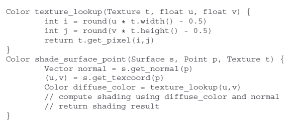

&emsp;&emsp;在这段代码中，着色器询问表面在纹理中的哪个位置，以及我们想要使用纹理着色的每个表面需要能够回答这个查询的一些问题。 这给我们带来了纹理映射的第一个关键要素：我们需要一个从表面映射到纹理的函数，我们可以轻松地为每个像素计算它。 这是纹理函数（纹理映射函数）（图 11.1），我们说它为表面上的每个点分配纹理坐标。 从数学上讲，它是从表面 S 到纹理域 T 的映射：

图 11.1 就像查看投影π将对象表面上的每个点映射到图像中的一个点一样，纹理坐标函数φ映射对象表面上的每个点到纹理贴图T中的一个点。适当定义此函数φ是所有纹理映射应用的基础。

$$\phi  :S  \rightarrow  T \\
\qquad\qquad\quad:(x,y,z)  \rightarrow  (u,v).$$

&emsp;&emsp;集合T，通常被称为“纹理空间”，通常只是一个包含图像的矩形；通常使用单位正方形(u，v)∈$[0,1]^2$(在本书中，我们将使用名称u和v作为两个纹理坐标)。在很多方面，它类似于第7章中讨论的视图投影，在本章中称为π，它将场景表面上的点映射到图像中的点；两者都是3d到二维映射，两者都需要渲染——一个知道从哪里获取纹理值，另一个知道在图像中放置着色结果。但也有一些重要的区别：π几乎总是一个透视或正交投影，而φ可以采取多种形式；一个图像只有一个视图投影，而场景中的每个对象都可能有一个完全独立的纹理坐标函数。

&emsp;&emsp;当我们的目标是将纹理放到表面上时，φ 是从表面到纹理的映射，这似乎令人惊讶，但这正是我们需要的函数。

&emsp;&emsp;对于木地板的情况，如果地板恰好处于恒定的z，并且与x轴和y轴对齐，我们可以只使用映射：

$$u=a x ; \quad v=b y$$

&emsp;&emsp;选择适当的比例因子a和b，将纹理坐标（s、t）分配到点（x、y、z）地板，然后使用纹理像素或纹理像素的值，然后使用最接近（u，v）的纹理像素值或texel作为（x，y）处的纹理值。通过这种方式，我们渲染了图11.2中的图像。

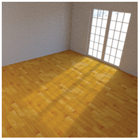

图11.2  一种木地板，使用纹理坐标函数进行纹理处理，它可以简单地直接使用点的x和y坐标。

&emsp;&emsp;不过，这是非常有限的：如果房间在x轴和y轴上倾斜一定角度进行建模，或者如果我们想要弯曲的椅背上的木材纹理呢？我们将需要一些更好的方法来计算曲面上的点的纹理坐标。

&emsp;&emsp;从最简单的纹理映射形式产生的另一个问题通过以高对比度纹理从掠射角渲染到低分辨率图像中得到了戏剧性的说明。 图 11.3 显示了使用相同方法纹理化的较大平面，但具有高对比度网格图案和朝向地平线的视图。 您可以看到它包含走样失真aliasing artifacts（前景中的阶梯，远处的波浪和闪光图案），类似于未使用适当过滤器时在图像重采样（第 9 章）中出现的伪影。 尽管在印刷在书中的微小静止图像中使这些伪影如此明显需要极端情况，但在动画中，这些图案会四处移动并且非常分散注意力，即使它们更加微妙。

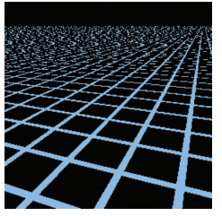

图11.3 一个大的水平面，纹理的方式与图11.2相同，并显示严重的走样失真aliasing artifacts。

&emsp;&emsp;我们现在已经看到了基本纹理映射中的两个主要问题：

- 定义纹理坐标函数
- 在不产生过多走样的情况下查找纹理值。

&emsp;&emsp;这两个问题是纹理映射的各种应用的基础，并在第 11.2 和 11.3 节中讨论。 一旦你理解了它们以及它们的一些解决方案，你就会理解纹理映射。 剩下的就是如何将基本的纹理机械应用于各种不同的目的，这将在第 11.4 节中讨论。

## 11.2  纹理坐标函数 Texture Coordinate Functions

&emsp;&emsp;“UV 映射”或“表面参数化”是您可能会遇到的纹理坐标函数的其他名称。

&emsp;&emsp;设计好纹理坐标函数 φ 是获得良好纹理映射结果的关键要求。 您可以将其视为决定如何使平面矩形图像变形，使其符合您要绘制的 3D 表面。 或者，您可以将表面轻轻压平，不要让它起皱、撕裂或折叠，使其平放在图像上。 有时这很容易：也许 3D 表面已经是一个平面矩形！ 在其他情况下，这非常棘手：3D 形状可能非常复杂，例如角色身体的表面。

&emsp;&emsp;定义纹理坐标函数的问题对计算机图形来说并不陌生。 制图师在设计覆盖地球表面大面积的地图时面临着完全相同的问题：从弯曲地球到平面地图的映射不可避免地会导致区域、角度和/或距离的走样，这很容易使地图产生误导。 几个世纪以来，人们提出了许多地图投影，所有这些都平衡了纹理映射中面临的相同竞争问题——最小化各种走样，同时在一个连续的部分中覆盖大面积。

&emsp;&emsp;在某些应用程序中（我们将在本章后面看到）有使用特定地图的明确理由。 但在大多数情况下，设计纹理坐标图是一项平衡竞争问题的微妙任务，熟练的建模人员为此付出了相当大的努力。

&emsp;&emsp;你可以用任何你能想到的方式来定义 φ。 但是有几个相互竞争的目标需要考虑：

- 双射性Bijectivity。 在大多数情况下，您希望 φ 是双射的（参见第 2.1.1 节），以便表面上的每个点都映射到纹理空间中的不同点。 如果多个点映射到同一个纹理空间点，则纹理中某一点的值会影响表面上的多个点。 如果您希望纹理在表面上重复（想想墙纸或地毯的重复图案），故意引入从表面点到纹理点的多对一映射是有意义的，但有时候您不希望这种情况发生。
- 尺寸失真Size distortion。 纹理的比例应该在整个表面上大致恒定。 也就是说，表面上任何距离大致相同的靠近点应该映射到纹理中距离大致相同的点。 就函数 φ 而言，φ 的导数幅度不应变化太大。
- 形状失真Shape distortion。 纹理不应该非常扭曲。 也就是说，绘制在表面上的小圆圈应该映射到纹理空间中合理的圆形，而不是极度压扁或拉长的形状。 就 φ 而言，φ 的导数在不同方向上不应相差太大。
- 连续性Continuity。不应该有太多的缝隙：表面上的相邻点应该映射到纹理中的相邻点。 也就是说，φ 应该是连续的，或者尽可能少的不连续。 在大多数情况下，一些不连续性是不可避免的，我们希望将它们放在不显眼的位置。

&emsp;&emsp;由参数方程（第 2.5.8 节）定义的表面带有纹理坐标函数的内置选择：只需反转定义表面的函数，并使用表面的两个参数作为纹理坐标。 这些纹理坐标可能具有也可能没有所需的属性，具体取决于表面，但它们确实提供了映射。

&emsp;&emsp;但是对于隐式定义的表面，或者只是由三角形网格定义的表面，我们需要一些其他方式来定义纹理坐标，而不依赖于现有的参数化。 从广义上讲，定义纹理坐标的两种方法是几何计算它们，从表面点的空间坐标，或者，对于网格表面，在顶点处存储纹理坐标的值并在整个表面上插值它们。 让我们逐个看看这些选项。

### 11.2.1 几何确定的坐标 Geometrically Determined Coordinates

&emsp;&emsp;几何确定的纹理坐标用于简单的形状或特殊情况，作为快速解决方案，或作为设计手动调整纹理坐标图的起点。

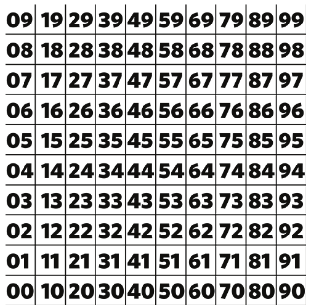

图 11.4 测试图像。

&emsp;&emsp;我们将通过将图 11.4 中的测试图像映射到表面来说明各种纹理坐标函数。 图像中的数字可让您从渲染图像中读取近似 (u, v) 坐标，网格可让您查看映射的失真程度。

**平面投影 Planar Projection**

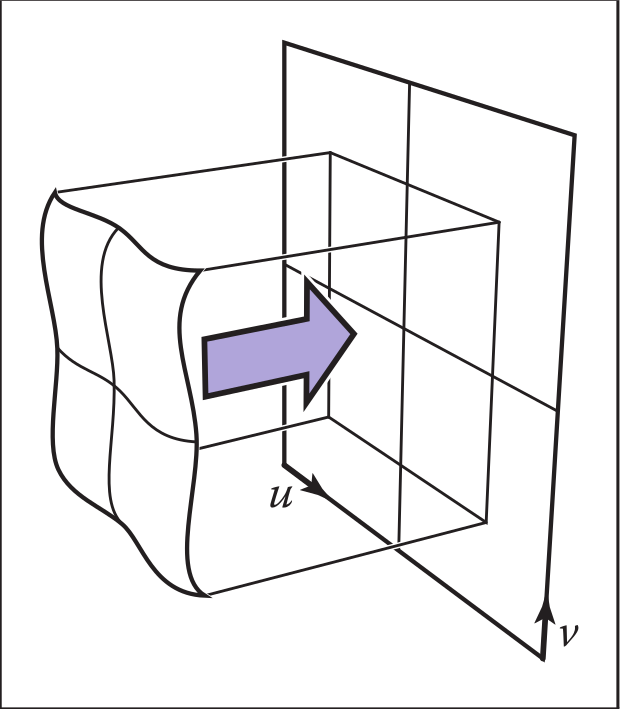

图 11.5。 如果投影方向大致沿整体法线选择，则平面投影可为对象或对象的一部分开始时几乎平坦的进行有用的参数化。

&emsp;&emsp;从 3D 到 2D 的最简单的映射可能是平行投影——与用于正交视图的映射相同（图 11.5）。 我们已经开发的用于查看的机制（第 7.1 节）可以直接重新用于定义纹理坐标：就像正交视图归结为乘以矩阵并丢弃 z 分量一样，可以通过平面投影生成纹理坐标 使用简单的矩阵乘法：

$$\phi(x, y, z)=(u, v) \quad \text { where } \quad\left[\begin{array}{l}
u \\
v \\
* \\
1
\end{array}\right]=M_{t}\left[\begin{array}{l}
x \\
y \\
z \\
1
\end{array}\right],$$

&emsp;&emsp;其中纹理矩阵 M t 表示仿射变换，星号表示我们不关心第三个坐标中的结果。

&emsp;&emsp;对于大部分平坦的表面来说效果很好，表面法线没有太多变化，并且可以通过取平均法线找到一个好的投影方向。 但是，对于任何类型的封闭形状，平面投影都不是单射的：正面和背面的点将映射到纹理空间中的同一点（图 11.6）。

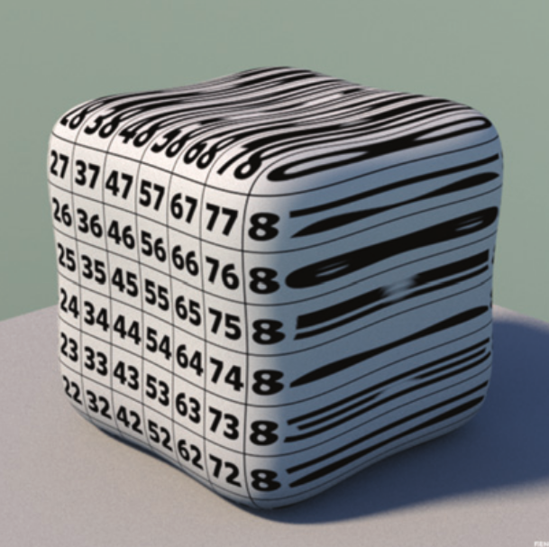

图 11.6  在闭合对象上使用平面投影总是会导致投影方向与表面相切的点附近的非射入、一对多映射和极端失真。

&emsp;&emsp;通过简单地用透视投影代替正交投影，我们得到投影纹理坐标（图 11.7）：

$$\phi(x, y, z)=(u, v) \quad \text { where } \quad\left[\begin{array}{l}
u \\
v \\
* \\
1
\end{array}\right]=M_{t}\left[\begin{array}{l}
x \\
y \\
z \\
1
\end{array}\right],\phi(x, y, z)=(\tilde{u} / w, \tilde{v} / w) \quad \text { where } \quad\left[\begin{array}{c}
\tilde{u} \\
\tilde{v} \\
* \\
w
\end{array}\right]=P_{t}\left[\begin{array}{c}
x \\
y \\
z \\
1
\end{array}\right]$$

&emsp;&emsp;现在 4 × 4 矩阵 P t 表示一个投影（不一定是仿射）变换——也就是说，最后一行可能不是 [0, 0, 0, 1]。

&emsp;&emsp;投影纹理坐标在第 11.4.4 节中讨论的阴影映射技术中很重要。

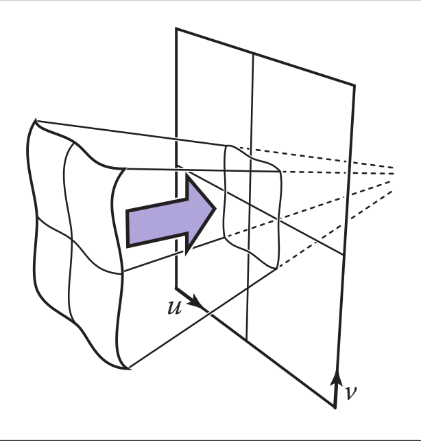

图 11.7 投影纹理变换使用类似观察的变换，投影到视点。

**球坐标 Spherical Coordinates**

&emsp;&emsp;对于球体，经/纬度参数化是熟悉且广泛使用的。它在极点附近有很多失真，并且仅沿一条纬度线存在不连续性，但它确实能表示一个球体。

&emsp;&emsp;可以使用纹理坐标函数对大致呈球形的表面进行参数化，该函数使用径向投影将表面上的点映射到球体上的点：从球体的中心通过表面上的点取一条线，然后找到 与球体的交点。 该交点的球坐标是您在表面上开始的点的纹理坐标。

&emsp;&emsp;另一种方法是，您用球坐标 (ρ, θ, φ) 表示表面点，然后丢弃 ρ 坐标并将 θ 和 φ 分别映射到 [0, 1] 范围内。 该公式取决于球坐标约定； 使用第 2.5.8 节的约定，

$$\phi(x, y, z)=([\pi+\operatorname{atan} 2(y, x)] / 2 \pi,[\pi-\operatorname{acos}(z /\|x\|)] / \pi)$$

&emsp;&emsp;如果从中心点可以看到整个表面，则球面坐标图将在除极点之外的任何地方都是双射的。 它继承了与球体上的经纬度地图相同的极点附近的失真。 图 11.8 显示了一个对象，其球坐标提供了合适的纹理坐标函数。

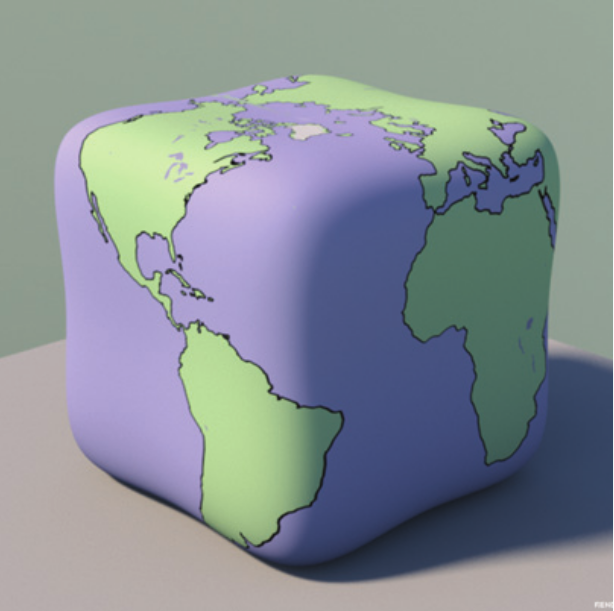

图 11.8 对于这个类似球状的物体，将每个点投影到以物体中心为中心的球体上提供了一个单射映射，这里用于放置与地球图像相同的贴图纹理。 请注意，表面远离中心的区域会放大（表面点在纹理空间中挤在一起），而表面靠近中心的区域会缩小。

**圆柱坐标 Cylindrical Coordinates**

&emsp;&emsp;对于柱状而不是球状的物体，从轴向外投影到圆柱上可能比从点投影到球体上效果更好（图 11.9）。 类似于球面投影，这相当于转换为圆柱坐标并丢弃半径：

$$\phi(x, y, z)=\left(\frac{1}{2 \pi}[\pi+\operatorname{atan} 2(y, x)] / 2 \pi, \frac{1}{2}[1+z]\right)$$

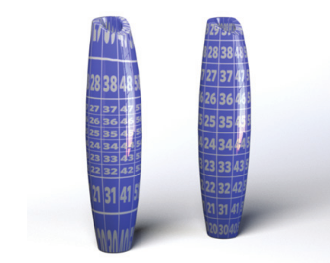

图 11.9  一个远离球面的花瓶，球面投影产生了很多扭曲（左），圆柱投影在外表面产生了很好的效果。

**立方体贴图 Cubemaps**

&emsp;&emsp;使用球坐标参数化球形或类似球体的形状会导致极点附近的形状和区域高度失真，这通常会导致可见的artifacts，表明纹理存在两个特殊点出现问题。 一种流行的替代方案更加统一，代价是具有更多的不连续性。 这个想法是投影到一个立方体上，而不是一个球体上，然后为立方体的六个面使用六个单独的方形纹理。 六个方形纹理的集合称为立方体贴图。 这会沿所有立方体边缘引入不连续性，但它使形状和区域的失真保持在较低水平。

&emsp;&emsp;计算立方体贴图纹理坐标也比球面坐标便宜，因为投影到平面上只需要除法——本质上与用于查看的透视投影相同。 例如，对于投影到立方体的 +z 面上的点：

$$(x, y, z) \mapsto\left(\frac{x}{z}, \frac{y}{z}\right)$$

&emsp;&emsp;立方体贴图的一个令人困惑的方面是建立关于如何在六个面上定义 u 和 v 方向的约定。 任何约定都可以，但是不同的约定会影响纹理的内容，因此标准化很重要。因为立方体贴图经常用于从立方体内部查看的纹理（请参阅第 11.4.5 节中的环境映射），通常的约定是 u 和 v 轴定向，以便从内部查看时 u 与 v 呈顺时针方向。 OpenGL 使用的约定是

$$\begin{array}{l}
\phi_{-x}(x, y, z)=\frac{1}{2}[1+(+z,-y) /|x|], \\
\phi_{+x}(x, y, z)=\frac{1}{2}[1+(-z,-y) /|x|], \\
\phi_{-y}(x, y, z)=\frac{1}{2}[1+(+x,-z) /|y|], \\
\phi_{+y}(x, y, z)=\frac{1}{2}[1+(+x,+z) /|y|], \\
\phi_{-z}(x, y, z)=\frac{1}{2}[1+(-x,-y) /|z|], \\
\phi_{+z}(x, y, z)=\frac{1}{2}[1+(+x,-y) /|z|] .
\end{array}$$

&emsp;&emsp;下标表示每个投影对应于立方体的哪个面。 例如，φ -x 用于在 x = +1 处投影到立方体表面的点。 您可以通过查看绝对值最大的坐标来判断一个点投影到哪个面：例如，如果|x| > |y| 和|x| > |z|，该点投影到 +x 或 -x 面，具体取决于 x 的符号。

&emsp;&emsp;立方体贴图实现的纹理有六个正方形块。 （参见图 11.10。）它们通常被打包在一个图像中进行存储，排列方式就像立方体被打开一样。

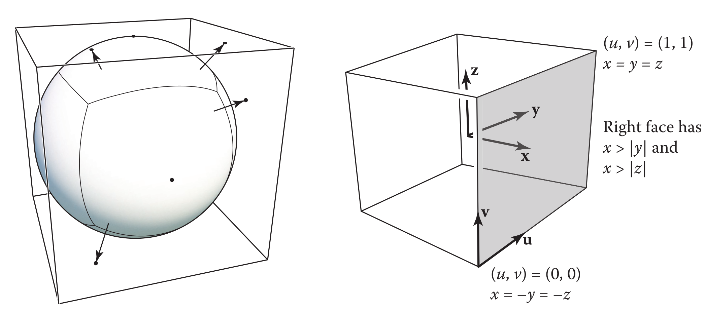

图 11.10  被投影到立方体贴图中的表面。 表面上的点从中心向外突出，每个点都映射到六个面之一上的一个点。

### 11.2.2 纹理坐标插值 Interpolated Texture Coordinates

&emsp;&emsp;为了对三角形网格表面上的纹理坐标函数进行更细粒度的控制，您可以在每个顶点显式存储纹理坐标，并使用重心插值（第 8.1.2 节）在三角形上对它们进行插值。 它的工作方式与您可能在网格上定义的任何其他平滑变化的数量完全相同：颜色、法线，甚至 3D 位置本身。

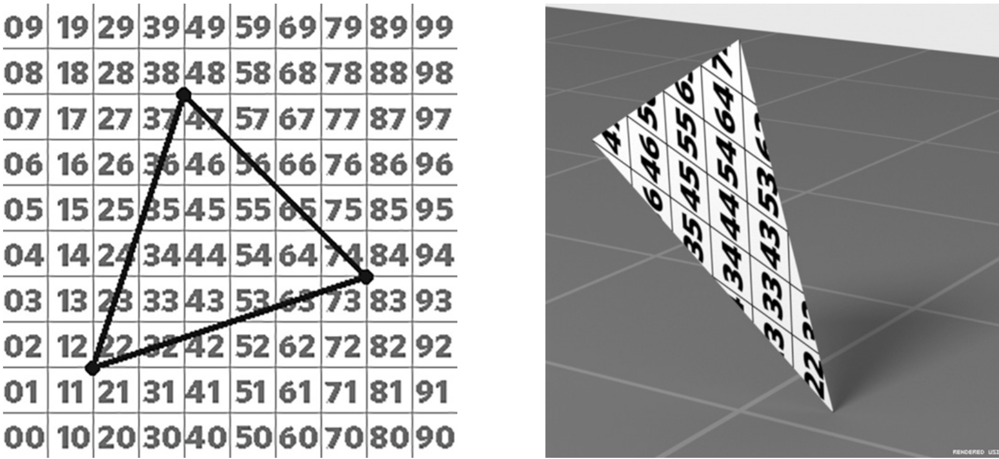

图 11.11  使用线性插值纹理坐标的单个三角形。 左：在纹理空间中绘制的三角形； 右：在 3D 场景中渲染的三角形。

&emsp;&emsp;让我们看一个只有一个三角形的例子。 图 11.11 显示了一个三角形纹理映射到现在熟悉的测试模式的一部分。 通过查看渲染三角形上出现的图案，可以推断出三个顶点的纹理坐标分别为（0.2, 0.2）、（0.8, 0.2）和（0.2, 0.8），因为它们是 出现在三角形三个角的纹理。就像上一节中几何确定的映射一样，我们通过提供从表面到纹理域的映射来控制纹理在表面上的位置，在这种情况下通过指定位置 每个顶点都应该进入纹理空间。 定位顶点后，三角形之间的线性（重心）插值会处理其余部分。

&emsp;&emsp;在图 11.12 中，我们展示了一种在整个网格上可视化纹理坐标的常用方法：简单地在纹理空间中绘制三角形，顶点位于其纹理坐标处。 此可视化显示了哪些三角形正在使用纹理的哪些部分，它是评估纹理坐标和调试各种纹理映射代码的便捷工具。

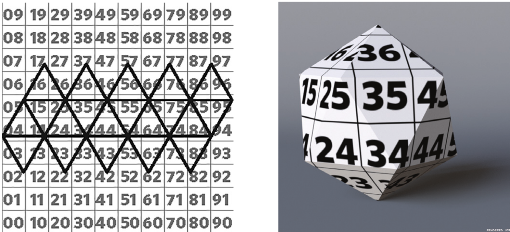

图 11.12。 一个二十面体，其三角形布置在纹理空间中以提供零失真但有许多裂缝。

&emsp;&emsp;由顶点纹理坐标定义的纹理坐标映射的质量取决于分配给顶点的坐标 - 即网格在纹理空间中的布局方式。 无论分配什么坐标，只要网格中的三角形共享顶点（第 12.1 节），纹理坐标映射始终是连续的，因为相邻的三角形会在它们共享边上的点上使用想就纹理坐标。 但是上面描述的其他令人满意的品质并不是那么自动的。 内射性意味着三角形在纹理空间中不重叠——如果重叠，则意味着纹理中的某个点将出现在表面上的多个位置。

&emsp;&emsp;当纹理空间中的三角形面积与其在 3D 中的面积成比例时，尺寸失真较低。 例如，如果用连续的纹理坐标函数映射一个角色的脸，那么鼻子通常会被挤压到纹理空间中相对较小的区域，如图 11.13 所示。 虽然鼻子上的三角形比脸颊上的小，但在纹理空间中的大小比例更为极端。 结果是鼻子上的纹理被放大了，因为小面积的纹理必须覆盖大面积的表面。 同样，将前额与太阳穴进行比较，三角形在 3D 中的大小相似，但太阳穴周围的三角形在纹理空间中更大，导致纹理在那里显得更小。

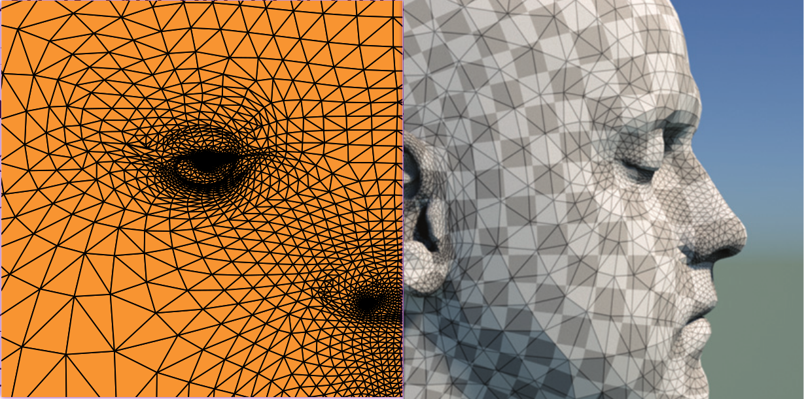

图 11.13  一个人脸模型，分配了纹理坐标以实现合理的低形状失真，但中等区域仍产生了失真。

&emsp;&emsp;同样，当三角形的形状在 3D 和纹理空间中相似时，形状失真较低。 面部示例具有相当低的形状失真，但是，例如，图 11.17 中的球体在极点附近具有非常大的形状失真。

### 11.2.3 平铺、环绕模式和纹理变换 Tiling, Wrapping Modes, and Texture Transformations

&emsp;&emsp;允许纹理坐标超出纹理图像的边界通常很有用。 有时这是一个细节：纹理坐标计算中的舍入错误可能会导致恰好落在纹理边界上的顶点稍微向外，在这种情况下纹理映射机制不应该失败。 但它也可以是一种建模工具。

&emsp;&emsp;如果纹理只应该覆盖表面的一部分，但纹理坐标已经设置为将整个表面映射到单位正方形，一个选择是准备一个大部分空白的纹理图像，内容在一个小区域。 但这可能需要非常高分辨率的纹理图像才能在相关区域获得足够的细节。 另一种选择是放大所有纹理坐标，使它们覆盖更大的范围——例如，[-4.5, 5.5] × [-4.5, 5.5]，将单位正方形定位在表面中心的十分之一大小 。

&emsp;&emsp;对于这种情况，纹理图像覆盖的单位正方形区域外的纹理查找应返回恒定的背景颜色。 一种方法是设置一个背景颜色，由单位正方形外的纹理查找返回。 如果纹理图像已经具有恒定的背景颜色（例如，白色背景上的徽标），另一种在平面上自动扩展此背景的方法是安排在单位正方形外查找以返回纹理图像的颜色边缘上最近的点，通过将 u 和 v 坐标限制在图像中从第一个像素到最后一个像素的范围内来实现。

&emsp;&emsp;有时我们想要一个重复的图案，例如棋盘、瓷砖地板或砖墙。 如果图案在矩形网格上重复，则创建具有相同数据的许多副本的图像将是浪费的。 相反，我们可以使用环绕索引处理纹理图像外部的纹理查找——当查找点离开纹理图像的右边缘时，它环绕到左边缘。 使用像素坐标上的整数余数运算可以非常简单地处理这一点。

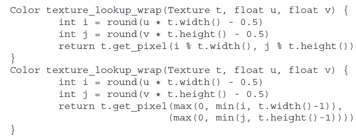

&emsp;&emsp;这两种处理越界查找的方法之间的选择是通过从列表中选择一种环绕模式来指定的，该列表包括平铺tiling、裁剪clamping以及通常两者的组合或变体。 使用环绕模式，我们可以自由地将纹理视为一个函数，它为无限 2D 平面中的任何点返回颜色（图 11.14）。 当我们使用图像指定纹理时，这些模式描述了应该如何使用有限图像数据来定义此函数。 在 11.5 节中，我们将看到程序纹理可以自然地跨越无限平面，因为它们不受有限图像数据的限制。 由于两者在逻辑上都是无限的，因此这两种类型的纹理可以互换。

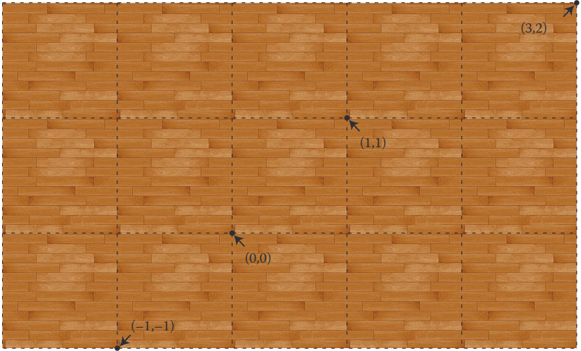

图 11.14  通过包裹纹素坐标平铺在纹理空间上的木地板纹理。

&emsp;&emsp;在调整纹理的比例和放置时，应该避免实际更改生成纹理坐标的函数，或存储在网格顶点处的纹理坐标值，而是在使用它们对纹理进行采样之前对纹理坐标应用矩阵变换 ：

$$\phi(\mathrm{x})=\mathrm{M}_{T} \phi_{\text {model }}(\mathrm{x})$$

&emsp;&emsp;其中 φ 模型是模型提供的纹理坐标函数，MT 是一个 3 x 3 矩阵，表示使用齐次坐标对 2D 纹理坐标进行仿射或投影变换。 大多数使用纹理映射的渲染器都支持这样的转换，有时仅限于缩放和/或平移。

### 11.2.4 透视校正插值 Perspective Correct Interpolation

&emsp;&emsp;通过在三角形之间插入纹理坐标来获得正确的透视图有一些微妙之处，但我们可以在光栅化阶段解决这个问题。 事情并不简单的原因是，仅在屏幕空间中插入纹理坐标会导致图像不准确，如图 11.15 中的网格纹理所示。 因为随着与观察者的距离增加，透视中的事物变得更小，所以在 3D 中均匀分布的线条应该在 2D 图像空间中压缩。 需要对纹理坐标进行更仔细的插值来实现这一点。

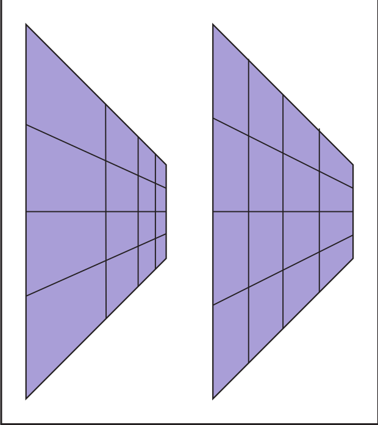

图 11.15  左：正确的视角。 右：屏幕空间中的插值。

&emsp;&emsp;我们可以通过对(u, v)坐标进行插值，修改8.1.2节的光栅化方法来实现三角形上的纹理映射，但是这会导致如图11.15右侧所示的问题。 如果使用屏幕空间重心坐标，三角形会出现类似的问题，如下面的光栅化代码：

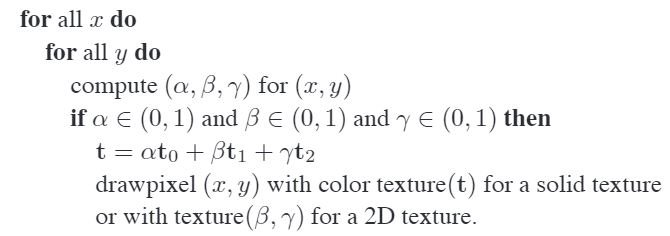

&emsp;&emsp;这段代码会生成图片，但是有个问题。 为了解开这个基本问题，让我们考虑从世界空间 q 到齐次点 r 到齐次化点 s 的过程：

$$\left[\begin{array}{c}
x_{q} \\
y_{q} \\
z_{q} \\
1
\end{array}\right] \stackrel{\text { transform }}{\longrightarrow}\left[\begin{array}{c}
x_{r} \\
y_{r} \\
z_{r} \\
h_{r}
\end{array}\right] \stackrel{\text { homogenize }}{\longrightarrow}\left[\begin{array}{c}
x_{r} / h_{r} \\
y_{r} / h_{r} \\
z_{r} / h_{r} \\
1
\end{array}\right] \equiv\left[\begin{array}{c}
x_{s} \\
y_{s} \\
z_{s} \\
1
\end{array}\right] .$$

&emsp;&emsp;纹理坐标插值问题的最简单形式是当我们有两个点 q 和 Q 关联的纹理坐标 (u, v) 时，我们需要沿着 s 和 S 之间的线在图像中生成纹理坐标。如果世界空间 q` 和 Q 之间的线上的空间点 q 投影到 s` 和 S 之间的线上的屏幕空间点 s，那么这两个点应该具有相同的纹理坐标。

&emsp;&emsp;由上述算法体现的天真的屏幕空间方法说，在点 s = s + α(S − s) 我们应该使用纹理坐标 us + α(u S − us ) 和 vs + α(v S - 对）。 这不能正常工作，因为转换为 s 的世界空间点 q 不是 q + α(Q − q)。

&emsp;&emsp;然而，我们从 7.4 节知道 q 和 Q 之间的线段上的点确实在 s 和 S 之间的线段上的某个地方结束了； 事实上，在那部分我们展示了

$$\mathbf{q}+t(\mathbf{Q}-\mathbf{q}) \mapsto \mathbf{s}+\alpha(\mathbf{S}+\mathbf{s})$$

插值参数 t 和 α 不一样，但我们可以从另一个计算一个:

$$t(\alpha)=\frac{w_{r} \alpha}{w_{R}+\alpha\left(w_{r}-w_{R}\right)} \quad \text { and } \quad \alpha(t)=\frac{w_{R} t}{w_{r}+t\left(w_{R}-w_{r}\right)}\tag{11.1}$$

&emsp;&emsp;这些方程为屏幕空间插值思想提供了一种可能的解决方法。要获得屏幕空间点 s = s + α(S − s) 的纹理坐标，计算 u s = us + t(α)(u S − us ) 和 vs = vs + t(α)(v S − vs )。 这些是映射到 s 的点 q 的坐标，所以这会起作用。 但是，为每个片段评估 t(α) 很慢，并且有一种更简单的方法。

&emsp;&emsp;关键的观察是，正如我们所知，透视变换保留了线和平面，因此可以安全地跨三角形线性插入我们想要的任何属性，但前提是它们与点一起经历透视变换。为了获得几何直觉，减少维度，以便我们有同质点（x r ，y r ， w r ）和一个被插值的属性 u。属性 u 应该是 x r 和 y r 的线性函数，因此如果我们将 u 绘制为 (x r , y r ) 上的高度场，结果是一个平面。现在，如果我们将 u 视为第三个空间坐标（称为 ur 以强调它与其他空间坐标相同）并通过透视变换发送整个 3D 同质点（xr , yr , ur , wr ），结果(xs , ys , us ) 仍然生成位于平面上的点。平面内会有一些翘曲，但平面保持平坦。这意味着我们是 (xs , ys ) 的线性函数——也就是说，我们可以使用基于坐标 (xs ) 的线性插值在任何地方计算我们, 是 )。

&emsp;&emsp;回到完整的问题，我们需要插入纹理坐标 (u, v)，它们是世界空间坐标 $(x_q,y_q,z_q)$ 的线性函数。 在将点转换到屏幕空间并添加纹理坐标后，就好像它们是附加坐标一样，我们有

$$\left[\begin{array}{c}
u \\
v \\
1 \\
x_{r} \\
y_{r} \\
z_{r} \\
w_{r}
\end{array}\right] \stackrel{\text { homogenize }}{\longrightarrow}\left[\begin{array}{c}
u / w_{r} \\
v / w_{r} \\
1 / w_{r} \\
x_{r} / w_{r}=x_{s} \\
y_{r} / w_{r}=y_{s} \\
z_{r} / w_{r}=z_{s} \\
1
\end{array}\right]\tag{11.2}$$

&emsp;&emsp;上一段的实际含义是我们可以继续并根据$(x_s,y_s$) 的值对所有这些变量进行插值，包括 z 缓冲区中使用的值 $z_s$。 天真的方法的问题很简单，我们正在对选择不一致的组件进行插值——只要所涉及的数量来自透视分割之前或全部来自透视分割之后，一切都会好起来的。

&emsp;&emsp;剩下的一个问题是 $(u/w_r,v/w_r)$不能直接用于查找纹理数据； 我们需要（u，v）。 这解释了我们引入（11.2）的额外参数的目的，其值始终为 1：一旦我们有了$u/w_r$ 、$v/w_r$ 和 $1/w_r$ ，我们可以通过除法轻松恢复 (u, v) 。

&emsp;&emsp;为了验证这一切是否正确，让我们检查一下，在屏幕空间内插值$1/w_r$确实产生了在世界空间中内插的$w_r$ 的倒数。 要确认这是真的，请确认（练习 2）：

$$\frac{1}{w_{r}}+\alpha(t)\left(\frac{1}{w_{R}}-\frac{1}{w_{r}}\right)=\frac{1}{w_{r}^{\prime}}=\frac{1}{w_{r}+t\left(w_{R}-w_{r}\right)}\tag{11.3}$$

记住 α(t) 和 t 与公式 11.1 相关。

&emsp;&emsp;这种在转换空间中不会产生错误的线性插值$1/w_r$的能力使我们能够正确地构造三角形。 我们可以使用这些事实来修改已经通过观察矩阵的三个点$t_i=(x_i,y_i,z_i)$的扫描转换代码，但尚未homogenized，完整的纹理坐标 t i = (u i , v i )：

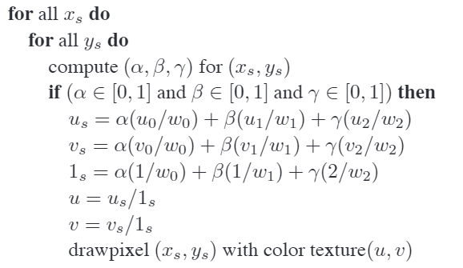

&emsp;&emsp;当然，这个伪代码中出现的许多表达式会在循环外预先计算以提高速度。 对于实体纹理，很简单，将原始世界空间坐标 $x_q,y_q,z_q$包含在属性列表中，与 u 和 v 一样处理，将获得正确的插值世界空间坐标，可以将其传递给实体纹理功能。

### 11.2.5 连续性和裂缝 Continuity and Seams

&emsp;&emsp;尽管低失真和连续性是纹理坐标函数的良好属性，但不连续性通常是不可避免的。 对于任何封闭的 3D 表面，拓扑的基本结果是没有连续的双射函数将整个表面映射到纹理图像。 必须做出一些改变，通过引入接缝——纹理坐标突然变化的表面上的曲线——我们可以在其他地方获得低失真。 上面讨论的许多几何确定的映射已经包含接缝：在球坐标和柱坐标系中，接缝是 atan2 计算的角度从 π 环绕到 -π 的位置，而在立方体贴图中，接缝沿着立方体边缘，其中 六个方形纹理之间的映射切换。

&emsp;&emsp;对于内插纹理坐标，接缝需要特别考虑，因为它们不会自然发生。我们之前观察到，内插纹理坐标在共享顶点网格上自动连续——纹理坐标的共享保证了这一点。但这意味着如果一个三角形跨越一个接缝，一些顶点在一侧，一些在另一侧，插值机制会很高兴地提供连续映射，但它可能会高度扭曲或折叠，因此它不是单射的。图 11.17 在用球坐标映射的地球上说明了这个问题。例如，地球底部附近有一个三角形，其一个顶点位于新西兰南岛的顶端，另一个顶点位于北岛东北约 400 公里处的太平洋。在这些点之间飞行的明智飞行员会飞越新西兰，但路径开始于经度 167 ◦ s E (+167)，结束于 179 ◦ s W（即，经度 -179），因此线性插值选择的路线是途中穿越南美洲。这会导致整个地图的后向副本被压缩成穿过第 180 条子午线的三角形条带！解决方案是用等效经度 181 ◦ s E 标记第二个顶点，但这只会将问题推到下一个三角形。

&emsp;&emsp;创建干净过渡的唯一方法是避免在接缝处共享纹理坐标：穿越新西兰的三角形需要插值到经度 +181，太平洋中的下一个三角形需要从经度 -179 开始继续。 为此，我们复制接缝处的顶点：对于每个顶点，我们添加具有等效经度的第二个顶点，相差 360°s，接缝两侧的三角形使用不同的顶点。 该解决方案如图 11.17 的右半部分所示，其中纹理空间最左侧和最右侧的顶点是重复的，具有相同的 3D 位置。

## 11.3 抗锯齿纹理查找 Antialiasing Texture Lookups

&emsp;&emsp;纹理映射的第二个基本问题是抗锯齿。 渲染纹理映射图像是一个采样过程：将纹理映射到表面，然后将表面投影到图像中会在图像平面上产生一个 2D 函数，我们以像素为单位对其进行采样。 正如我们在第 9 章中看到的那样，当图像包含细节时，使用点样本会产生走样失真或锐利的边缘——而且由于纹理的全部意义在于引入细节，因此它们成为我们在图 11.3 中看到的走样问题的主要来源。

&emsp;&emsp;就像线条或三角形的抗锯齿光栅化、抗锯齿光线追踪（第 13.4 节）或下采样图像（第 9.4 节）一样，解决方案是使每个像素不是点样本而是图像的面积平均值，在类似于像素大小。 使用与抗锯齿光栅化和光线追踪相同的超级采样方法，如果有足够的样本，可以在不改变纹理映射机制的情况下获得出色的结果：像素区域内的许多样本将落在纹理映射的不同位置，并计算使用不同纹理查找的平均着色结果是近似像素上图像平均颜色的准确方法。 但是，对于具有更多细节的纹理，需要非常多的样本才能获得良好的结果，这很慢。 在表面存在纹理的情况下有效地计算该面积平均值是纹理抗锯齿的第一个关键主题。

&emsp;&emsp;纹理图像通常由光栅图像定义，因此也需要考虑重建问题，就像向上采样图像（第 9.4 节）一样。纹理的解决方案是相同的：使用重建过滤器在纹素之间进行插值。

&emsp;&emsp;我们将在以下各节中扩展这些主题中的每一个。

### 11.3.1 像素的足迹 The Footprint of a Pixel

&emsp;&emsp;渲染图像和纹理之间的关系不断变化，使得抗锯齿纹理比其他类型的抗锯齿更复杂。 每个像素值都应计算为图像中属于该像素的区域的平均颜色，并且在像素注视单个表面的常见情况下，这对应于对表面上的一个区域进行平均。 如果表面颜色来自纹理，则这又相当于对纹理的相应部分进行平均，称为像素的纹理空间足迹。 图 11.18 说明了正方形区域（可能是低分辨率图像中的像素区域）的足迹如何映射到地板纹理空间中大小和形状完全不同的区域。

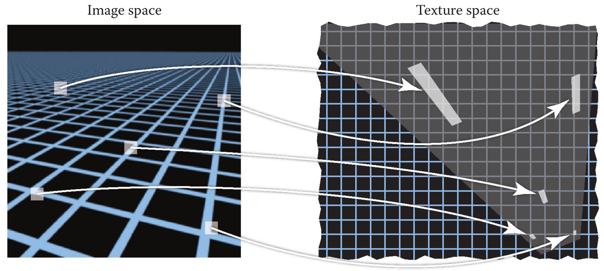

图 11.18  图像中相同大小的正方形区域的纹理空间中的足迹在整个图像中的大小和形状各不相同。

&emsp;&emsp;回想一下用纹理渲染涉及的三个空间：将 3D 点映射到图像的投影 π 和将 3D 点映射到纹理空间的纹理坐标函数 φ。 为了处理像素足迹，我们需要了解这两个映射的组成：首先向后跟随 π 从图像到表面，然后向前跟随 φ。 这种组合 ψ = φ ◦ $\pi ^ {-1}$ 决定了像素足迹：像素的足迹是映射 ψ 下该像素的图像正方形区域的图像。

&emsp;&emsp;纹理抗锯齿的核心问题是计算像素足迹上的纹理平均值。 一般来说，要做到这一点可能是一项非常复杂的工作：对于具有复杂表面形状的遥远物体，足迹可能是一个复杂的形状，覆盖了纹理空间中的大面积，或者可能是几个不连续的区域。 但在典型情况下，像素落在表面的平滑区域，该区域映射到纹理中的单个区域。

&emsp;&emsp;因为 ψ 包含图像到表面的映射和表面到纹理的映射，所以足迹的大小和形状取决于查看情况和纹理坐标函数。 当表面靠近相机时，像素足迹会更小； 当同一表面移得更远时，足迹会变大。 当以倾斜角度查看表面时，表面上像素的足迹会被拉长，这通常意味着它在纹理空间中也会被拉长。 即使使用固定视图，纹理坐标函数也会导致足迹发生变化：如果它扭曲区域，足迹的大小会发生变化，如果扭曲形状，即使对于表面的正面视图，它们也会被拉长。

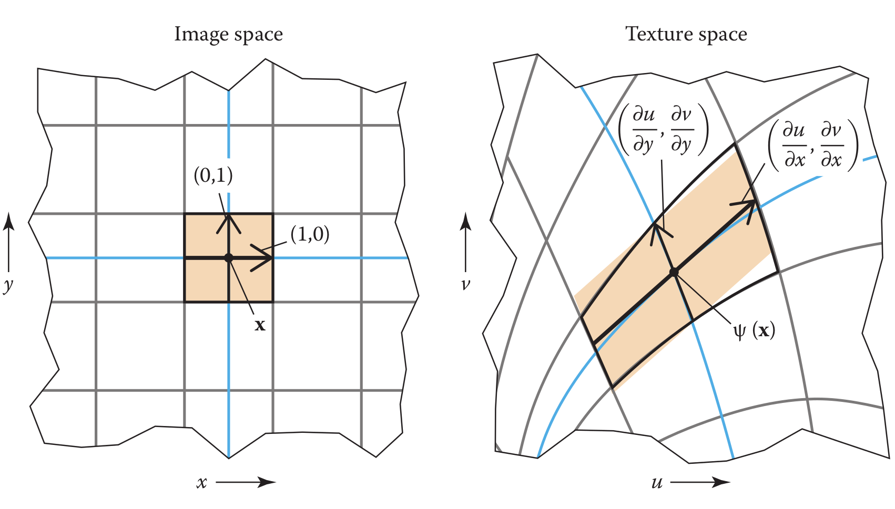

图 11.19。 可以使用从 (x, y) 到 (u, v) 的映射的导数来近似像素的纹理空间足迹。 关于 x 和 y 的偏导数与 x 和 y 等值线（蓝色）的图像平行，并跨越一个平行四边形（橙色阴影），该平行四边形近似于精确足迹的弯曲形状（黑色轮廓）。  

&emsp;&emsp;然而，为了找到一种有效的算法来计算抗锯齿查找，需要一些实质性的近似值。 当函数是平滑的时，线性近似通常很有用。 在纹理抗锯齿的情况下，这意味着将图像空间到纹理空间的映射 ψ 近似为从 2D 到 2D 的线性映射：

$$\psi(\mathrm{x})=\psi\left(\mathrm{x}_{0}\right)+\mathrm{J}\left(\mathrm{x}-\mathrm{x}_{0}\right)$$

&emsp;&emsp;其中 2×2 矩阵 J 是$\psi$导数的某种近似值。 它有四个条目，如果我们将图像空间位置表示为 x = (x, y)，将纹理空间位置表示为 u = (u, v) 那么

$$\mathbf{M}=\left[\begin{array}{ll}
\frac{d u}{d x} & \frac{d u}{d y} \\
\frac{d v}{d x} & \frac{d v}{d y}
\end{array}\right]$$

&emsp;&emsp;其中四个导数描述了当我们改变 x 和 y 时，在图像中的点 (x, y) 处看到的纹理点 (u, v) 如何变化。

&emsp;&emsp;这种近似的几何解释是它说图像中以 x 为中心的单位大小的方形像素区域将近似映射到纹理空间中的平行四边形，以$\psi(\mathrm{x})$为中心，其边缘平行于向量$u_x= ( du/dx, dv/dx)$和$u_y= (du/dy, dv/dy)$。

&emsp;&emsp;导数矩阵 J 很有用，因为它讲述了整个图像（近似）纹理空间足迹变化的整个故事。 幅度较大的导数表示更大的纹理空间足迹，而导数向量$u_x$ 和$u_y$之间的关系表示形状。 当它们正交且长度相同时，覆盖区是方形的，并且当它们变得倾斜和/或长度非常不同时，覆盖区变得拉长。

&emsp;&emsp;我们现在已经达到了通常被认为是“正确答案”的问题形式：特定图像空间位置的过滤纹理样本应该是纹理定义的平行四边形足迹上的纹理贴图的平均值 在那个点坐标导数。 这已经包含了一些假设——即从图像到纹理的映射是平滑的——但它对于出色的图像质量来说已经足够准确了。然而，这个平行四边形面积平均值已经太昂贵而无法精确计算，因此使用了各种近似值。 纹理抗锯齿方法的不同之处在于它们在近似此查找时所做的速度/质量权衡。 我们将在以下各节中讨论这些。

### 11.3.2 重建 Reconstruction

&emsp;&emsp;当足迹小于 texel 时，我们将放大纹理，因为它被映射到图像中。 这种情况类似于对图像进行上采样，主要考虑的是在纹素之间进行插值，以产生纹素网格不明显的平滑图像。 就像在图像上采样中一样，这个平滑过程由一个重建滤波器定义，该滤波器用于计算纹理空间中任意位置的纹理样本。 （见图 11.20。）这里的方法使用框过滤器对图像进行采样。 一些系统改为使用高斯像素过滤器，它在纹理空间中变成椭圆高斯； 这是椭圆加权平均 (EWA)。

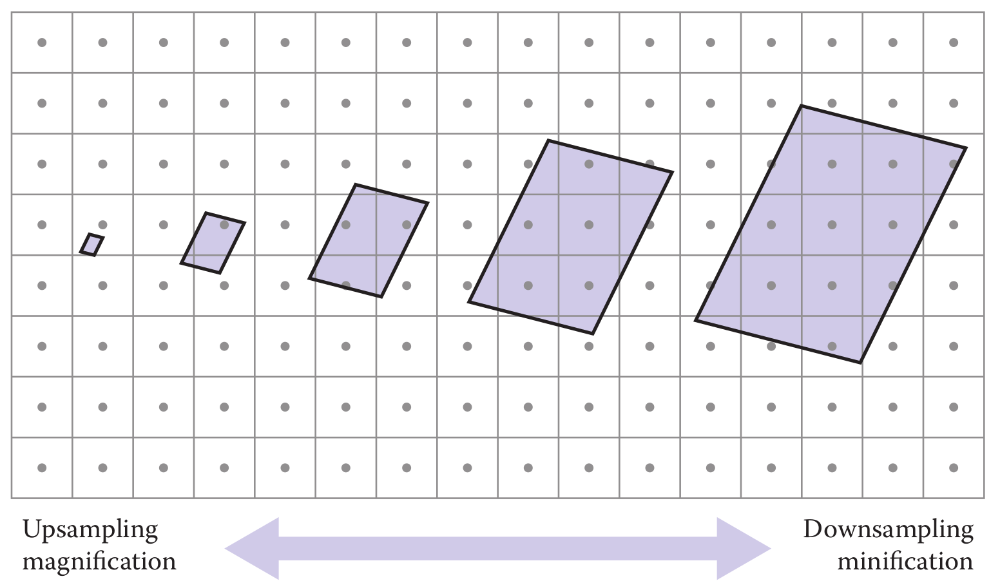

图 11.20。 纹理过滤的主要问题随着足迹大小而变化。 对于小足迹（左），需要在像素之间进行插值以避免块状失真**artifacts**； 对于大足迹，挑战是有效地找到许多像素的平均值。
 

&emsp;&emsp;考虑因素与图像重采样几乎相同，但有一个重要区别。 在图像重采样中，任务是在规则网格上计算输出样本，并且在可分离重建滤波器的情况下，该规则使重要的优化成为可能。 在纹理过滤中，查找的模式不规则，样本必须单独计算。这意味着使用大型、高质量的重建过滤器非常昂贵，因此通常用于纹理的最高质量过滤器是双线性插值。

&emsp;&emsp;双线性插值纹理样本的计算与计算使用双线性插值进行上采样的图像中的一个像素相同。 首先我们用（实值）纹素坐标表示纹理空间样本点，然后我们读取四个相邻纹素的值并取平均值。纹理通常在单位正方形上参数化，纹素位于 与任何图像中的像素相同，在 u 方向上间隔距离为$1/n_u$，在 v 方向上间隔为$1/n_v$，纹素 (0,0) 位于距边缘半个纹素处以实现对称。 （有关完整说明，请参阅第 9 章。）

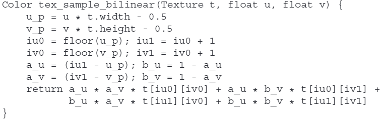

&emsp;&emsp;在许多系统中，此操作成为一个重要的性能瓶颈，主要是因为从纹理数据中获取四个 texel 值所涉及的内存延迟。纹理样本点的模式是不规则的，因为从图像到纹理空间的映射是任意的，但通常是连贯的，因为附近的图像点倾向于映射到附近的纹理点，这些点可以读取相同的纹素。出于这个原因，高性能系统具有专门用于纹理采样的特殊硬件，用于处理插值和管理最近使用的纹理数据的缓存，以最大限度地减少从存储纹理数据的内存中获取慢速数据的次数。

&emsp;&emsp;阅读第 9 章后，您可能会抱怨线性插值对于某些要求苛刻的应用程序来说可能不够平滑。 但是，通过使用更好的过滤器将纹理重新采样到更高的分辨率，它总是可以做得足够好，这样纹理就足够平滑，双线性插值效果很好。

### 11.3.3 Mipmapping

&emsp;&emsp;只有在纹理被放大的情况下才能做好插值工作：与纹素的间距相比，像素足迹很小。 当像素足迹覆盖许多纹素时，良好的抗锯齿需要计算许多纹素的平均值来平滑信号，以便可以安全地对其进行采样。

&emsp;&emsp;计算足迹上平均纹理值的一种非常准确的方法是找到足迹内的所有纹素并将它们相加。 然而，当占用空间很大时，这可能会非常昂贵——它可能需要读取数千个纹素，仅用于单次查找。 更好的方法是预先计算并存储不同大小和位置的各个区域的纹理平均值。

&emsp;&emsp;这个想法的一个非常流行的版本被称为“MIP 映射”或称为 mipmapping。 mipmap 是一系列纹理，它们都包含相同的图像，但分辨率越来越低。 原始的全分辨率纹理图像称为 mipmap 的基础级别或级别 0，级别 1 是通过获取该图像并在每个维度上按因子 2 对其进行下采样来生成的，从而生成具有$1/4$多的纹素。 粗略地说，此图像中的纹素是 0 级图像中大小为 2 x 2 纹素的正方形区域的平均值。

&emsp;&emsp;这个过程可以继续定义尽可能多的 mipmap 级别：级别 k 的图像是通过将级别 k - 1 的图像下采样 2 来计算的。 第 k 层的纹素对应于原始纹理中$2^k * 2^k$纹素的正方形区域。 例如，从一个 1024 × 1024 的纹理图像开始，我们可以生成一个具有 11 个级别的 mipmap：级别 0 是 1024 × 1024； 级别 1 是 512 × 512，依此类推，直到级别 10，它只有一个纹素。 这种结构，图像以一系列越来越低的采样率表示相同的内容，称为图像金字塔，基于将所有较小图像堆叠在原始图像上的视觉模拟。

### 11.3.4 使用 Mipmap 进行基本纹理过滤 Basic Texture Filtering with Mipmaps

&emsp;&emsp;使用 mipmap 或图像金字塔，纹理过滤可以比单独访问许多纹素更有效地完成。当我们需要大面积平均的纹理值时，我们只需使用来自 Mipmap 更高级别的值，这些值已经是图像大面积的平均值。 最简单和最快的方法是从 mipmap 中查找单个值，选择级别，以便该级别的纹素覆盖的大小与像素足迹的整体大小大致相同。当然，像素足迹的形状可能与纹素表示的（始终为正方形）区域的形状大不相同，我们可以预期这会造成一些失真。

&emsp;&emsp;暂且不提当像素足迹具有细长形状时该怎么做的问题，假设足迹是宽度为 D 的正方形，以全分辨率纹理中的纹素来衡量。 什么级别的 mipmap 适合采样？ 由于第 k 层的纹素覆盖宽度为$2^k$的正方形，似乎这样选择 k 是合适的：

$$2^{k} \approx D$$

&emsp;&emsp;所以我们让$k = log_2D$。当然，这在大多数情况下会给出 k 的非整数值，而且我们只存储了整数级别的 mipmap 图像。 两种可能的解决方案是仅查找最接近 k 的整数的值（有效但在级别之间的突然转换处会产生接缝）或查找与 k 最接近的两个整数的值并线性插值这些值（两倍的工作， 但更流畅）。

&emsp;&emsp;在我们真正写下采样 mipmap 的算法之前，我们必须决定当足迹不是方形时我们将如何选择“宽度”D。一些可能性可能是使用面积的平方根或找到最长的轴 的足迹并称之为宽度。 一个易于计算的实用折衷方案是使用最长边的长度：

$$D=\max \left\{\left\|\mathbf{u}_{x}\right\|,\left\|\mathbf{u}_{y}\right\|\right\} .$$

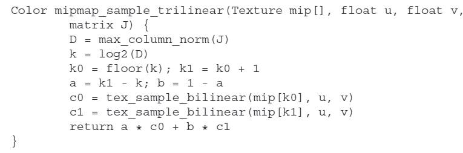

&emsp;&emsp;基本的 mipmapping 在消除锯齿方面做得很好，但是因为它无法处理拉长的或各向异性的像素足迹，所以当以掠射角查看表面时，它的表现不佳。 这在代表观看者站立的表面的大平面上最常见。 地板上远处的点以非常陡峭的角度观察，导致非常各向异性的足迹，mipmapping 近似于更大的正方形区域。 生成的图像在水平方向上会显得模糊。

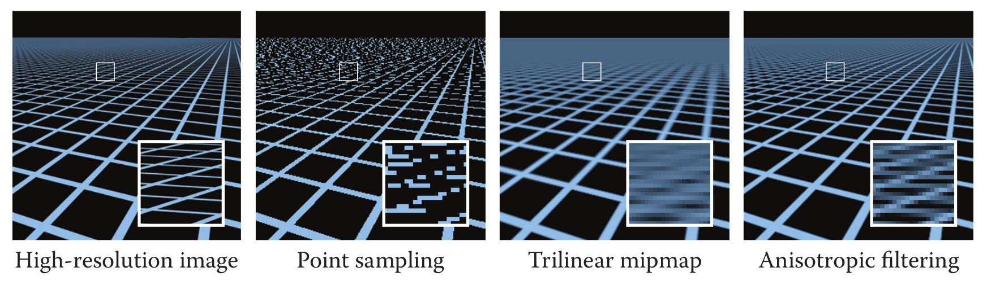

图 11.21  使用三种不同策略对具有挑战性的测试场景（显示详细结构的参考图像，左侧）进行抗锯齿的结果：使用最近邻插值简单地获取单点样本； 使用 mipmap 金字塔为每个像素在纹理中平均一个正方形区域； 使用来自 mipmap 的几个样本来平均纹理中的各向异性区域。 

### 11.3.5 各向异性过滤 Anisotropic Filtering

&emsp;&emsp;mipmap 可以与多次查找一起使用，以更好地近似拉长的足迹。 这个想法是根据足迹的最短轴而不是最大轴来选择 mipmap 级别，然后将沿长轴间隔开的几个查找平均在一起。 （见图 11.21。）

## 11.4 纹理贴图的应用 Applications of Texture Mapping

&emsp;&emsp;一旦您理解了为表面定义纹理坐标的想法以及查找纹理值的机制，这种机制就有很多用途。 在本节中，我们调查了纹理映射中一些最重要的技术，但纹理是一种非常通用的工具，其应用程序仅受程序员想象力的限制。

### 11.4.1 控制着色参数 Controlling Shading Parameters

&emsp;&emsp;纹理映射的最基本用途是通过使用于着色计算的漫反射颜色（无论是在光线跟踪器中还是在片段着色器中，依赖于从纹理中查找的值来引入颜色变化）。 带纹理的漫反射组件可用于在表面上粘贴贴花、油漆装饰或打印文本，还可以模拟材质颜色的变化，例如木材或石材。

&emsp;&emsp;不过，没有什么限制我们只能改变漫反射颜色。 任何其他参数，例如镜面反射率或镜面粗糙度，也可以进行纹理化。 例如，贴有透明包装胶带的纸板箱可能到处都是相同的漫反射颜色，但更亮，镜面反射率更高，粗糙度更低， 磁带所在的位置比别处多。 在许多情况下，不同参数的映射是相关的：例如，印有徽标的光面白色陶瓷杯可能在印刷的地方更粗糙和更暗（图 11.22），而书名则用金属墨水印刷 可能会同时改变漫反射颜色、镜面反射颜色和粗糙度。

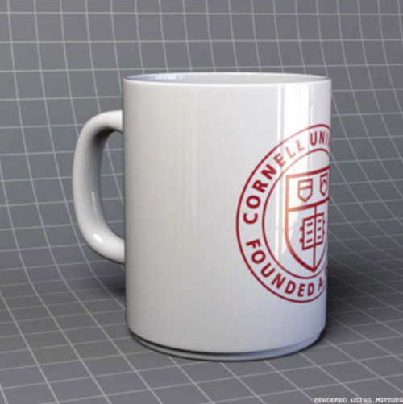

图 11.22  具有镜面粗糙度的陶瓷杯，由漫反射颜色纹理的反转副本控制。

### 11.4.2 法线贴图和凹凸贴图 Normal Maps and Bump Maps

&emsp;&emsp;另一个对着色很重要的量是表面法线。 使用插值法线（第 8.2 节），我们知道着色法线不必与底层表面的几何法线相同。 法线贴图利用了这一事实，使阴影法线取决于从纹理贴图读取的值。 最简单的方法是将法线存储在纹理中，在每个被解释的纹素中存储三个数字，而不是作为颜色的三个分量，作为法线向量的 3D 坐标。

&emsp;&emsp;但是，在使用法线贴图之前，我们需要知道从贴图读取的法线是用什么坐标系表示的。 将法线直接存储在对象空间中，与用于表示表面几何本身的坐标系相同，是最简单的： 从贴图读取的法线可以以与表面本身报告的法线完全相同的方式使用：在大多数情况下，需要将其转换到世界空间以进行光照计算，就像几何体附带的法线一样。

&emsp;&emsp;然而，存储在对象空间中的法线贴图本质上与表面几何相关联——即使法线贴图没有效果，为了用几何法线再现结果，法线贴图的内容必须跟踪表面的方向。 此外，如果表面将变形，从而几何法线发生变化，则不能再使用对象空间法线贴图，因为它将继续提供相同的着色法线。

&emsp;&emsp;解决方案是为附着在表面上的法线定义坐标系。 这样的坐标系可以基于表面的切线空间定义（参见第 2.5 节）：选择一对切向量并使用它们来定义正交基（第 2.4.5 节）。 纹理坐标函数本身提供了一种有用的方法来选择一对切向量：使用与常数 u 和 v 相切的方向。这些切线通常不是正交的，但我们可以使用第 2.4.7 节中的过程到“正方形 up”正交基，或者它可以使用表面法线和一个切线向量来定义。

&emsp;&emsp;当在此基础上表示法线时，它们的变化要小得多； 由于它们大多指向光滑表面的法线方向附近，因此它们将靠近法线贴图中的向量 $(0, 0, 1)^T$。

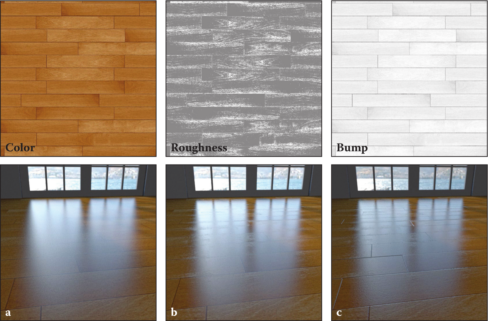

图 11.23  使用纹理贴图控制阴影渲染的木地板。 (a) 只有漫反射颜色由纹理贴图调制。 (b) 镜面反射粗糙度也由第二个纹理贴图调制。 (c) 表面法线由凹凸贴图修改。

&emsp;&emsp;法线贴图从何而来？ 通常，它们是从更详细的模型计算得出的，平滑表面是该模型的近似值； 其他时候，它们可以直接从真实表面测量。 它们也可以作为建模过程的一部分进行创作； 在这种情况下，使用凹凸贴图间接指定法线通常很好。 这个想法是凹凸贴图是一个高度场：一个函数，它给出了光滑表面上方的细节表面的局部高度。 值高的地方（地图看起来很亮，如果你把它显示为图像）表面突出到光滑表面之外； 在值较低的地方（地图看起来很暗），表面在其下方后退。 例如，凹凸贴图中的一条狭窄的暗线是划痕，或者小白点是凹凸。

&emsp;&emsp;从凹凸贴图导出法线贴图很简单：法线贴图（在切线框架中表示）是凹凸贴图的导数。

&emsp;&emsp;图 11.23 显示了纹理贴图用于创建木纹颜色并模拟由于饰面浸入木材多孔部分而增加的表面粗糙度，以及用于创建不完美饰面和板之间间隙的凹凸贴图，以制作逼真的木地板。

### 11.4.3 置换贴图 Displacement Maps

&emsp;&emsp;法线贴图的一个问题是它们实际上根本不会改变表面；它们只是一种着色技巧。 当法线贴图隐含的几何体应该在 3D 中产生明显的效果时，这一点变得很明显。 在静止图像中，首先要注意的问题通常是尽管内部出现凹凸，但物体的轮廓仍然保持平滑。 在动画中，缺乏视差会暴露出凹凸，无论多么令人信服，实际上只是“画”在表面上。

&emsp;&emsp;纹理不仅可以用于着色，还可以用于改变几何体。 置换贴图是这个想法的最简单版本之一。 这个概念与凹凸贴图相同：标量（单通道）贴图给出高于“平均地形”的高度，但效果不同。置换贴图不是使用平滑几何体时从高度贴图导出着色法线，而是实际上改变了表面，沿着平滑表面的法线将每个点移动到新位置。 每种情况下的法线大致相同，但表面不同。

&emsp;&emsp;实现置换贴图最常见的方法是用大量小三角形细分平滑表面，然后使用置换贴图置换生成的网格的顶点。 在图形管道中，这可以通过在顶点阶段使用纹理查找来完成，这对于地形特别方便。

### 11.4.4 阴影贴图 Shadow Maps

&emsp;&emsp;阴影是描述场景中对象关系的重要线索，正如我们所见，它们很容易包含在光线追踪图像中。 然而，如何在光栅化渲染中获得阴影并不简单，因为表面一次被视为一个，孤立地。 阴影贴图是一种使用纹理贴图机制从点光源获取阴影的技术。

&emsp;&emsp;阴影贴图的想法是表示点光源照亮的空间体积。 想象一下像聚光灯或视频投影仪这样的光源，它从一个点向有限范围的方向发射光。 被照亮的体积——如果你把它握在手上，你会在手上看到光的一组点——是沿着离开该点的每条光线将光源连接到最近的表面点的线段的联合。

&emsp;&emsp;有趣的是，这个体积与位于与光源相同点的透视相机可见的体积相同：当且仅当一个点从光源位置可见时，它才会被光源照亮。

&emsp;&emsp;在这两种情况下，都需要评估场景中点的可见性：对于可见性，我们需要知道一个片段是否对相机可见，知道是否要在图像中绘制它； 对于阴影，我们需要知道一个片段是否对光源可见，以了解它是否被该光源照亮。 （见图 11.24。）

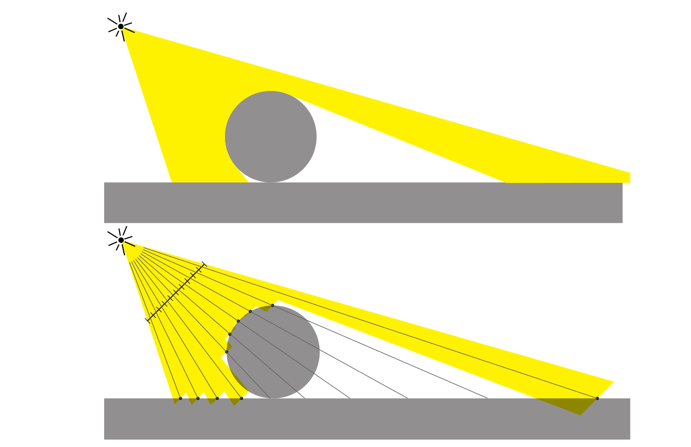

图 11.24  顶部：点光源照亮的空间区域。 底部：该区域由 10 像素宽的阴影贴图近似。

&emsp;&emsp;在这两种情况下，解决方案都是一样的：深度图告诉我们沿着一束光线到最近表面的距离。 在可见性情况下，这是 z 缓冲区（第 8.2.3 节），对于阴影情况，它称为阴影贴图。 在这两种情况下，通过将新片段的深度与存储在地图中的深度进行比较来评估可见性，如果其深度大于最近的可见表面的深度，则该表面对投影点是隐藏的（被遮挡或阴影） . 不同之处在于 z 缓冲区用于跟踪迄今为止看到的最近表面并在渲染期间更新，而阴影贴图则告诉我们到整个场景中最近表面的距离。

&emsp;&emsp;提前在单独的渲染过程中计算阴影贴图：像往常一样简单地光栅化整个场景，并保留生成的深度贴图（无需费心计算像素值）。 然后，拿着阴影贴图，执行一个普通的渲染过程，当你需要知道一个片段是否对源可见时，你在阴影贴图中投影它的位置（使用与渲染相同的透视投影） 首先是阴影贴图）并将查找值$d_{map}$与到源的实际距离 d 进行比较。 如果距离相同，则片段的点被照亮；如果$d > d_{map}$，这意味着有一个更接近源的不同表面，所以它被视为阴影。

&emsp;&emsp;“如果距离相同”这句话应该会引起您的注意：由于所有涉及的数量都是精度有限的近似值，我们不能指望它们完全相同。 对于可见点，$d ≈ d_{map}$但有时 d 会大一点，有时会小一点。 出于这个原因，需要一个容错：如果$d − d_{map} <\epsilon$，则认为一个点被照亮。 这种容差称为阴影偏差（shadow bias）。

&emsp;&emsp;在阴影贴图中查找时，在贴图中记录的深度值之间进行插值并没有多大意义。 这可能会导致平滑区域中更准确的深度（需要更少的阴影偏差），但会在阴影边界附近导致更大的问题，其中深度值突然变化。因此，阴影贴图中的纹理查找使用最近邻重建完成。 为了减少走样，可以使用多个样本，平均 1 或 0 阴影结果（而不是深度）； 这称为百分比更接近过滤。

### 11.4.5 环境贴图 Environment Maps

&emsp;&emsp;正如纹理可以方便地将细节引入表面的着色中，而不必向模型添加更多细节，纹理也可用于将细节引入照明，而无需对复杂的光源几何体进行建模。 与视野中物体的大小相比，当光线来自远处时，场景中点与点之间的照明变化很小。 假设照明仅取决于您看的方向，并且场景中的所有点都相同，然后使用环境贴图表达照明对方向的依赖性，这很方便。

&emsp;&emsp;环境贴图的想法是，在 3D 方向上定义的函数是单位球体上的函数，因此可以使用纹理贴图以完全相同的方式表示它，就像我们可能在球形物体上表示颜色变化一样。 我们不是从表面点的 3D 坐标计算纹理坐标，而是使用完全相同的公式从表示我们想知道照明方向的单位向量的 3D 坐标计算纹理坐标。

&emsp;&emsp;环境贴图最简单的应用是在光线追踪器中为不击中任何对象的光线赋予颜色：

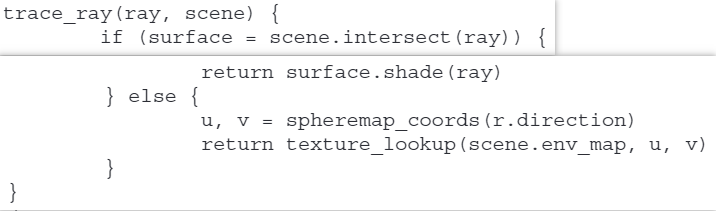

&emsp;&emsp;通过对光线追踪器的这一更改，反射其他场景对象的对象现在也将反映背景环境。

&emsp;&emsp;通过在着色计算中添加镜面反射，可以在光栅化上下文中实现类似的效果，其计算方式与光线追踪器中的计算方式相同，但只是直接在环境贴图中查找，不考虑其他对象场景：

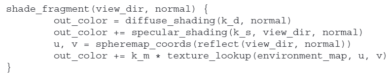

这种技术称为反射映射。

&emsp;&emsp;更高级的环境贴图使用计算来自环境贴图的所有照明，而不仅仅是镜面反射。 这是环境光照，可以使用蒙特卡罗积分在光线追踪器中计算，也可以通过使用一组点源近似环境并计算许多阴影贴图在光栅化中进行计算。

&emsp;&emsp;环境贴图可以存储在可用于映射球体的任何坐标中。 球面（经纬度）坐标是一种流行的选择，尽管在极点压缩纹理会浪费纹理分辨率并可能在极点产生失真。 立方体贴图是一种更有效的选择，广泛用于交互式应用程序（图 11.25）。

&emsp;&emsp;环境贴图可以存储在可用于映射球体的任何坐标中。 球面（经纬度）坐标是一种流行的选择，尽管在极点压缩纹理会浪费纹理分辨率并可能在极点产生伪影。 立方体贴图是一种更有效的选择，广泛用于交互式应用程序（图 11.25）。

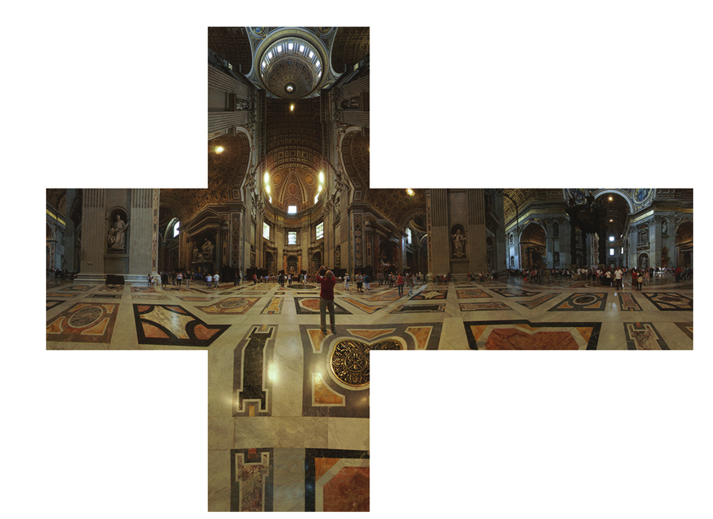

图 11.25  圣彼得大教堂的立方体地图，六个面以展开的“水平十字”排列存储在图像中。 （质地：埃米尔佩尔松）

## 11.5 程序化 3D 纹理 Procedural 3D Textures

&emsp;&emsp;在前面的章节中，我们使用$c_r$作为对象上某个点的漫反射率。对于没有纯色的对象，我们可以将其替换为将 3D 点映射到 RGB 颜色的函数$c_r$
 (p) 。 这个函数可能只返回包含 p 的对象的反射率。 但是对于具有纹理的对象，我们应该期望$c_r$
 (p)  随着 p 在表面上的移动而变化。

&emsp;&emsp;定义从 3D 表面映射到 2D 纹理域的纹理映射函数的另一种方法是创建一个 3D 纹理，该纹理定义 3D 空间中每个点的 RGB 值。 我们只会为表面上的点 p 调用它，但通常为所有 3D 点定义它比在任意表面上的潜在奇怪的 2D 点子集更容易。 3D纹理映射的好处是可以很容易地定义映射函数，因为表面已经嵌入了3D空间，从3D到纹理空间的映射没有失真。 这种策略显然适用于从固体介质“雕刻”出来的表面，例如大理石雕塑。

&emsp;&emsp;3D 纹理的缺点是将它们存储为 3D 光栅图像或体积会消耗大量内存。 出于这个原因，3D 纹理坐标最常与程序纹理一起使用，其中使用数学程序而不是通过从纹理图像查找纹理值来计算纹理值。 在本节中，我们将介绍几个用于定义程序纹理的基本工具。 这些也可用于定义 2D 程序纹理，尽管在 2D 中使用光栅纹理图像更为常见。

### 11.5.1 3D 条纹纹理 3D Stripe Textures

&emsp;&emsp;有许多方法可以制作条纹纹理。 假设我们有两种颜色$c_0$和$c_1$，我们想用它们来制作条纹颜色。 我们需要一些振荡函数来在两种颜色之间切换。 一个简单的方法是使用正弦：

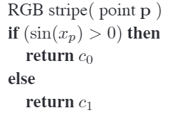

我们还可以使条纹的宽度 w 可控：

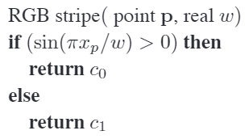

如果我们想在条纹颜色之间平滑地插值，我们可以使用参数 t 来线性改变颜色：

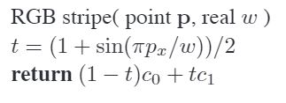

这三种可能性如图 11.26 所示。

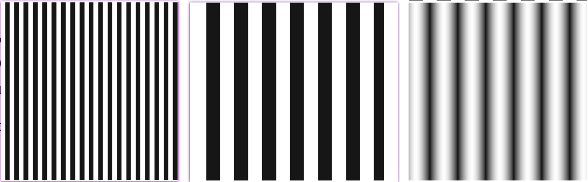

图 11.26  在保持 z 不变的情况下绘制 xy 点的规则阵列会产生各种条纹纹理。

### 11.5.2 固体噪声 Solid Noise

&emsp;&emsp;虽然条纹等常规纹理通常很有用，但我们希望能够制作“斑驳”纹理，例如我们在鸟蛋上看到的。 这通常是通过使用一种“固体噪声”来完成的，通常以其发明者的名字称为柏林噪声，他因其对电影业的影响而获得奥斯卡技术奖 (Perlin, 1985)。

&emsp;&emsp;通过为每个点调用随机数来获得嘈杂的外观是不合适的，因为它就像电视静态中的“白噪声”。我们希望在不失去随机质量的情况下使其更流畅。一种可能性是模糊白噪声，但没有实际实现。另一种可能是在每个格点处制作一个带有随机数的大格子，然后在格子节点之间为新点插值这些随机点；这只是一个 3D 纹理数组，如上一节所述，数组中包含随机数。这种技术使晶格过于明显。 Perlin 使用了各种技巧来改进这种基本的点阵技术，因此点阵不是那么明显。这导致了一组看起来颇为巴洛克风格的步骤，但从本质上讲，线性插值随机值的 3D 数组只有三个变化。第一个变化是使用 Hermite 插值来避免马赫带，就像使用常规纹理一样。第二个变化是使用随机向量而不是值，用点积来导出随机数；通过将局部最小值和最大值移出网格顶点，这使得底层网格结构在视觉上不那么明显。第三个变化是使用一维数组和散列来创建随机向量的虚拟 3D 数组。这增加了计算以降低内存使用。这是他的基本方法：

$$n(x, y, z)=\sum^{\lfloor x\rfloor+1} \sum^{\lfloor y\rfloor+1} \sum^{\lfloor z\rfloor+1} \Omega_{i j k}(x-i, y-j, z-k)$$

其中 (x, y, z) 是 x 的笛卡尔坐标，并且

$$\Omega_{i j k}(u, v, w)=\omega(u) \omega(v) \omega(w)\left(\Gamma_{i j k} \cdot(u, v, w)\right)$$

ω(t) 是三次加权函数：

$$\omega(t)=\left\{\begin{array}{ll}
2|t|^{3}-3|t|^{2}+1 & \text { if }|t|<1 \\
0 & \text { otherwise }
\end{array}\right.$$

&emsp;&emsp;最后一点是$Γ_{ijk}$是格点 (x, y, z) = (i, j, k) 的随机单位向量。 由于我们想要任何潜在的 ijk，我们使用一个伪随机表：

$$\Gamma_{i j k}=\mathbf{G}(\phi(i+\phi(j+\phi(k))))$$

其中 G 是一个预先计算的 n 个随机单位向量数组，并且$φ(i) = P [i\,\,mod\,\,n]$其中 P 是一个长度为 n 的数组，其中包含整数 0 到 n − 1 的排列。实际上，Perlin 报告了 n = 256 效果很好。 选择一个随机单位向量$(v_x , v_y , v_z )$首先设置

$$\begin{array}{l}
v_{x}=2 \xi-1 \\
v_{y}=2 \xi^{\prime}-1 \\
v_{z}=2 \xi^{\prime \prime}-1
\end{array}$$

&emsp;&emsp;其中$\xi, \xi^{\prime}, \xi^{\prime \prime}$是规范随机数（在区间 [0, 1) 内均匀。那么，如果$(v_x^2 + v_y^2 + v_z^2 ) < 1$，则使向量成为单位向量。 否则继续随机设置直到其长度小于1，然后将其设为单位向量。 这是一个拒绝方法的例子，将在第 14 章中详细讨论。本质上，“小于”测试在单位球体中获取一个随机点，并且该点的原点向量是均匀随机的。 对于立方体中的随机点，情况并非如此，因此我们在测试中“摆脱”了角落。

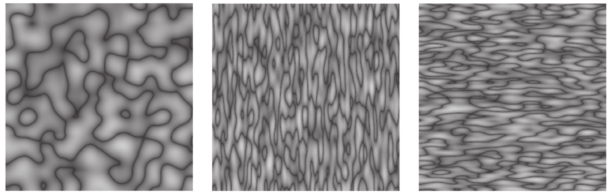

图 11.27  固体噪声的绝对值，以及缩放 x 和 y 值的噪声。

&emsp;&emsp;因为固体噪声可以是正的也可以是负的，所以在转换为颜色之前必须对其进行转换。 图 11.27 显示了 10 × 10 正方形上的噪声绝对值以及拉伸版本。 这些版本通过缩放输入到噪声函数的点来拉伸。

&emsp;&emsp;暗曲线是原始噪声函数从正变为负的地方。 由于噪声在 -1 到 1 之间变化，因此可以通过对颜色使用 (noise + 1)/2 来获得更平滑的图像。 然而，由于接近 1 或 -1 的噪声值很少见，这将是一个相当平滑的图像。 较大的缩放比例可以增加对比度（图 11.28）。

图 11.28  使用 0.5(noise+1)（左边）和 0.8（noise+1）（右边）作为强度。

### 11.5.3 湍流 Turbulence

许多自然纹理在同一纹理中包含多种特征尺寸。 Perlin 使用伪分形“湍流”函数：

$$n_{t}(\mathrm{x})=\sum_{i} \frac{\left|n\left(2^{i} \mathrm{x}\right)\right|}{2^{i}}$$

如图 11.29 所示，这有效地在其自身之上重复添加了噪声函数的缩放副本。

&emsp;&emsp;湍流可用于扭曲条纹函数：

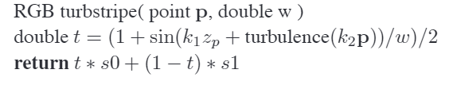

$k_1$和$k_2$的各种值用于生成图11.30。

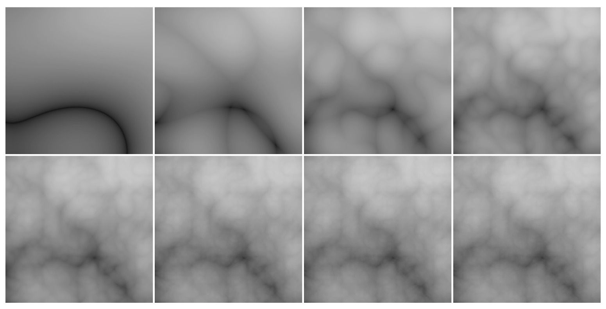

图 11.29  湍流函数（从左上角到右下角）总和中有 1 到 8 个项。

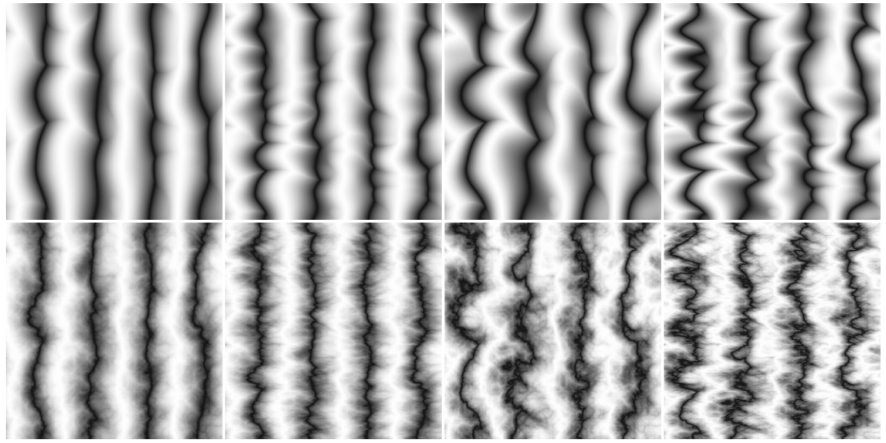

图 11.30  具有不同$k_1$,$k_2$的各种湍流条纹纹理。 顶行只有湍流序列的第一项。

## 经常问的问题

- 如何在光线追踪中实现置换贴图？

&emsp;&emsp;没有理想的方法来做到这一点。 生成所有三角形并在必要时缓存几何图形将防止内存过载（Pharr & Hanrahan，1996 年；Pharr、Kolb、Gershbein 和 Hanrahan，1997 年）。 当位移函数受到限制时，可以尝试直接与位移曲面相交（Patterson,Hoggar, & Logie, 1991; Heidrich & Seidel, 1998; Smits, Shirley, & Stark, 2000）。

- 为什么我的带有纹理的图像看起来不真实？

&emsp;&emsp;人类善于观察表面的小瑕疵。 使用纹理贴图获取细节的计算机生成图像中通常不存在几何缺陷，因此它们看起来“过于平滑”。

## 笔记

&emsp;&emsp;透视正确纹理的讨论基于使用纹理映射的快速阴影和光照效果（Segal、Korobkin、van Widenfelt、Foran 和 Haeberli，1992）和 3D 游戏引擎设计（Eberly，2000）。

## 练习

1. 找到几种使用曲面和实体技术实现无限 2D 棋盘格的方法。 哪个最好？
2. 使用蛮力代数验证等式 (11.3) 是有效的等式。
3. 如何通过使用 z 缓冲区深度和矩阵变换来实现实体纹理？
4. 将函数 mipmap sample trilinear 扩展为单个函数。