# 13 More Ray Tracing

光线追踪器是建立各种高级渲染效果的一个很好的基底。许多需要花大力气才能适应物序光栅化框架的效果，包括第四章中已经介绍过的阴影和反射等基本效果，在光线追踪器中都是简单而优雅的。在本章中，我们将讨论一些更高级的技术，这些技术可以用来对更多的场景进行光线追踪，并包含更多的效果。一些扩展允许更多的几何图形：实例化和构造实体几何（CSG）是使模型更复杂的两种方法，而对程序的复杂度增加得最少。其他扩展增加了我们可以处理的材料范围：通过透明材料（如玻璃和水）的折射，以及各种表面的光泽反射，对许多场景的真实性至关重要。

&emsp;&emsp;光线追踪的优雅性的代价是计算时间：对于任何非微观的场景，大多数这些扩将追踪大量的光线。正因为如此，使用第12章中描述的方法来加速光线追踪是关重要的。

## 13.1 透明度和折射率 Transparency and Refraction

&emsp;&emsp;在第四章中，我们讨论了使用递归光线追踪来计算表面的镜面反射，或者说镜面反射。另一种类型的镜面物体是电介质--一种能折射光线的透明材料。钻石、玻璃、水和空气都是电介质。电介质还可以过滤光线；一些玻璃过滤掉的红光和蓝光比绿光多，所以玻璃呈现出绿色的色调。当光线从折射率为n的介质进入折射率为$n _ t$的介质时，部分光线被透射，并发生弯曲。这在图13.1中显示了$n _ t$ > n的情况。斯涅尔（Snell）定律告诉我们：

$$n sin \theta = n _ t sin \phi.$$

n的示例值。
      
<center>空气：1.00。</center>

<center>水：1.33-1.34。</center>

<center>窗玻璃。1.51;</center>

<center>光学玻璃。1.49-1.92;</center>

<center>钻石：2.42。</center>


&emsp;&emsp;计算两个向量之间的角度的正弦通常不像计算余弦那样方便，对于单位向量来说，余弦是一个简单的点积，比如我们这里就有。使用三角函数特性$sin ^ 2 θ + cos ^ 2 θ = 1$，我们可以推导出余弦的折射关系。

$$\cos \phi = 1 - \frac{n^2(1-\cos^2\theta)}{n_t^2}$$

请注意，如果n和$n _ t$是相反的，那么$\theta$和$\phi$也是相反的，如图13.1右侧所示。

<div align=center>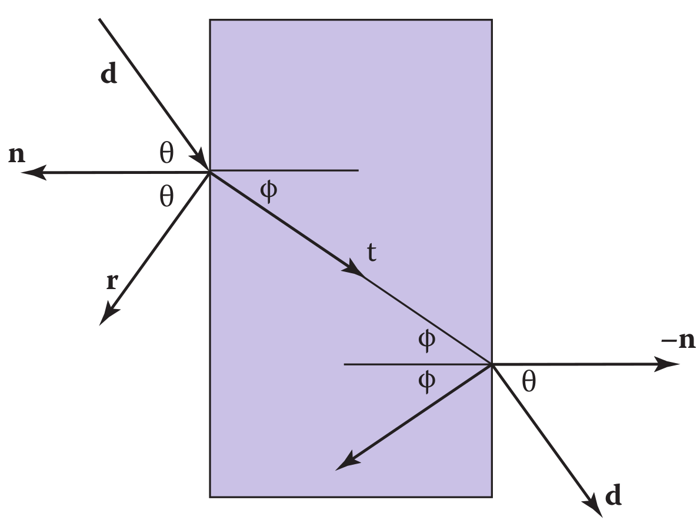</div>
<center>

图 13.1 斯涅尔定律描述了角度 $\phi$ 如何取决于角度 $\theta$ 以及物体和周围介质的折射率。

</center>


为了将$sin \phi$和$cos \phi$转换为三维矢量，我们可以在表面法线n和射线方向d的平面上建立一个二维的正交基。

<div align=center></div>
<center>

图 13.2 矢量 n 和 b 形成平行于传输矢量 t 的二维正交基。

</center>


从图 13.2 中，我们可以看到 n 和 b 形成了折射平面的正交基。根据定义，我们可以根据正交基描述变换后的光线 t 的方向为：

$$t = sin \phi b − cos \phi n.$$

由于我们可以在相同的基础上描述d，并且d是已知的，我们可以求解b。

$$d = sin \theta b − cos \theta n,$$
$$b = \frac{d+n\cos\theta}{\sin\theta}$$

这意味着我们可以用已知变量求解 t：

$$t = \frac{n(d+ncos\theta)}{n_t} - n\cos\phi$$

$$=\frac{n(d-n(d \cdot n))}{n_t} - n\sqrt{1 - \frac{n^2(1 - (d \cdot n)^2)}{n_t^2}}$$

&emsp;&emsp;请注意，无论n和$n _ t$哪个大，这个方程都有效。一个直接的问题是，"如果平方根下的数字是负的，你应该怎么做？" 在这种情况下，没有折射的光线，所有的能量都被反射。这被称为全内反射，它是玻璃物体丰富外观的主要原因。

&emsp;&emsp;根据菲涅耳方程，电介质的反射率随入射角而变化。实现接近菲涅耳方程的一个好方法是使用 Schlick 近似 (Schlick, 1994a)，

$$R(\theta) = R _ 0 + (1 − R _ 0 ) (1 − \cos \theta) ^ 5 ,$$

&emsp;&emsp;其中 $R _ 0$ 是法线入射的反射率：

$$R_0 = (\frac{n_t-1}{n_t+1})^2$$

请注意，上面的$\cos \theta$项总是针对空气中的角度（相对于法线的内角和外角中较大的那个）。

&emsp;&emsp;对于均匀的杂质，就像在典型的彩色玻璃中发现的那样，根据比尔（Beer）定律，携带光线的强度将被衰减。当光线穿过介质时，它的强度会根据$dI = -CI dx$而减弱，其中$dx$是距离。因此，$dI/dx = -CI$。我们可以解这个方程，并得到指数$I = k exp(-Cx)$。衰减的程度由RGB衰减常数a描述，它是一个单位距离后的衰减量。放在边界条件下，我们知道$I(0)=I _0$，$I(1)=aI(0)$。前者意味着$I(x)=I_0exp(-Cx)$ 。后者意味着$I _ 0 a = I _ 0 exp(-C)$，所以$-C = ln(a)$。因此，最后的公式是

$$I(s) = I(0) e ^ {ln(a)s} ,$$

&emsp;&emsp;其中I(s)是距离界面s处的光束强度。在实践中，我们用眼睛逆向计算，因为这样的数据很难找到。图13.3中可以看到比尔定律的影响，玻璃呈现出绿色的色调。

<div align=center>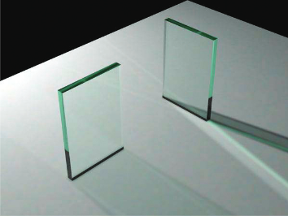</div>
<center>

图 13.3。玻璃的颜色受全内反射和比尔定律的影响。透射和反射的光量由菲涅耳方程确定。如第 23 章所述，使用粒子追踪计算地平面上的复杂照明。

</center>

&emsp;&emsp;为了给我们的代码添加透明材质，我们需要一种方法来确定光线何时 "进入 "一个物体。最简单的方法是假设所有物体都嵌入在折射率非常接近1.0的空气中，并且表面法线指向 "外面"（朝向空气）。在这些假设下，光线和电介质的代码段是：

```cpp
if (p is on a dielectric) then
	r = reflect(d, n )
if (d · n < 0) then
	refract(d, n, n, t)
	c = −d · n
	k r = k g = k b = 1
else
	k r = exp(−a r t)
	k g = exp(−a g t)
	k b = exp(−a b t)
if refract(d, −n, 1/n, t) then
	c = t · n
else
	return k ∗ color(p + tr)
R 0 = (n − 1) 2 /(n + 1) 2
R = R 0 + (1 − R 0 )(1 − c) 5
return k(R color(p + tr) + (1 − R) color(p + tt))
```

&emsp;&emsp;上面的代码假设自然对数已被折叠为常量（$a _ r ， a _ g ， a _ b$ ）。如果存在全反射，折射函数返回false，否则填充参数列表的最后一个参数。

## 13.2  实例化 Instancing

光线追踪的一个优雅属性是它允许非常自然的实例化。实例化的基本思想是在显示物体之前通过一个变换矩阵对物体上的所有点进行扭曲。例如，如果我们将单位圆（二维）在x和y方向上分别用一个比例系数（2，1）进行变换，然后将其旋转45◦，并在x方向上移动一个单位，其结果是一个偏心率为2的椭圆，长轴沿（x=-y）方向，中心在（0，1）（图13.4）。使该实体成为 "实例 "的关键之处在于我们存储了圆和复合变换矩阵。因此，椭圆的显式构造被留作未来渲染时的操作。

<div align=center>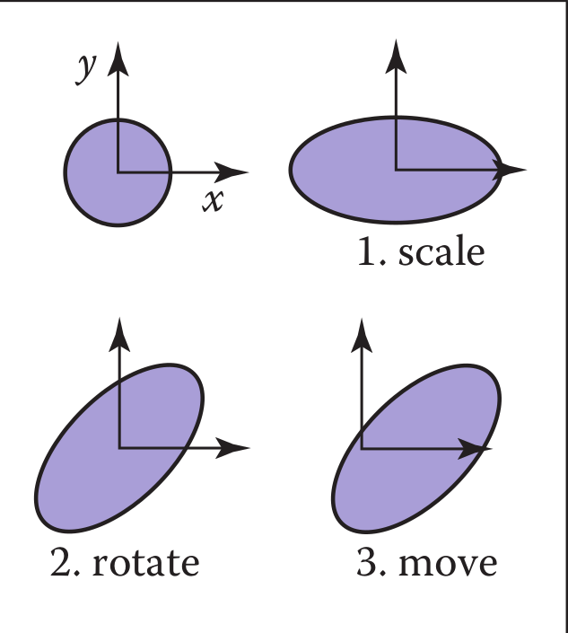</div>
<center>

图13.4  圆的一个实例加上一系列的三个变换就是一个椭圆。

</center>

&emsp;&emsp;在光线追踪中，实例化的优势在于我们可以选择做交集的空间。如果基础对象是由一组点组成的，其中一个点是p，那么转换后的对象是由矩阵M转换后的那组点组成的，其中实例点被转换为Mp。如果我们有一条光线a+tb想要与变换后的物体相交，我们可以改用逆变换的光线与未变换的物体相交（图13.5）。在未变换的空间（即图13.5的右侧）进行计算有两个潜在的好处：

1. 未变换的对象可能具有更简单的相交过程，例如，球体与椭圆体。
2. 许多转换后的对象可以共享同一个未转换的对象，从而减少存储量，例如，汽车的交通拥堵，其中个别汽车只是几个基础（未转换的）模型的转换。

正如第6.2.2节所讨论的，表面法线向量的变换是不同的。考虑到这一点，并使用图13.5中说明的概念，我们可以确定射线与矩阵M变换的物体的交点。如果我们创建一个表面类型的实例类，我们需要创建一个hit函数。

<div align=center>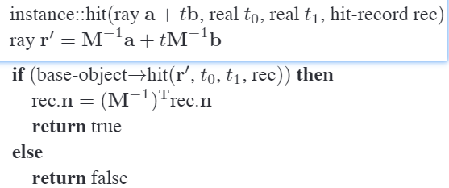</div>

&emsp;&emsp;这个函数的一个优雅之处是参数 rec.t 不需要更改，因为它在任何一个空间中都是相同的。还要注意，我们不需要计算或存储矩阵 M。

&emsp;&emsp;这带来了一个非常重要的问题：射线方向b不能被限制为单位长度的矢量，否则上面的基础设施都不能用。出于这个原因，不把射线方向限制为单位向量是很有用的。

<div align=center>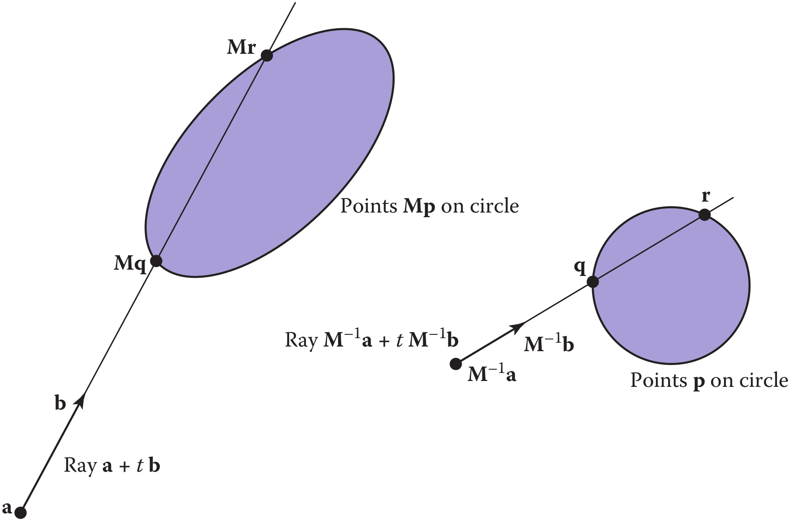</div>
<center>

图 13.5 两个空间中的射线相交问题只是彼此的简单变换。对象被指定为一个球体加矩阵 M。射线在变换后的（世界）空间中由位置 a 和方向 b 指定。

</center>


## 13.3 构造实体几何 Constructive Solid Geometry

光线追踪的一个好处是，可以计算与 3D 线的交点的任何几何图元都可以无缝添加到光线追踪器中。事实证明，将构造实体几何 (CSG) 添加到光线追踪器也很简单 (Roth, 1982)。 CSG 的基本思想是使用集合操作来组合实体形状。这些基本操作如图 13.6 所示。这些操作可以看作是集合操作。例如，我们可以考虑 C 是圆中所有点的集合，S 是正方形中所有点的集合。交运算$C ∩ S$ 是所有同时属于C 和S 的点的集合。其他运算类似。

<div align=center></div>
<center>

图 13.6 二维圆和正方形上的基本 CSG 操作。

</center>

&emsp;&emsp;尽管可以直接在模型上执行 CSG，但如果只需要一张图像，我们就不需要显式更改模型。相反，我们在光线与模型交互时直接对它们执行集合操作。为了使这更自然，我们找到了光线与模型的所有交点，而不仅仅是最近的交点。例如，光线 a + tb 可能在 t = 1 和 t = 2 处撞击球体。对于 CSG，我们将其视为 t ∈ [1, 2] 的球体内部的射线。我们可以计算所有表面的这些“内部间隔”，并对这些间隔进行设置操作（回忆第 2.1.2 节）。这在图 13.7 中进行了说明，其中处理命中间隔以指示差异对象内有两个间隔。 t > 0 的第一次命中是射线实际相交的部分。

<div align=center>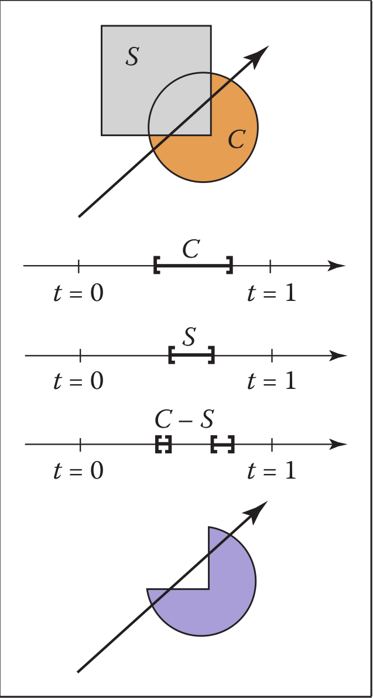</div>
<center>

图13.7  对间隔进行处理，以表明射线如何击中复合物体。

</center>

&emsp;&emsp;在实践中，CSG 交叉例程必须维护一个间隔列表。当第一个碰撞点确定后，材料属性和表面法线就是与碰撞点相关的。此外，您必须注意精度问题，因为没有什么可以阻止用户取两个相邻的物体并取一个交叉点。这可以通过消除厚度低于特定公差的区间来实现。

## 13.4 分布式光线追踪 Distribution Ray Tracing

&emsp;&emsp;对于某些应用来说，光线追踪的图像实在是太 "干净 "了。这种影响可以通过分布式光线追踪来缓解（Cook等人，1984）。传统的光线追踪图像看起来很干净，因为一切都很清晰；阴影完全清晰，反射没有模糊，一切都在完美的焦点上。有时，我们希望阴影是柔和的（就像现实生活中一样），反射是模糊的，就像金属拉丝一样，图像有不同程度的焦点，就像大光圈的照片一样。虽然从第一原理上完成这些事情有些复杂（如第23章所述），但我们可以通过对基本的光线追踪算法做一些相当简单的改变来获得大部分的视觉效果。此外，该框架还为我们提供了一种相对简单的方法来抗锯齿（回顾第8.3节）图像。

### 13.4.1 抗锯齿 Antialiasing

<div align=center>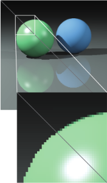</div>
<center>

图 13.8。一个简单的场景，每像素一个样本（左下半部分）和每像素九个样本（右上半部分）。

</center>

&emsp;&emsp;回想一下，消除图像锯齿的一种简单方法是计算像素区域的平均颜色，而不是中心点的颜色。在光线追踪中，我们的计算原语是计算屏幕上某个点的颜色。如果我们对像素中的许多点进行平均，我们就接近了真实的平均值。如果包围像素的屏幕坐标是 [i, i + 1] × [j, j + 1]，那么我们可以替换循环：

<div align=center>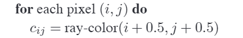</div>

使用在每个像素内的常规 n × n 样本网格上采样的代码：

<div align=center>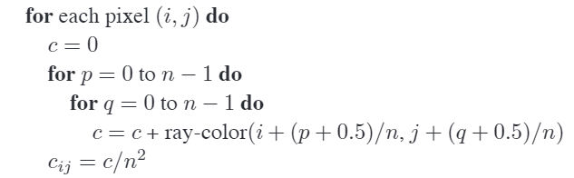</div>

这通常被称为常规采样。图13.9中显示了n=4的像素中的16个采样位置。请注意，这与在$n_x n$乘$n_y n$的分辨率下以每个像素一个样本渲染传统的光线追踪图像，然后对n乘n的像素块进行平均，得到$n _ x$ $n _ y$的图像，产生的答案是一样的。

<div align=center>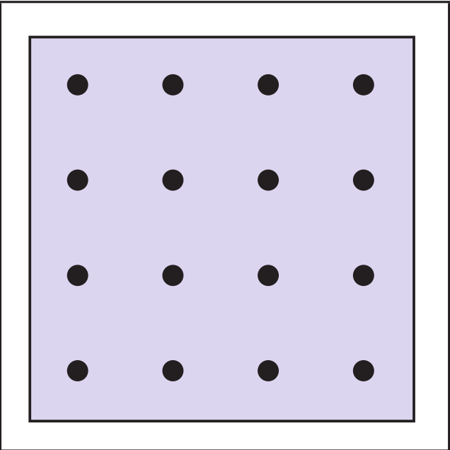</div>
<center>

图 13.9 单个像素的十六个常规样本。 

</center>

<div align=center>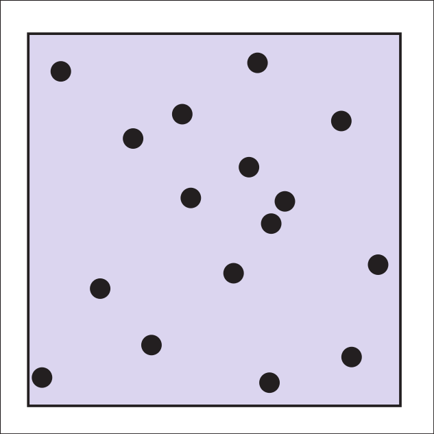</div>
<center>

图 13.10 单个像素的 16 个随机样本。

</center>

&emsp;&emsp;在一个像素内以有规律的模式取样的一个潜在问题是，可能会出现有规律的失真，如摩尔纹图案。如图13.10所示，通过在每个像素内以随机模式取样，可以将这些伪影变成噪声。这通常被称为随机取样，只需要对代码做一个小小的改动:

<div align=center>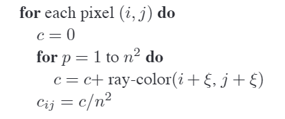</div>

&emsp;&emsp;这里 ξ 是一个调用，它返回范围 [0, 1) 内的均匀随机数。不幸的是，除非采集许多样本，否则噪声可能会令人反感。一种妥协是制定一种随机扰动规则网格的混合策略：

<div align=center></div>

这种方法通常称为抖动或分层抽样（图 13.11）。

<div align=center>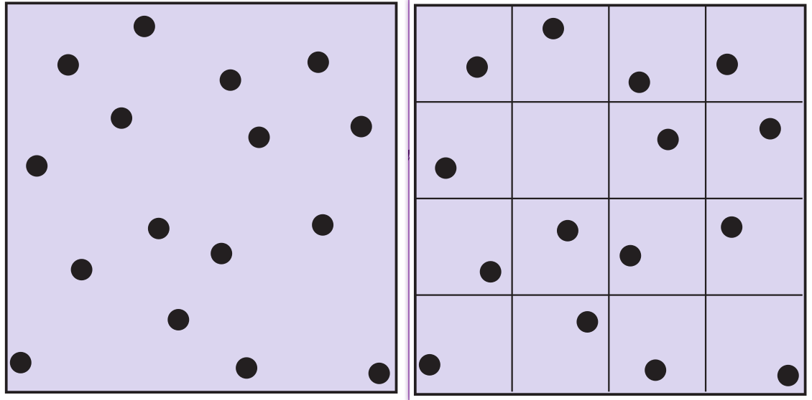</div>
<center>

图 13.11 单个像素的 16 个分层（抖动）样本显示有和没有突出显示的 bin。每个 bin 内恰好有一个随机样本。

</center>

### 13.4.2 软阴影 Soft Shadows

阴影在标准光线追踪中难以处理的原因是灯光是无穷小的点或方向，因此可见或不可见。在现实生活中，灯光具有非零面积，因此可以部分可见。这个想法在图 13.12 中以二维形式显示。光完全不可见的区域称为本影。部分可见的区域称为半影。对于不在阴影中的区域，没有一个常用的术语，但它有时被称为反本影。

&emsp;&emsp;实现软阴影的关键是以某种方式将光视为一个区域而不是一个点。一个简单的方法是用一组分布式的 N 个点光源来近似光，每个点光源的强度是基础光的强度的 N 分之一。这个概念在图 13.13 的左边说明了，其中使用了九个灯。您可以在标准光线追踪器中执行此操作，这是在现成的渲染器中获得软阴影的常用技巧。这种技术有两个潜在的问题。首先，通常需要数十个点光源来实现视觉上的平滑效果，这会大大减慢程序的速度。第二个问题是阴影在半影内部有明显的过渡。

<div align=center></div>
<center>

图 13.12 软阴影从无阴影区域逐渐过渡到阴影区域。过渡区是图中 p 表示的“半影”。

</center>


&emsp;&emsp;分布式光线追踪在阴影代码中引入了一个小的变化。我们不是在一个离散数量的点源上表示区域光，而是将其表示为一个无限的数字，并在每条观察光线中随机选择一个。这相当于为任何被照亮的表面点选择一个随机的光点，如图13.13的右边所示。

<div align=center>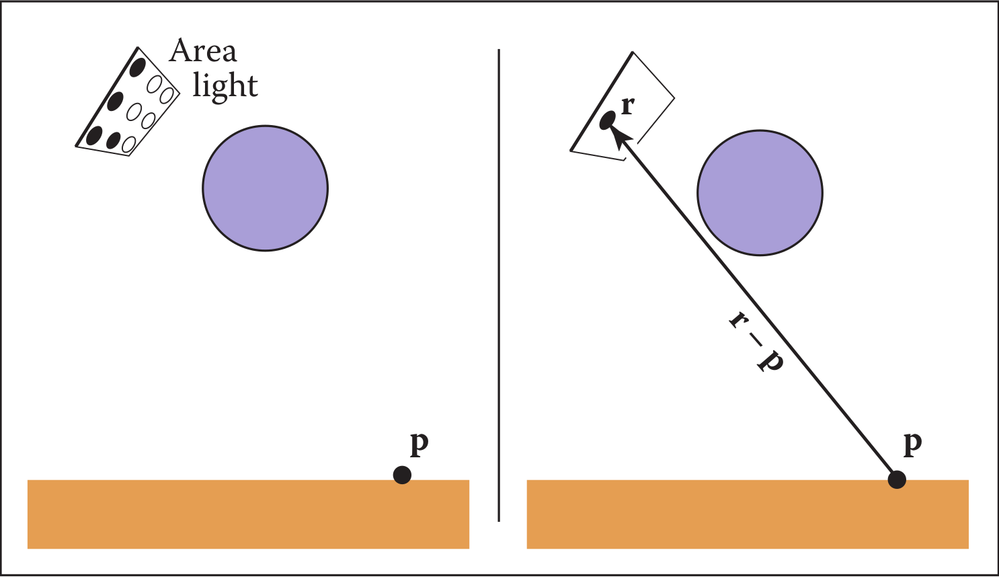</div>
<center>

图 13.13 左图：区域光可以用一定数量的点光源来近似；九个点中有四个对 p 可见，因此它在半影中。右：为阴影光线选择灯光上的一个随机点，它有一定的机会击中灯光或不击中灯光。

</center>


&emsp;&emsp;如果光是由角点 c 和两个边缘向量 a 和 b 指定的平行四边形（图 13.14），则选择随机点 r 很简单：

$$r = c + ξ _ 1 a + ξ _ 2 b,$$

其中$ξ _ 1$ 和$ξ _ 2$ 是 [0, 1) 范围内的均匀随机数。

&emsp;&emsp;然后我们向该点发送一条阴影光线，如图 13.13 右侧所示。请注意，这条光线的方向不是单位长度，这可能需要根据其假设对您的基本光线追踪器进行一些修改。

&emsp;&emsp;我们真的很想在灯光上抖动点。然而，不加思索地实现这一点可能是危险的。我们不希望像素左上角的光线始终生成到光线左上角的阴影光线。相反，我们希望对样本进行打乱，这样像素样本和光样本本身都是抖动的，但像素样本和光样本之间没有相关性。实现这一点的一个好方法是生成两组不同的 $n _ 2$ 个抖动样本并将样本传递到光源例程中：

<div align=center></div>


&emsp;&emsp;这个 shuffle 例程消除了数组 r 和 s 之间的任何一致性。阴影例程将只使用存储在 s[p] 中的 2D 随机点，而不是调用随机数生成器。索引从 0 到 N − 1 的数组的 shuffle 例程是：

<div align=center>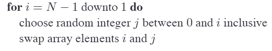</div>

### 13.4.3 景深 Depth of Field

&emsp;&emsp;大多数照片中看到的柔焦效果可以通过在非零尺寸“镜头”而不是一个点上收集光线来模拟。这称为景深。透镜从锥形方向收集光，该锥形方向的顶点位于所有物体都聚焦的距离处（图 13.15）。我们可以将采样的“窗口”放置在所有物体都聚焦的平面上（而不是像我们之前那样在 z = n 平面上）和眼睛的镜头。到一切都聚焦的平面的距离我们称为焦点平面，距离由用户设置，就像在真实相机中到焦点平面的距离由用户或测距仪设置一样。

<div align=center>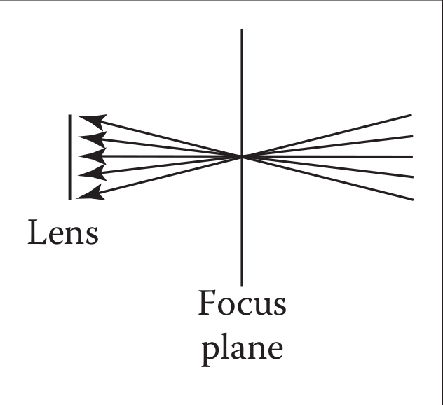</div>
<center>

图13.15  镜头对击中被采样的像素位置的锥体方向进行平均。

</center>

&emsp;&emsp;为了最忠实于真实的相机，我们应该把镜头做成圆盘。然而，我们用一个方形的镜头会得到非常相似的效果（图13.16）。所以我们选择镜头的边长，并在其上随机取样。视线的原点将是这些扰动的位置，而不是眼睛的位置。同样，一个shuffling程序被用来防止与像素样本位置的相关性。图13.17中显示了一个使用每个像素25个样本和一个大盘透镜的例子。

<div align=center>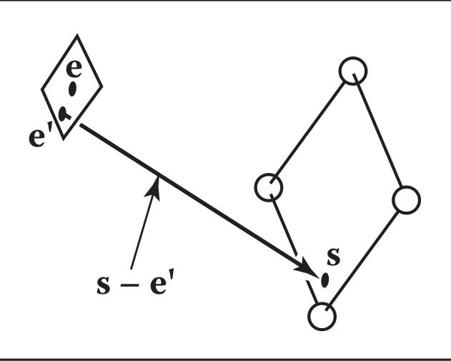</div>
<center>

图13.16 为了生成景深效果，眼睛被随机地从一个正方形区域中选择。

</center>

### 13.4.4 光泽反射 Glossy Reflection

&emsp;&emsp;一些表面，例如拉丝金属，介于理想的镜子和漫射表面之间。在反射中可以看到一些可辨别的图像，但它是模糊的。我们可以通过随机扰动理想的镜面反射光线来模拟这一点，如图 13.18 所示。

<div align=center>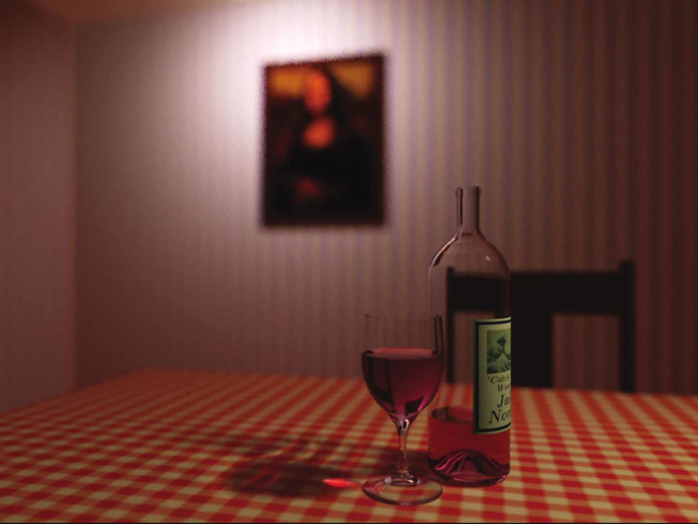</div>
<center>

图 13.17 景深示例。酒杯阴影中的焦散是使用粒子追踪计算的，如第 23 章所述。

</center>

&emsp;&emsp;只需要解决两个细节：如何选择矢量 r 以及当产生的扰动光线低于反射光线的表面时该怎么办。后一个细节通常通过在光线低于表面时返回零颜色来解决。

<div align=center>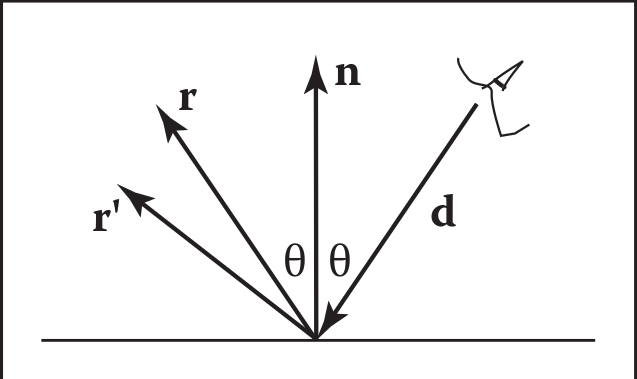</div>
<center>

图 13.18。反射光线被扰乱为随机向量$r^\prime$。

</center>

为了选择$r^\prime$ ，我们再次对一个随机正方形采样。这个正方形与 r 垂直，宽度为 a，用于控制模糊程度。我们可以通过使用第 2.4.6 节中的技术创建 w = r 的正交基来设置正方形的方向。然后，我们在 2D 正方形中创建一个边长为 a， 以原点为中心的随机点。如果我们有 二维 样本点$(ξ, ξ‘ ) ∈ [0, 1] ^ 2$ ，那么所需正方形上的类似点为

$$u = -\frac{a}{2} + ξa$$

$$v = -\frac{a}{2} + ξ'a$$

因为我们要扰动的正方形平行于 u 和 v 向量，所以射线 $r'$ 只是

$$\mathbf{r}^{\prime}=\mathbf{r}+u \mathbf{u}+v \mathbf{v}$$

请注意，$r^\prime$不一定是单位向量，如果您的代码需要对光线方向进行标准化，则应该对其进行标准化.

### 13.4.5 运动模糊 Motion Blur

我们可以为对象添加模糊外观，如图 13.19 所示。这称为运动模糊，是在非零时间跨度内形成图像的结果。在真实相机中，光圈在物体移动的某个时间间隔内打开。我们可以通过设置一个从$T _ 0$ 到$T _ 1$ 的时间变量来模拟开孔。对于每条观察光线，我们选择一个随机时间，

$$T = T_0 + ξ(T_ 1 − T_ 0 ).$$

我们可能还需要创建一些对象来随时间移动。例如，我们可能有一个运动球体，其中心在区间内从$c _ 0$ 移动到$c _ 1$。给定 T ，我们可以计算实际中心并与该球体进行射线相交。因为每条射线都是在不同的时间发送的，所以每条都会在不同的位置遇到球体，最终的外观会变得模糊。请注意，运动球体的边界框应该限制其整个路径，以便可以为整个时间间隔构建效率结构（Glassner，1988）。

<div align=center>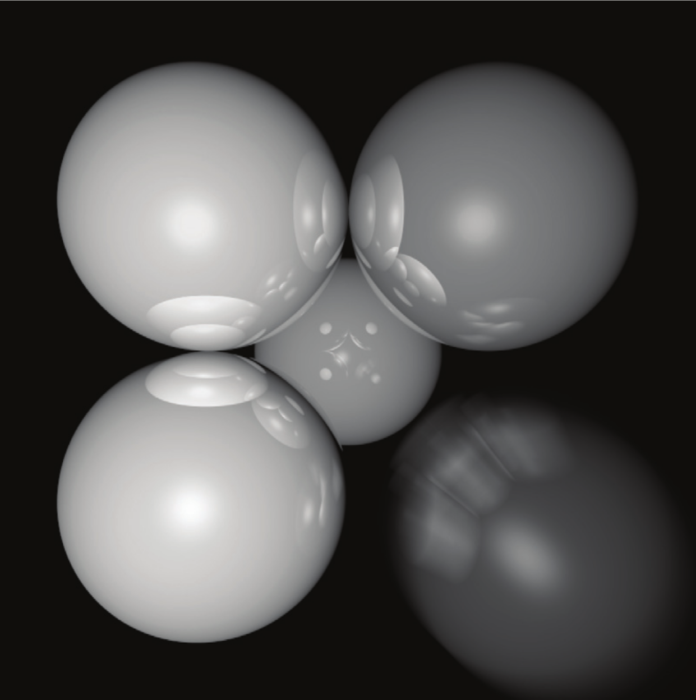</div>
<center>

图 13.19 右下角的球体在运动，因此外观模糊。图片由 Chad Barb 提供。

</center>

**Notes**

在光线追踪框架中，还有许多其他高级方法可以实现。有关更多信息的一些资源是 Glassner 的光线追踪和数字图像合成原理简介、Shirley 的真实光线追踪以及 Pharr 和 Humphreys 的基于物理的渲染：从理论到实现。

**Frequently Asked Questions**

- 什么射线相交结构的效率最好？

最流行的结构是二元空间分割树（BSP树）、均匀细分网格和边界体积层次。大多数使用BSP树的人都将分割平面与轴对齐，这种树通常被称为K-D树。哪种方法最好，没有明确的答案，但在实践中都比暴力搜索好得多，好得多。如果我只实现一个，那将是边界体积层次结构(BVH)，因为它的简单性和稳健性。

- 为什么人们使用包围盒而不是球体或椭圆体？

有时球体或椭球体更好。然而，许多模型具有由框紧密包围的多边形元素，但它们很难与椭球紧密绑定。