# 23 Global Illumination

现实世界中的许多表面从其他反射表面接收大部分或全部入射光。 这通常称为间接照明或相互照明。 例如，大多数房间的天花板很少或没有直接从灯具（发光物体）获得照明。 照明的直接和间接分量如图 23.1 所示。

&emsp;&emsp;尽管考虑表面之间光的相互反射很简单，但它可能是昂贵的，因为所有表面都可能反射任何给定的表面，导致 N 个表面的相互作用多达 $O(N^2)$。 因为对象的整个全局数据库可能会照亮任何给定的对象，所以考虑间接照明通常称为全局照明问题。

&emsp;&emsp;关于解决全局照明问题有丰富而复杂的文献（例如，Appel，1968；Goral、Torrance、Greenberg 和 Battaile，1984；Cook 等，1984；Immel 等，1986；Kajiya，1986；Malley , 1988)。 在本章中，我们将讨论两种算法作为示例：粒子追踪和路径追踪。 第一个对于迷宫游戏等漫游应用程序很有用，并且可以作为批处理渲染的组件。 第二个对于逼真的批处理渲染很有用。 然后我们讨论分离“直接”照明，其中光在灯具和相机之间反射一次。

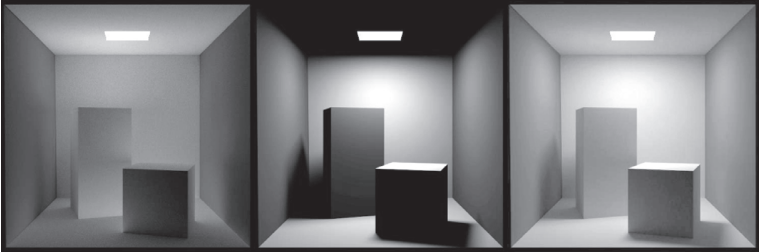

图 23.1  在左边和中间的图像中，间接照明和直接照明分别被分离出来。 在右侧，显示了两个组件的总和。 全局照明算法考虑直接和间接照明。

## 23.1 Lambertian场景的粒子追踪 Particle Tracing for Lambertian Scenes

回忆一下 18.2 节中的传输方程：

$$L_s(k_o)=\int_{all\ k_i}\rho(k_i,k_o)L_f(k_i)\cos\theta_id\sigma_i.$$

该方程的几何图形如图 23.2 所示。 当被照点为Lambertian时，该等式简化为：

$$L_s = \frac{R}{\pi}\int_{all\ k_i}L_f(k_i)\cos\theta_id\sigma_i$$

其中 R 是漫反射率。 近似求解该方程的一种方法是使用有限元方法。 首先，我们将场景分成 N 个表面，每个表面具有未知的表面辐射率（radiance）$L_i$、反射率$R_i$ 和发射辐射率$E_i$。 这就得到了一组N个联立线性方程组：

$$L_i = E_i + \frac{R_i}{\pi} \sum_{j=1}^N k_{ij} L_j$$s

其中$k_ij$是与原始积分表示相关的常数。 然后我们求解这组线性方程，我们可以渲染 N 个恒定颜色的多边形。 这种有限元方法通常称为辐射度（radiosity）。

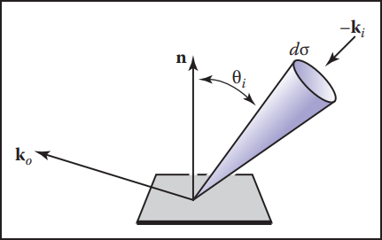

图 23.2  方向形式的传输方程的几何形状。

另一种替代辐射度的方法是使用统计模拟方法，通过随机跟踪来自灯具的光“粒子”穿过环境。这是一种粒子追踪。有许多算法使用某种形式的粒子追踪;我们将讨论粒子追踪的一种形式，它在三角形的纹理中沉积光线。首先，我们回顾一些基本的辐射度量学知识。面积为A的Lambertian表面的辐射率（radiance）L与单位面积的入射功率成正比:

$$L=\frac{\varPhi}{\pi A}$$

其中$\varPhi$ 是表面的输出功率。 请注意，在此讨论中，所有辐射量都是光谱或 RGB，具体取决于实现。 如果表面具有发射功率$\varPhi_e$、入射功率$\varPhi_i$ 和反射率 R，则该等式变为

$$L = \frac{\varPhi_e+{R}{\varPhi_i}}{\pi A}$$

如果给定一个模型，其中为每个三角形指定了$\varPhi _ e$和$R$，我们可以逐个灯具处理，以来自每个灯具的粒子形式发射功率。 我们将纹理贴图与每个三角形相关联以存储累积的辐射，所有纹素初始化为

$$L=\frac{\varPhi_e}{\pi A}$$

如果一个给定的三角形有面积$A$ 和$n_t$ 个纹素，并且它被一个携带功率$\phi$ 的粒子击中，那么该纹素的辐射增加了

$$\varDelta L=\frac{n_t \phi}{\pi A}$$

一旦粒子撞击表面，我们就会增加它撞击的纹素的辐射度（radiance），概率性地决定是否反射粒子，如果我们反射它，我们选择一个方向并调整它的功率。

&emsp;&emsp;请注意，我们希望粒子在某个点终止。 对于每个表面，我们可以为每个表面交互分配一个反射概率 $p$。 一个自然的选择是让 $p = R$，就像自然界中的光一样。 然后粒子会在环境中散射，在被吸收之前不会失去或获得任何能量。 当粒子携带单一波长时，这种方法很有效（Walter、Hubbard、Shirley 和 Greenberg，1997）。 然而，当光谱或 RGB 三元组由光线承载时（如经常实现的（Jensen，2001）），没有单一的 $R$ 并且应该为 $p$ 的值选择一些折衷。 应调整反射粒子的功率 $\phi '$以考虑粒子可能的消光：

$$\phi' = \frac{R\phi}{p}$$

请注意，$p$可以设置为任何小于 1 的正实数，并且该实数对于每次交互都可以不同。 对于给定的波长，当$p>R$ 时，粒子将在该波长处获得功率，而当$p<R$ 时，它将在该波长处失去功率。 它获得功率的情况不会干扰收敛，因为只要$p < 1$，粒子就会停止散射并在某个点终止。对于本讨论的其余部分，我们设置$p = 0.5$。 这种系统中单个粒子的路径如图 23.3 所示。

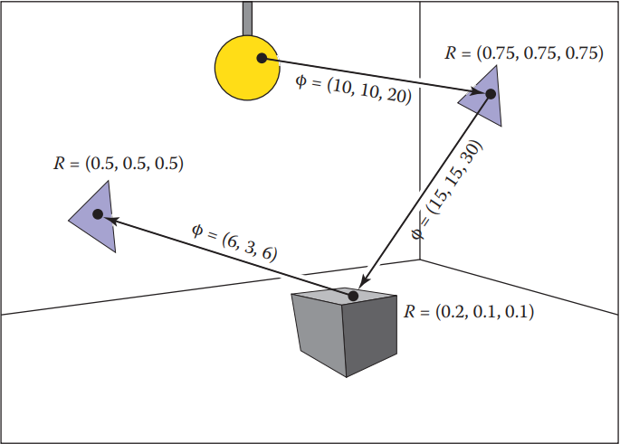

图 23.3  以 0.5 的概率存活并在最后一个交叉点被吸收的粒子的路径。 显示了每个路径段的 RGB 功率。

&emsp;&emsp;该算法的一个关键部分是我们以适当的Lambertian表面分布散射光。 如第 14.4.1 节所述，我们可以通过如下变换两个典型的随机数 $(\xi_1, \xi_2)$ 来找到具有余弦 (Lambertian) 分布的向量：

$$a = (\cos(2\pi\xi_1)\sqrt{\xi_2}\ ,\ \sin(2\pi\xi_1)\sqrt{\xi_2}\ ,\ \sqrt{1-\xi_2})\tag{23.2}$$                                

&emsp;&emsp;请注意，这假设法向量平行于 z 轴。 对于三角形，我们必须建立一个正交基，w平行于法向量。 我们可以通过以下方式实现：

$$w = \frac{n}{||n||},$$

$$u = \frac{p_1-p_0}{||p_1-p_0||},$$

$$v=w\times u,$$

其中 $p_i$ 是三角形的顶点。 然后，根据定义，我们在适当坐标中的向量是

$$a= \cos(2\pi\xi_1)\sqrt{\xi_2}u+\sin(2\pi\xi_1)\sqrt{\xi_2}v+\sqrt{1-\xi_2}w.\tag{23.3}$$                 

在伪代码中，我们针对$p = 0.5$和一个灯具的算法是：

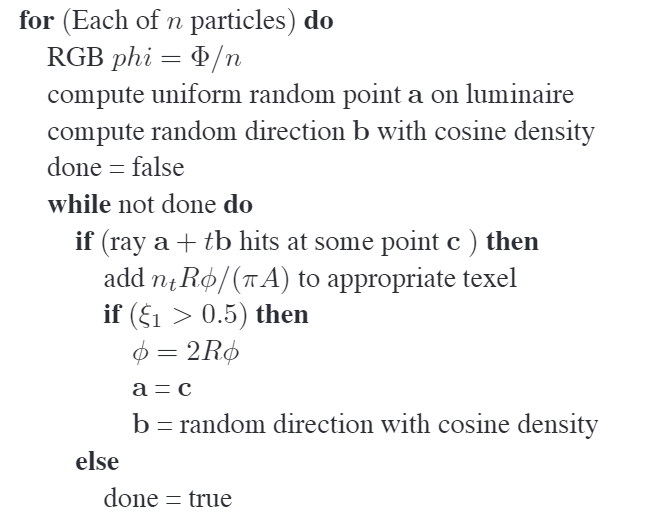

这里$\xi_i$是规范随机数。 运行此代码后，纹理贴图会存储每个三角形的辐射度（radiance），并且任何视点可以直接渲染而无需额外计算。

## 23.2 路径追踪 Path Tracing

虽然粒子追踪非常适合漫反射场景的辐射度的预计算，但它对于创建具有一般 BRDF 的场景或包含许多对象的场景的图像是有问题的。 创建此类场景图像的最直接方法是使用路径追踪 (Kajiya, 1986)。 这是一种概率方法，它从眼睛发出光线并将它们追溯到光线。 经常路径追踪仅用于计算间接照明。 在这里，我们将以一种捕获所有照明的方式呈现它，这可能是低效的。 这有时称为暴力路径追踪。 在第 23.3 节中，可以添加更有效的直接照明技术。

&emsp;&emsp;在路径追踪中，我们从完整的传输方程开始：

$$L_s(k_o)=L_e(k_o)+\int_{all\ k_i}\rho(k_i,k_o)L_f(k_i)\cos\theta_id\sigma_i.$$

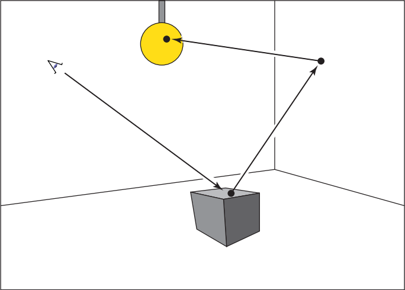

图 23.4  在路径追踪中，光线从眼睛开始穿过一个像素，然后在场景中散射，直到它击中灯具。

我们使用 Monte Carlo 积分来逼近每个观察射线的这个方程的解。 回忆 14.3 节，我们可以使用随机样本来近似积分：

$$\displaystyle\int_{x\in s}g(x)d\mu\approx\frac{1}{N}\displaystyle\sum_{i=1}^N\frac{g(x_i)}{p(x_i)}$$

其中$x_i$ 是具有概率密度函数 $p$ 的随机点。 如果我们将其直接应用于$N = 1$ 的传输方程，我们得到

$$L_s(k_o)\approx L_e(k_o)+\frac{\rho(k_i,k_o)L_f(k_i)\cos\theta_id\sigma_i}{p(k_i)}$$

所以，如果我们有一种方法，在已知密度$p$的情况下，随机选择方向$k_i$，我们可以得到一个估计值。问题是，$L_f(k_i)$本身是一个未知数。幸运的是，我们递归的向这个方向发射射线来估算$L_f (k_i)$，从而找到那个方向的表面。当遇到灯具且$L_e$非零时，结束(图23.4)。这种方法假设光线的反射率为零，否则我们将继续递归。

&emsp;&emsp;在Lambertian BRDF($ρ = R/π$)的情况下，我们可以使用余弦密度函数：

$$p(k_i)=\frac{\cos\theta_i}{\pi}.$$

可以根据公式（23.3）选择具有该密度的方向。 这允许在我们的估计中取消一些余弦项：

$$L_s(k_o)\approx L_e(k_o)+RL_f(k_i).$$

&emsp;&emsp;在伪代码中，Lambertian 表面的这种路径追踪器的操作就像第 4 章中描述的光线追踪器一样，但 raycolor 函数将被修改：

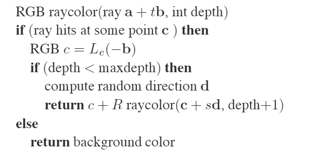

这将导致图像非常嘈杂，除非使用大型灯具或大量样本。 请注意，灯具的颜色必须远高于 1（有时数千或数万）才能使表面具有接近于 1 的最终颜色，因为只有那些偶然照射到灯具的光线才会做出贡献，而大多数光线只会做出贡献 接近零的颜色。 为了生成随机方向 d，我们使用与粒子追踪相同的技术（参见方程（23.2））。

&emsp;&emsp;在一般情况下，我们可能想要使用光谱颜色或更一般的 BRDF。 在实践中，我们应该让材料类包含成员函数来计算随机方向以及计算与该方向关联的$\rho$。 通过这种方式，材料可以透明地添加到实现中。

## 23.3 准确的直接照明 Accurate Direct Lighting

本节介绍了一种比第 10 章更符合物理的直接照明方法。这些方法将有助于提高全局照明算法的效率。 关键思想是如第 4 章所述将阴影射线发送到灯具，但要根据前一章的传输方程仔细的记录。 可以调整全局照明算法，以确保它们只计算一次直接分量。 例如，在粒子追踪中，直接来自灯具的粒子不会被记录下来，所以粒子会编码间接照明进行。 这使得好看的阴影比在全局照明环境下计算直接照明更有效。

### 23.3.1 数学框架 Mathematical Framework

为了计算从一个灯具（发光物体）到非发光表面的直接光，我们求解第 18.2 节中传输方程的一种形式：

$$L_s(x,k_o)=\displaystyle\int_{all\ x'}\frac{\rho(k_i,k_p)L_e(x',-k_i)v(x,x')\cos\theta_i\cos\theta'}{||x-x'||^2}dA'.\tag{23.4}$$            

回想一下，$L_e$ 是光源发出的辐射亮度，$v$ 是一个可见性函数，如果 $x$ “看到” $x'$则等于 1，否则等于 0，其他变量如图 23.5 所示。

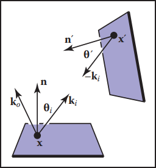

图 23.5  等式（23.4）的直接光照项。

&emsp;&emsp;如果我们要使用蒙特卡罗积分对方程（23.4）进行采样，我们需要在具有密度函数 $p$（所以 $x'$~$p$）的灯具表面上随机选取一个点 $x'$。 只需用一个样本代入方程（14.5）即可得到

 $$L_s(x,k_o)\approx\frac{\rho(k_i,k_o)L_e(x',-k_i)v(x,x')\cos\theta_i\cos\theta'}{p(x')||x-x'||^2}.\tag{23.5}$$                              

如果我们在灯具上随机选取一个均匀的点，则 $p = 1/A$，其中 A 是灯具的面积。 这可以得到：

$$L_s(x,k_o)\approx\frac{\rho(k_i,k_o)L_e(x',-k_i)v(x,x')A\cos\theta_i\cos\theta'}{||x-x'||^2}.\tag{23.6}$$

我们可以使用公式 (23.6) 以简单的方式对平面（例如矩形）灯具进行采样。 我们只是在每个灯具上随机选择一个点。

&emsp;&emsp;一个灯具的代码是：

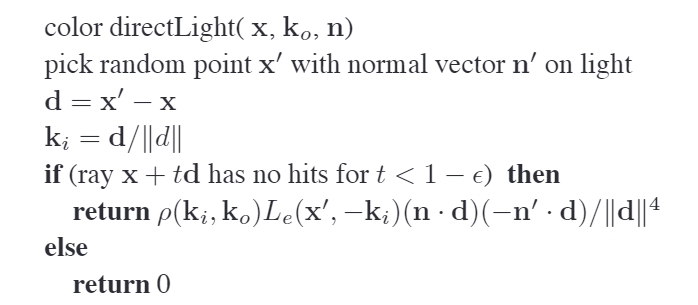

上面的代码需要一些额外的测试，例如如果余弦为负，则将余弦裁剪为零。 请注意，$||d||^4$来自距离平方项和两个余弦，例如，$n · d = ||d|| cos\theta$，因为 d 不一定是单位向量。

&emsp;&emsp;软阴影的几个例子如图 23.6 所示。

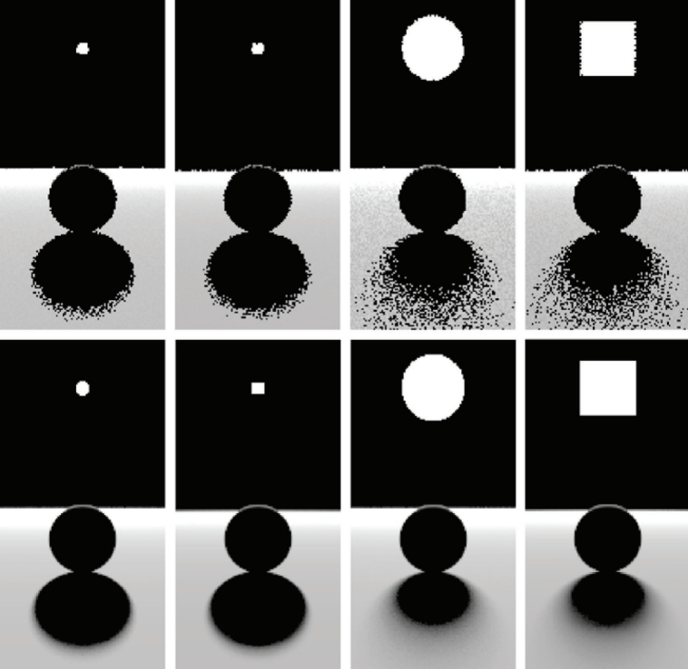

图 23.6  带有正方形和区域光源的背光球体上的各种柔和阴影。 顶部：1 个样本。 底部：100 个样本。 请注意，在确定阴影外观时，光源的形状不如其大小重要。

### 23.3.2 对球形灯具进行采样 Sampling a Spherical Luminaire

尽管可以使用方程（23.6）对中心为 $c$ 且半径为 $R$ 的球体进行采样，但这种采样会产生非常嘈杂的图像，因为许多样本将位于球体的背面，并且 $cos\theta$ 项变化很大。 相反，我们可以使用更复杂的 $p(x’)$ 来降低噪声。

&emsp;&emsp;我们可能尝试的第一个非均匀密度是$p(x’) \propto \cos\theta$ 。 事实证明，这与使用$p(x') \propto \cos\theta' / ||x' − x|| ^ 2$ 进行采样一样复杂，因此我们在这里讨论它。 我们观察到，以这种方式在灯具上采样与使用恒定密度函数$q(k_i) = const$ 相同，该函数定义在从 x 看的灯具对向空间中。 我们现在使用以$x$ 为原点定义的坐标系，以及$w = (c − x)/ || c − x ||和 v = (w × n)/ ||(w × n)||$的右手正交基 （见图 23.7）。 我们还将$(α, \phi)$定义为相对于 uvw 坐标系的方位角和极角。

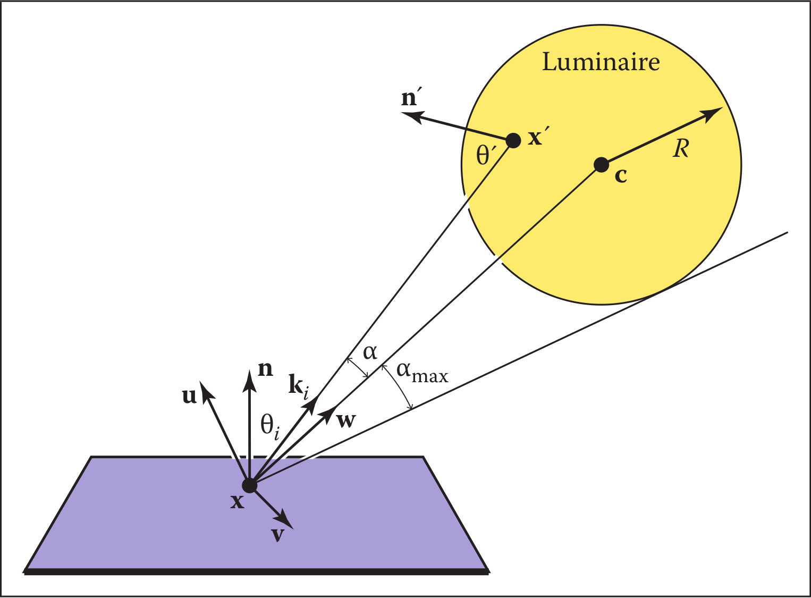

图 23.7  球形灯具在 x 点直接照明的几何图形。

包括球形灯具的最大 α 由下式给出:

$$a_{max}=\arcsin(\frac{R}{||x-c||})=\arccos\sqrt{1-(\frac{R}{||x-c||})^2}.$$

因此，球体所对的方向锥内的均匀密度（相对于立体角）只是球体所对的立体角$2π(1 − cos\alpha_{max} )$的倒数：

$$q(k_i)=\frac{1}{2\pi(1-\sqrt{1-(\frac{R}{||x-c||})^2})}.$$

我们得到

$$\begin{bmatrix}
\cos\alpha \\
\phi
\end{bmatrix}=\begin{bmatrix}{1-\xi_1+\xi_1\sqrt{1-(\frac{R}{||x-c||})^2}}\\ 2\pi\xi_2 \end{bmatrix}.$$

这给了我们方向$k _i$ 。 要找到实际点，我们需要找到球体上那个方向的第一个点。 那个方向的光线就是$(x + tk _i )$，其中$k _ i$ 由下式给出

$$k_i=\begin{bmatrix}                           u_x\quad v_x\quad w_x \\
u_y\quad v_y\quad w_y \\ u_z \quad v_z\quad w_z\end{bmatrix}\begin{bmatrix}                        cos\phi\sin\alpha \\ \sin\phi\sin\alpha \\ \cos\alpha \end{bmatrix}.$$

我们还必须计算$p(x' )$，即相对于面积测度的概率密度函数（回忆密度函数$q$是在立体角空间中定义的）。 由于我们知道$q$是使用$ω$测度的有效概率密度函数，并且我们知道 $d\varOmega = dA(x' ) \cos\theta / ||x' − x ||^2$ ，我们可以关联任何概率密度函数$q(k_i )$与其相关的概率密度函数$p(x ')$：

$$q(k_i)=\frac{p(x')\cos\theta'}{||x'-x||^2}\tag{23.7}$$  

所以我们可以求解$p(x')$：

$$p(x')=\frac{\cos\theta'}{2\pi||x'-x||^2(1-\sqrt{1-(\frac{R}{||x-c||})^2})}.$$

一个很好的调试案例如图 23.8 所示。

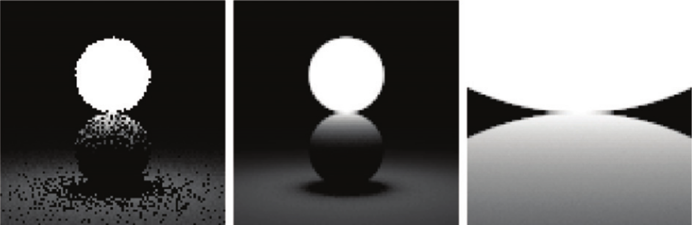

图 23.8&emsp;$L_e = 1$的球体与反射率为 1 的球体接触。当两个球体接触时，反射球体应具有$L(x' ) = 1$ 。 左：1 个样本。 中间：100 个样本。 右图：100 个样本，特写。

### 23.3.3 非散射光源 Nondiffuse Luminaries

灯具的亮度没有理由不能随方向和位置而变化。 例如，如果灯具是电视，它可以随位置而变化。它可以随汽车前灯和其他定向光源的方向而变化。 除了$L_e (x' )$必须更改为$L_e (x' , -k_ i )$之外，我们的分析中几乎不需要对前面的部分进行更改。 随方向改变强度的最简单方法是对法向量 n 使用类似 Phong 的模式。 为了避免在总光输出项中使用指数，我们可以使用以下形式

$$L_e(x',-k_i)=\frac{(n+1)E(x')}{2\pi}\cos^{n-1}\theta',$$

其中$E(x' )$是$x$点的辐射出射率（每单位面积的功率），n 是 Phong 指数。您将获得 n = 1 的漫射光。如果光线在其区域内不均匀，例如，如电视机，则 E 将不是常数。

### **Frequently Asked Questions**

- 我的像素值不再处于某个合理的零到一范围内。我应该显示什么？

&emsp;&emsp;你应该使用第21章中描述的一种音色再现技术。

- 实践中使用了哪些全局照明技术？

&emsp;&emsp;对于复杂场景的批量渲染，通常使用带有一级反射的路径追踪。如Jensen的书中的章节注释所描述的那样，路径追踪通常会用粒子追踪的预处理来增强。对于穿行游戏，经常使用某种形式的世界空间预处理，比如本章中描述的粒子追踪。对于具有非常复杂的镜面传输的场景，一种优雅但复杂的方法，Metropolis Light Transport（Veach & Guibas，1997）可能是最好的选择。

- 环境组件如何与全局照明相关？

&emsp;&emsp;对于漫反射场景，表面的辐射度与表面的辐照度和表面的反射率的乘积成正比。因此，尽管这是一个粗略的近似，但可以有一些方法来猜测它（M. F. Cohen, Chen, Wallace, & Greenberg, 1988），它可能比什么都不做，即使用零的环境项更准确。因为间接辐照度在一个场景中可能变化很大，对每个表面使用不同的常数可以获得更好的结果，而不是使用一个全局环境项。

- 为什么大多数算法都使用传统的光线追踪来计算直接照明？

&emsp;&emsp;虽然全局光照算法会自动计算直接光照，而且实际上让它们只计算间接光照稍微复杂一些，但单独计算直接光照通常更快。这有三个原因。首先，与直接照明相比，间接照明趋于平滑（见图 23.1），因此可以使用更粗糙的表示，例如，用于粒子追踪的低分辨率纹理贴图。第二个原因是光源往往很小，在路径追踪等“从眼睛”的方法中很少会偶然碰到它们，而直接阴影射线是有效的。第三个原因是直接照明允许分层采样，因此与非分层采样相比，它收敛速度很快。分层问题是在 Metropolis Light Transport 中使用阴影光线的原因，尽管其默认技术是稳定的。处理直接光照的默认技术是稳定的，因为它只是处理一种类型的路径。

- 假设理想的漫反射和镜面反射行为是多么的人为？

&emsp;&emsp;对于只有哑光和镜面的环境，Lambertian/specular假设的效果很好。图23.9显示了使用该假设的渲染和照片之间的比较。

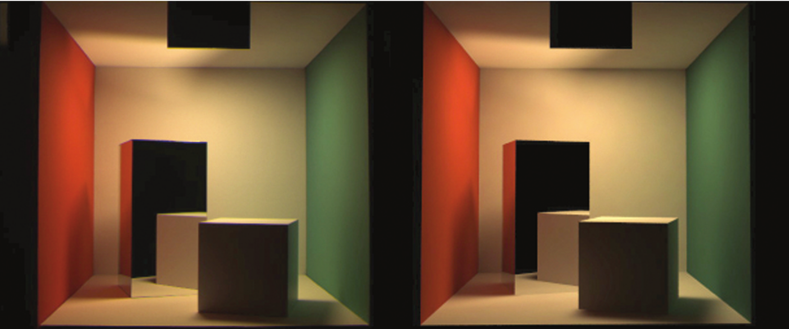

图23.9 渲染图和照片之间的比较。图片来源：Sumant Pattanaik和康奈尔大学计算机图形学项目。

- 每个像素需要多少阴影光线？

&emsp;&emsp;通常是在16到400之间。使用狭窄的半影、大的环境项（或大的间接分量）和遮蔽纹理（Ferwerda, Shirley, Pattanaik,& Greenberg, 1997）可以减少所需的数量。

- 我如何对像带有金属反射器的灯丝这样的东西进行取样，其中大部分光线是从灯丝上反射的？

&emsp;&emsp;通常情况下，整个光被一个简单的源所取代，该源近似于它的聚合行为。对于观看射线，则使用复杂的源。因此，一个汽车头灯在观看者看来是复杂的，但照明代码可能会看到简单的圆盘状灯光。

- 像天空这样的东西不就是一个发光体吗？

&emsp;&emsp;是的，您可以将其视为一个。然而，如此大的光源可能无助于直接照明；蛮力技术可能更有效。

### **Notes**

全局照明起源于热传导和照明工程领域，这在Radiosity中有所记载。A Programmer's Perspective (Ashdown,1994)。其他与全局光照有关的好书包括Radiosity和全局光照（M. F. Cohen & Wallace, 1993），Radiosity和现实图像合成（Sillion & Puech, 1994），数字图像合成原理（Glassner, 1995），使用光子映射的现实图像合成（Jensen, 2001），高级全局光照（Dutré, Bala, & Bekaert, 2002），以及基于物理的渲染（Pharr & Humphreys, 2004）。本章讨论的概率方法来自《直接照明计算的蒙特卡洛技术》（Shirley, Wang, & Zimmerman, 1996）。

### Exercises

1. 对于一个封闭的环境，每个表面都是漫反射体和发射体，反射率为R，发射辐射度为E，那么每一点的总辐射度是多少？提示：对于R=0.5，E=0.25，答案是0.5。这是一个很好的调试案例。
2.  使用第18章的定义，验证公式（23.1）。
3. 如果我们想用厘米平方分辨率的纹理渲染一个典型大小的房间，我们应该发送大约多少粒子才能获得每个纹素约 1000 次点击的平均数？
4. 开发一种从磁盘上随机抽取密度均匀样本的方法。
5. 开发一种从三角形中随机抽取密度均匀样本的方法。
6. 开发一种在“天穹”（半球内部）上采集均匀随机样本的方法。